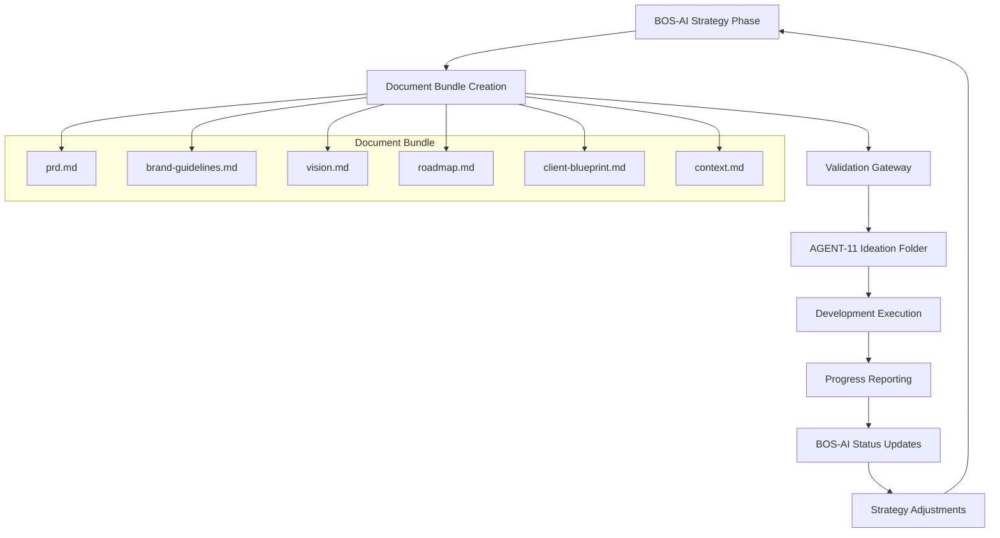

# BOS-AI ↔ AGENT-11 Integration Architecture

**Architecture Decision Record**
- **Decision**: Document-based integration bridge between BOS-AI and AGENT-11 systems
- **Context**: Separate projects requiring seamless handoff with no direct agent communication
- **Trade-offs**: Document-based approach trades real-time sync for system independence
- **Implementation**: Standardized document schemas with automated validation
- **Risks**: Version drift, manual synchronization overhead, context loss

---

## Executive Summary

This architecture defines a robust document-based integration between BOS-AI (product strategy) and AGENT-11 (development execution) using standardized document schemas, automated validation, and bidirectional progress tracking.

### Integration Flow Overview



---

## 1. Document Flow Architecture

### 1.1 Standardized Document Schemas

Each document follows YAML frontmatter + Markdown structure for machine readability and human usability:

#### PRD Schema (prd.md)
```yaml
---
version: "1.0.0"
project_id: "proj_001"
created: "2024-12-29T10:00:00Z"
updated: "2024-12-29T10:00:00Z"
status: "approved" # draft, review, approved, deprecated
priority: "high" # low, medium, high, critical
estimated_complexity: 8 # 1-10 scale
target_completion: "2024-02-15"
dependencies: []
stakeholders:
  - product_owner: "jane@company.com"
  - technical_lead: "john@company.com"
validation:
  schema_version: "2.0"
  checksum: "abc123"
  required_fields_complete: true
---

# Product Requirements Document

## Problem Statement
[Clear problem definition with user pain points]

## Solution Overview
[High-level solution approach]

## Core Features
### Feature 1: [Name]
- **User Story**: As a [user type], I want [functionality] so that [benefit]
- **Acceptance Criteria**: 
  - [ ] Criterion 1
  - [ ] Criterion 2
- **Priority**: High/Medium/Low
- **Complexity**: [1-10]

## Technical Requirements
[Performance, security, compliance requirements]

## Success Metrics
[Measurable outcomes and KPIs]
```

#### Context Schema (context.md)
```yaml
---
version: "1.0.0"
project_id: "proj_001"
business_context:
  industry: "fintech"
  target_market: "small_business"
  competitive_landscape: "crowded"
decision_rationale:
  key_assumptions: []
  risk_factors: []
  success_factors: []
---

# Business Context & Decision Rationale

## Market Analysis
[Industry context, competitive positioning]

## Key Assumptions
[Critical assumptions underlying the strategy]

## Risk Assessment
[Identified risks and mitigation strategies]

## Success Criteria
[What success looks like from business perspective]
```

### 1.2 Ideation Folder Structure

```
./ideation/
├── manifest.yaml              # Bundle metadata and validation
├── core-requirements/
│   ├── prd.md                 # Primary requirements
│   ├── context.md             # Business rationale
│   └── client-blueprint.md    # Success metrics
├── design-specifications/
│   ├── brand-guidelines.md    # Visual standards
│   ├── design-system.md       # UI/UX specifications
│   └── user-experience.md     # Journey maps, flows
├── strategic-direction/
│   ├── vision.md              # Long-term vision
│   ├── roadmap.md             # Feature evolution
│   └── market-analysis.md     # Competitive landscape
├── technical-constraints/
│   ├── architecture-notes.md  # Technical boundaries
│   ├── integration-requirements.md
│   └── compliance-requirements.md
└── progress-tracking/
    ├── project-plan.md        # AGENT-11 generated
    ├── progress.md            # Development log
    └── status-reports/        # Periodic updates
        ├── 2024-12-29-weekly.md
        └── 2024-01-05-weekly.md
```

### 1.3 Version Control Strategy

#### Document Versioning
- **Semantic Versioning**: MAJOR.MINOR.PATCH for document bundles
- **MAJOR**: Breaking changes requiring development restart
- **MINOR**: Feature additions, scope changes
- **PATCH**: Clarifications, typo fixes

#### Change Tracking
```yaml
# manifest.yaml
bundle_version: "2.1.3"
document_versions:
  prd.md: "2.1.0"
  context.md: "1.0.0"
  brand-guidelines.md: "1.2.1"
change_log:
  - version: "2.1.3"
    date: "2024-12-29"
    changes: ["Updated acceptance criteria in PRD", "Fixed brand color codes"]
    impact: "minor" # major, minor, patch
```

---

## 2. Data Exchange Protocols

### 2.1 PRD Handoff Mechanism

#### BOS-AI → AGENT-11 Flow
1. **Bundle Creation**: BOS-AI generates complete document bundle
2. **Validation**: Automated schema validation and completeness check
3. **Staging**: Documents placed in staging area for review
4. **Handoff**: Validated bundle moved to AGENT-11 ideation folder
5. **Acknowledgment**: AGENT-11 confirms receipt and begins analysis

#### Document Bundle Validation
```yaml
# validation-rules.yaml
required_documents:
  - prd.md
  - context.md
  - brand-guidelines.md
validation_rules:
  prd.md:
    required_sections: ["Problem Statement", "Solution Overview", "Core Features"]
    required_fields: ["priority", "estimated_complexity", "target_completion"]
    max_complexity_score: 10
  context.md:
    required_sections: ["Business Context", "Key Assumptions"]
    min_word_count: 500
completeness_threshold: 95 # Minimum completion percentage
```

### 2.2 Progress Reporting Structure

#### Weekly Status Report Template
```yaml
---
report_type: "weekly_status"
report_date: "2024-12-29"
project_id: "proj_001"
reporting_period: "2024-12-23 to 2024-12-29"
overall_status: "on_track" # on_track, at_risk, delayed, blocked
completion_percentage: 65
---

# Weekly Development Status Report

## Executive Summary
[High-level progress and status]

## Completed Tasks
- [x] Task 1: Authentication system implementation
- [x] Task 2: Database schema design

## In Progress
- [ ] Task 3: Frontend component library (60% complete)
- [ ] Task 4: API integration testing (30% complete)

## Upcoming This Week
- [ ] Task 5: Payment system integration
- [ ] Task 6: User onboarding flow

## Blockers & Issues
### Issue 1: Third-party API limitations
- **Impact**: High
- **Description**: Rate limiting affecting user import
- **Resolution**: Exploring alternative APIs
- **ETA**: 2024-01-02

## Metrics & Performance
- **Code Coverage**: 85%
- **Performance Tests**: All passing
- **Security Scans**: 2 low-priority issues identified

## Business Impact Assessment
- **Feature Delivery**: On schedule
- **Budget Status**: Within limits
- **Risk Level**: Low

## Change Requests Needed
[Any clarifications or scope changes needed from BOS-AI]
```

### 2.3 Change Request Workflows

#### Change Request Template
```yaml
---
change_type: "scope_addition" # scope_addition, clarification, constraint_change
priority: "medium"
requested_by: "development_team"
impact_assessment: "low" # low, medium, high
estimated_effort: "2_days"
---

# Change Request: [Title]

## Current State
[What exists now]

## Requested Change
[What needs to change and why]

## Business Justification
[Why this change is necessary]

## Impact Analysis
- **Development Time**: +2 days
- **Budget Impact**: +$500
- **Timeline Impact**: No delay expected
- **Technical Risks**: Low

## Proposed Solution
[How to implement the change]

## Approval Required
- [ ] Product Owner
- [ ] Technical Lead
- [ ] Budget Owner
```

---

## 3. Integration Components

### 3.1 Document Parser/Validator for AGENT-11

#### AGENT-11 Ideation Processor
```python
# Conceptual implementation structure
class IdeationProcessor:
    def validate_bundle(self, bundle_path):
        # Schema validation
        # Completeness check  
        # Dependency verification
        # Return validation report
        
    def parse_requirements(self, prd_path):
        # Extract user stories
        # Parse acceptance criteria
        # Identify dependencies
        # Generate task breakdown
        
    def extract_context(self, context_path):
        # Business rationale
        # Risk factors
        # Success criteria
        # Market constraints
```

### 3.2 Progress Report Generator

#### Automated Status Collection
```python
class ProgressReporter:
    def collect_metrics(self):
        # Git commit analysis
        # Test coverage reports
        # Performance metrics
        # Issue tracking status
        
    def generate_report(self, template="weekly"):
        # Compile progress data
        # Apply report template
        # Format for BOS-AI consumption
        # Include visual progress indicators
```

### 3.3 Context Preservation System

#### Business Context Linking
```yaml
# context-mapping.yaml
feature_mappings:
  "user_authentication":
    business_goal: "reduce_signup_friction"
    success_metric: "signup_completion_rate > 85%"
    market_driver: "competitive_parity"
    user_impact: "seamless_onboarding"
decision_trail:
  authentication_method: 
    rationale: "OAuth reduces friction vs custom forms"
    data_source: "user_research_2024_q4"
    risk_assessment: "vendor_dependency_acceptable"
```

---

## 4. Automation Opportunities

### 4.1 Automated Document Validation

#### Pre-handoff Validation Pipeline
1. **Schema Compliance**: YAML frontmatter structure validation
2. **Content Completeness**: Required sections and word counts
3. **Cross-reference Integrity**: Internal document links and dependencies
4. **Format Consistency**: Markdown structure and style compliance
5. **Metadata Validation**: Version numbers, dates, stakeholder information

#### Validation Scripts
```bash
# Validation workflow
./scripts/validate-bundle.sh ./ideation/
# - Schema validation using yamllint and custom rules
# - Content analysis using markdown parsers  
# - Cross-reference checking
# - Generate validation report

./scripts/bundle-health-check.sh
# - Document freshness checks
# - Version consistency verification
# - Missing dependency identification
```

### 4.2 Progress Report Generation

#### Automated Metrics Collection
```yaml
# metrics-config.yaml
data_sources:
  git_repository:
    commit_frequency: true
    branch_health: true
    code_churn: true
  test_suite:
    coverage_percentage: true
    test_pass_rate: true
    performance_benchmarks: true
  issue_tracker:
    open_issues: true
    resolution_time: true
    bug_priority_distribution: true
reporting_schedule:
  weekly: "fridays_5pm"
  milestone: "on_completion"
  critical: "immediate"
```

### 4.3 Status Synchronization

#### Bidirectional Update System
1. **AGENT-11 → BOS-AI**: Automated progress reports pushed to shared location
2. **BOS-AI → AGENT-11**: Change requests and clarifications delivered to ideation folder
3. **Conflict Resolution**: Automated detection of conflicting updates
4. **Notification System**: Alerts for critical changes or blockers

---

## 5. Technical Specifications

### 5.1 File Formats

#### Primary Format: Markdown + YAML
- **Rationale**: Human-readable, version-control friendly, tooling support
- **Structure**: YAML frontmatter for metadata, Markdown for content
- **Validation**: JSON Schema for YAML, CommonMark for Markdown

#### Alternative Formats
- **JSON**: For pure data exchange (metrics, status)
- **CSV**: For tabular data (timelines, budgets)
- **PNG/SVG**: For diagrams and mockups (referenced in Markdown)

### 5.2 Directory Structures

#### BOS-AI Output Structure
```
./bos-ai-output/
├── projects/
│   └── [project-id]/
│       ├── bundle-v[version]/
│       │   ├── manifest.yaml
│       │   ├── prd.md
│       │   ├── context.md
│       │   ├── brand-guidelines.md
│       │   ├── vision.md
│       │   ├── roadmap.md
│       │   └── client-blueprint.md
│       └── change-requests/
│           └── cr-[timestamp].md
```

#### AGENT-11 Working Structure
```
./project-root/
├── ideation/              # BOS-AI handoff location
├── project-plan.md        # AGENT-11 generated
├── progress.md            # Development log
├── CLAUDE.md             # Project context
└── status-reports/        # BOS-AI consumption
    ├── weekly/
    ├── milestone/
    └── critical/
```

### 5.3 Naming Conventions

#### Document Naming
- **Format**: `[document-type]-[version].md`
- **Examples**: `prd-2.1.0.md`, `status-weekly-2024-12-29.md`
- **Versioning**: Semantic versioning for content changes
- **Timestamps**: ISO 8601 format (YYYY-MM-DD)

#### Project Identification
- **Project ID**: `proj_[3-digit-sequential]` (e.g., proj_001)
- **Bundle Version**: `bundle-v[semantic-version]`
- **Report ID**: `[type]-[date]-[project-id]`

### 5.4 Metadata Requirements

#### Document Metadata Standards
```yaml
# Required in all documents
version: "X.Y.Z"           # Semantic version
project_id: "proj_XXX"     # Project identifier  
created: "ISO-8601"        # Creation timestamp
updated: "ISO-8601"        # Last modification
status: "draft|review|approved|deprecated"
checksum: "hash"           # Content integrity

# Document-specific metadata
document_type: "prd|context|status|change_request"
schema_version: "X.Y"      # Schema compatibility
validation_status: "pass|fail|warning"
dependencies: []           # Related documents
stakeholders: {}           # Responsible parties
```

---

## Integration Success Criteria

### Seamless Document Handoff
- ✅ 95%+ validation success rate for BOS-AI generated bundles
- ✅ Zero manual intervention required for standard handoffs
- ✅ Complete bundle transfer within 5 minutes

### Clear Bidirectional Communication
- ✅ Weekly progress reports delivered automatically
- ✅ Change requests processed within 24 hours
- ✅ Critical issues escalated immediately

### Context Preservation
- ✅ Business rationale linked to technical decisions
- ✅ Full decision trail maintained throughout development
- ✅ Market context accessible during implementation

### Process Alignment
- ✅ Synchronized planning cycles between systems
- ✅ Consistent priority scoring and timeline estimates
- ✅ Unified success metrics across strategy and execution

### Minimal Manual Intervention
- ✅ 90%+ of standard operations automated
- ✅ Manual steps only for exceptions and approvals
- ✅ Self-healing for common integration issues

---

## Implementation Roadmap

### Phase 1: Foundation (Week 1-2)
- [ ] Document schema design and validation
- [ ] Ideation folder structure implementation
- [ ] Basic handoff mechanism

### Phase 2: Automation (Week 3-4)
- [ ] Automated validation pipeline
- [ ] Progress report generation
- [ ] Status synchronization

### Phase 3: Enhancement (Week 5-6)
- [ ] Context preservation system
- [ ] Change request workflows
- [ ] Performance optimization

### Phase 4: Monitoring (Week 7-8)
- [ ] Integration health dashboard
- [ ] Error handling and recovery
- [ ] Documentation and training

---

## Risk Mitigation

### Version Drift Prevention
- Automated version consistency checks
- Bundle integrity validation
- Change impact assessment

### Manual Synchronization Overhead
- Comprehensive automation pipeline
- Exception-only manual intervention
- Self-service status checking

### Context Loss Prevention
- Comprehensive context documentation
- Decision trail preservation
- Business rationale linking

This architecture ensures robust, automated integration between BOS-AI strategy and AGENT-11 execution while maintaining system independence and minimizing manual overhead.