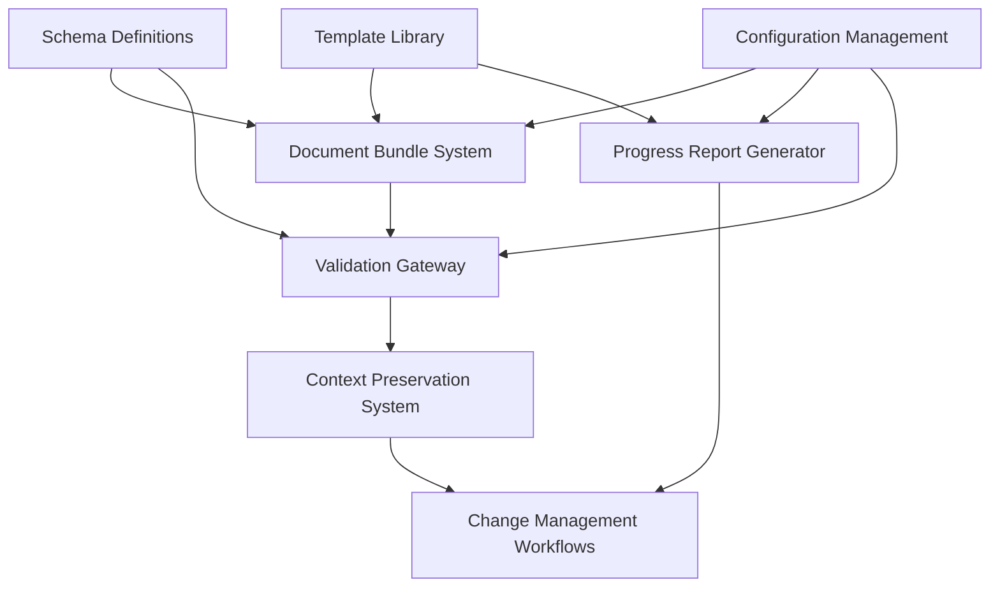

# BOS-AI ↔ AGENT-11 Integration Implementation Plan

**Project**: Document-based integration bridge between BOS-AI and AGENT-11 systems
**Target**: 90%+ automation with seamless document handoff
**Timeline**: 8 weeks (4 phases)

---

## 1. Technical Components to Build

### 1.1 Core Infrastructure Components

#### Document Bundle System
- **Purpose**: Standardized document packaging and distribution
- **Technology**: Bash scripts + YAML + Markdown parsers
- **Components**:
  - Bundle creation toolkit
  - Document schema validators
  - Version management system
  - Integrity verification tools

#### Validation Gateway
- **Purpose**: Automated document validation and quality assurance
- **Technology**: Python/Node.js validators + JSON Schema
- **Components**:
  - Schema validation engine
  - Content completeness checker
  - Cross-reference validator
  - Metadata integrity verifier

#### Progress Report Generator
- **Purpose**: Automated status collection and reporting
- **Technology**: Bash + Git hooks + Markdown generators
- **Components**:
  - Metrics collector
  - Report template engine
  - Status aggregator
  - Timeline tracker

#### Context Preservation System
- **Purpose**: Maintain business rationale throughout development
- **Technology**: YAML mapping + Context linkers
- **Components**:
  - Decision trail tracker
  - Business rationale linker
  - Feature mapping system
  - Change impact analyzer

#### Change Management Workflows
- **Purpose**: Handle scope changes and clarifications
- **Technology**: Git-based workflow + Markdown templates
- **Components**:
  - Change request processor
  - Impact assessment calculator
  - Approval workflow manager
  - Version reconciliation system

### 1.2 Technology Choices & Dependencies

```yaml
# Technology Stack
core_languages:
  - bash: "Primary automation scripting"
  - python: "Complex validation and parsing"
  - yaml: "Configuration and metadata"
  - markdown: "Human-readable documents"

validation_tools:
  - yamllint: "YAML syntax validation"
  - markdownlint: "Markdown style checking"
  - jq: "JSON/YAML processing"
  - pandoc: "Document conversion (optional)"

version_control:
  - git: "Document versioning"
  - semantic_versioning: "Bundle version management"

testing_framework:
  - bats: "Bash script testing"
  - pytest: "Python component testing"
  - shellcheck: "Shell script linting"

dependencies:
  required:
    - bash >= 4.0
    - git >= 2.0
    - python >= 3.8 (for advanced validators)
  optional:
    - pandoc: "For document format conversion"
    - jq: "Enhanced YAML/JSON processing"
    - curl: "Remote synchronization features"
```

### 1.3 Component Dependencies



---

## 2. Implementation Phases

### Phase 1: Foundation (Weeks 1-2)
**Goal**: Core document handling and basic validation

#### Week 1 Deliverables
- [ ] Document schema definitions (YAML + JSON Schema)
- [ ] Basic bundle creation script
- [ ] Directory structure templates
- [ ] Core validation framework

#### Week 2 Deliverables
- [ ] Schema validation pipeline
- [ ] Document parsing utilities
- [ ] Basic handoff mechanism
- [ ] Initial testing framework

**Resource Requirements**: 1 developer, focus on Bash scripting
**Risk Factors**: Schema design complexity, validation rule completeness

### Phase 2: Automation (Weeks 3-4)
**Goal**: Automated validation, transfer, and reporting

#### Week 3 Deliverables
- [ ] Automated bundle validation pipeline
- [ ] Progress report generation system
- [ ] Git integration for versioning
- [ ] Error handling and recovery

#### Week 4 Deliverables
- [ ] Status synchronization mechanisms
- [ ] Automated metrics collection
- [ ] Notification system
- [ ] Integration testing suite

**Resource Requirements**: 1 developer + 0.5 QA tester
**Risk Factors**: Git integration complexity, timing synchronization

### Phase 3: Enhancement (Weeks 5-6)
**Goal**: Context preservation and change management

#### Week 5 Deliverables
- [ ] Context preservation system
- [ ] Business rationale linking
- [ ] Decision trail tracking
- [ ] Feature mapping implementation

#### Week 6 Deliverables
- [ ] Change request workflows
- [ ] Impact assessment tools
- [ ] Version reconciliation system
- [ ] Advanced validation rules

**Resource Requirements**: 1 developer focused on business logic
**Risk Factors**: Complex business rule mapping, workflow edge cases

### Phase 4: Monitoring & Optimization (Weeks 7-8)
**Goal**: System reliability, performance, and documentation

#### Week 7 Deliverables
- [ ] Integration health monitoring
- [ ] Performance optimization
- [ ] Comprehensive error handling
- [ ] Backup and recovery procedures

#### Week 8 Deliverables
- [ ] Complete documentation suite
- [ ] Training materials
- [ ] Performance benchmarks
- [ ] Production deployment guide

**Resource Requirements**: 1 developer + 0.5 technical writer
**Risk Factors**: Documentation completeness, performance tuning

---

## 3. Code Structure

### 3.1 Directory Organization

```
/integration-bridge/
├── README.md                          # Project overview and setup
├── CONFIGURATION.md                   # Configuration guide
├── TROUBLESHOOTING.md                # Common issues and solutions
│
├── config/                           # Configuration files
│   ├── schemas/                      # Document schemas
│   │   ├── prd-schema.json
│   │   ├── context-schema.json
│   │   ├── brand-guidelines-schema.json
│   │   ├── vision-schema.json
│   │   ├── roadmap-schema.json
│   │   └── client-blueprint-schema.json
│   ├── validation-rules.yaml         # Content validation rules
│   ├── reporting-config.yaml         # Report generation config
│   └── integration-settings.yaml     # System integration settings
│
├── scripts/                          # Core automation scripts
│   ├── bundle/                       # Document bundle management
│   │   ├── create-bundle.sh          # Bundle creation
│   │   ├── validate-bundle.sh        # Bundle validation
│   │   ├── extract-bundle.sh         # Bundle extraction
│   │   └── version-bundle.sh         # Version management
│   ├── validation/                   # Document validation
│   │   ├── validate-schemas.sh       # Schema validation
│   │   ├── check-completeness.sh     # Content completeness
│   │   ├── verify-integrity.sh       # Integrity checking
│   │   └── cross-reference.sh        # Link validation
│   ├── reporting/                    # Progress reporting
│   │   ├── collect-metrics.sh        # Metrics collection
│   │   ├── generate-report.sh        # Report generation
│   │   ├── sync-status.sh            # Status synchronization
│   │   └── notify-changes.sh         # Change notifications
│   ├── context/                      # Context preservation
│   │   ├── extract-context.sh        # Context extraction
│   │   ├── link-decisions.sh         # Decision linking
│   │   ├── map-features.sh           # Feature mapping
│   │   └── track-rationale.sh        # Rationale tracking
│   └── workflows/                    # Change management
│       ├── process-change-request.sh # Change processing
│       ├── assess-impact.sh          # Impact assessment
│       ├── reconcile-versions.sh     # Version reconciliation
│       └── approve-changes.sh        # Approval workflow
│
├── templates/                        # Document templates
│   ├── documents/                    # Core document templates
│   │   ├── prd-template.md
│   │   ├── context-template.md
│   │   ├── brand-guidelines-template.md
│   │   ├── vision-template.md
│   │   ├── roadmap-template.md
│   │   └── client-blueprint-template.md
│   ├── reports/                      # Report templates
│   │   ├── weekly-status-template.md
│   │   ├── milestone-report-template.md
│   │   └── critical-issue-template.md
│   ├── workflows/                    # Workflow templates
│   │   ├── change-request-template.md
│   │   ├── impact-assessment-template.md
│   │   └── approval-template.md
│   └── ideation/                     # Ideation folder templates
│       ├── manifest-template.yaml
│       └── directory-structure.txt
│
├── validators/                       # Advanced validation tools
│   ├── python/                       # Python-based validators
│   │   ├── schema_validator.py       # JSON Schema validation
│   │   ├── content_analyzer.py       # Content analysis
│   │   ├── dependency_checker.py     # Dependency validation
│   │   └── integrity_verifier.py     # Integrity verification
│   ├── tests/                        # Validator tests
│   │   ├── test_schema_validator.py
│   │   ├── test_content_analyzer.py
│   │   └── test_dependency_checker.py
│   └── requirements.txt              # Python dependencies
│
├── tools/                           # Utility tools
│   ├── setup/                       # Setup and installation
│   │   ├── install-integration.sh    # Installation script
│   │   ├── configure-environment.sh  # Environment setup
│   │   ├── verify-setup.sh          # Setup verification
│   │   └── uninstall.sh             # Cleanup script
│   ├── maintenance/                 # System maintenance
│   │   ├── cleanup-old-bundles.sh   # Bundle cleanup
│   │   ├── backup-integration.sh    # Backup procedures
│   │   ├── restore-integration.sh   # Restore procedures
│   │   └── health-check.sh          # Health monitoring
│   └── development/                 # Development tools
│       ├── test-runner.sh           # Test execution
│       ├── lint-checker.sh          # Code quality checks
│       ├── generate-docs.sh         # Documentation generation
│       └── benchmark.sh             # Performance testing
│
├── tests/                          # Testing suite
│   ├── unit/                       # Unit tests
│   │   ├── test-bundle-creation.bats
│   │   ├── test-validation.bats
│   │   ├── test-reporting.bats
│   │   └── test-workflows.bats
│   ├── integration/                # Integration tests
│   │   ├── test-end-to-end.bats
│   │   ├── test-handoff-flow.bats
│   │   └── test-change-management.bats
│   ├── fixtures/                   # Test data
│   │   ├── sample-bundles/
│   │   ├── invalid-documents/
│   │   └── test-configurations/
│   └── helpers/                    # Test utilities
│       ├── test-helpers.sh
│       ├── mock-generators.sh
│       └── assertion-library.sh
│
├── docs/                          # Documentation
│   ├── api/                       # API documentation
│   │   ├── bundle-management.md
│   │   ├── validation-api.md
│   │   ├── reporting-api.md
│   │   └── workflow-api.md
│   ├── guides/                    # User guides
│   │   ├── getting-started.md
│   │   ├── configuration-guide.md
│   │   ├── troubleshooting.md
│   │   └── best-practices.md
│   ├── examples/                  # Example configurations
│   │   ├── sample-bundle/
│   │   ├── custom-validation/
│   │   └── workflow-examples/
│   └── architecture/              # Architecture docs
│       ├── design-decisions.md
│       ├── data-flow.md
│       └── integration-points.md
│
└── examples/                      # Example implementations
    ├── basic-integration/         # Simple setup example
    ├── advanced-workflow/         # Complex workflow example
    └── custom-validation/         # Custom validation example
```

### 3.2 Key Scripts to Develop

#### Core Bundle Management (`scripts/bundle/create-bundle.sh`)
```bash
#!/bin/bash
# Creates a validated document bundle from BOS-AI output
# Usage: ./create-bundle.sh --source /path/to/bos-output --output /path/to/bundle
```

#### Master Validation Pipeline (`scripts/validation/validate-bundle.sh`)
```bash
#!/bin/bash
# Comprehensive bundle validation with detailed reporting
# Usage: ./validate-bundle.sh --bundle /path/to/bundle --report /path/to/report
```

#### Automated Handoff (`scripts/workflows/handoff-to-agent11.sh`)
```bash
#!/bin/bash
# Complete handoff workflow from BOS-AI to AGENT-11
# Usage: ./handoff-to-agent11.sh --bundle /path/to/bundle --project /path/to/agent11-project
```

### 3.3 Integration Points

#### With Existing AGENT-11 System
- Integrates with existing `/project/deployment/scripts/` infrastructure
- Extends current validation system (`validate-environment.sh`)
- Uses existing template system in `/project/templates/`
- Maintains compatibility with current mission workflows

#### With BOS-AI System
- Reads from standardized BOS-AI output directory structure
- Provides feedback mechanism through status reports
- Handles version synchronization between systems
- Manages change request workflows

---

## 4. Automation Scripts

### 4.1 Document Validation Script

#### `scripts/validation/validate-bundle.sh`
```bash
#!/bin/bash
# Comprehensive document bundle validation

set -euo pipefail

# Configuration
SCRIPT_DIR="$(cd "$(dirname "${BASH_SOURCE[0]}")" && pwd)"
CONFIG_DIR="$SCRIPT_DIR/../../config"
SCHEMAS_DIR="$CONFIG_DIR/schemas"
VALIDATION_RULES="$CONFIG_DIR/validation-rules.yaml"

# Colors for output
RED='\033[0;31m'
GREEN='\033[0;32m'
YELLOW='\033[1;33m'
BLUE='\033[0;34m'
NC='\033[0m'

# Validation results
declare -a VALIDATION_ERRORS=()
declare -a VALIDATION_WARNINGS=()
declare -a VALIDATION_PASSES=()

# Main validation function
validate_bundle() {
    local bundle_path="$1"
    local report_path="${2:-/dev/stdout}"
    
    log_info "Starting bundle validation: $bundle_path"
    
    # Check bundle structure
    validate_structure "$bundle_path"
    
    # Validate individual documents
    validate_documents "$bundle_path"
    
    # Check cross-references
    validate_cross_references "$bundle_path"
    
    # Verify completeness
    validate_completeness "$bundle_path"
    
    # Generate report
    generate_validation_report "$report_path"
    
    # Return success/failure
    [[ ${#VALIDATION_ERRORS[@]} -eq 0 ]]
}

# Validate bundle directory structure
validate_structure() {
    local bundle_path="$1"
    
    # Required files
    local required_files=(
        "manifest.yaml"
        "core-requirements/prd.md"
        "core-requirements/context.md"
        "design-specifications/brand-guidelines.md"
        "strategic-direction/vision.md"
        "strategic-direction/roadmap.md"
        "core-requirements/client-blueprint.md"
    )
    
    for file in "${required_files[@]}"; do
        if [[ ! -f "$bundle_path/$file" ]]; then
            add_error "Missing required file: $file"
        else
            add_pass "Found required file: $file"
        fi
    done
}

# Validate document schemas
validate_documents() {
    local bundle_path="$1"
    
    # Document validation mappings
    declare -A doc_schemas=(
        ["core-requirements/prd.md"]="prd-schema.json"
        ["core-requirements/context.md"]="context-schema.json"
        ["design-specifications/brand-guidelines.md"]="brand-guidelines-schema.json"
        ["strategic-direction/vision.md"]="vision-schema.json"
        ["strategic-direction/roadmap.md"]="roadmap-schema.json"
        ["core-requirements/client-blueprint.md"]="client-blueprint-schema.json"
    )
    
    for doc_path in "${!doc_schemas[@]}"; do
        local full_path="$bundle_path/$doc_path"
        local schema="${doc_schemas[$doc_path]}"
        
        if [[ -f "$full_path" ]]; then
            validate_document_schema "$full_path" "$SCHEMAS_DIR/$schema"
        fi
    done
}

# Individual document schema validation
validate_document_schema() {
    local doc_path="$1"
    local schema_path="$2"
    
    log_info "Validating document schema: $(basename "$doc_path")"
    
    # Extract YAML frontmatter
    local frontmatter
    frontmatter=$(extract_frontmatter "$doc_path")
    
    if [[ -z "$frontmatter" ]]; then
        add_error "No YAML frontmatter found in: $doc_path"
        return 1
    fi
    
    # Validate against schema using Python validator
    if command -v python3 >/dev/null 2>&1; then
        local validation_result
        validation_result=$(python3 "$SCRIPT_DIR/../validators/python/schema_validator.py" \
            --schema "$schema_path" \
            --document <(echo "$frontmatter") 2>&1)
        
        if [[ $? -eq 0 ]]; then
            add_pass "Schema validation passed: $(basename "$doc_path")"
        else
            add_error "Schema validation failed: $(basename "$doc_path") - $validation_result"
        fi
    else
        add_warning "Python3 not available - skipping schema validation"
    fi
}

# Extract YAML frontmatter from Markdown
extract_frontmatter() {
    local file_path="$1"
    
    awk '
        BEGIN { in_frontmatter = 0; found_start = 0 }
        /^---$/ {
            if (!found_start) {
                found_start = 1
                in_frontmatter = 1
                next
            } else {
                exit
            }
        }
        in_frontmatter { print }
    ' "$file_path"
}

# Validation result management
add_error() { VALIDATION_ERRORS+=("$1"); log_error "$1"; }
add_warning() { VALIDATION_WARNINGS+=("$1"); log_warning "$1"; }
add_pass() { VALIDATION_PASSES+=("$1"); log_success "$1"; }

# Logging functions
log_info() { echo -e "${BLUE}[INFO]${NC} $1" >&2; }
log_success() { echo -e "${GREEN}[PASS]${NC} $1" >&2; }
log_warning() { echo -e "${YELLOW}[WARN]${NC} $1" >&2; }
log_error() { echo -e "${RED}[ERROR]${NC} $1" >&2; }

# Generate validation report
generate_validation_report() {
    local report_path="$1"
    
    {
        echo "# Bundle Validation Report"
        echo "Generated: $(date -u +%Y-%m-%dT%H:%M:%SZ)"
        echo
        
        if [[ ${#VALIDATION_ERRORS[@]} -gt 0 ]]; then
            echo "## Validation Errors (${#VALIDATION_ERRORS[@]})"
            for error in "${VALIDATION_ERRORS[@]}"; do
                echo "- ❌ $error"
            done
            echo
        fi
        
        if [[ ${#VALIDATION_WARNINGS[@]} -gt 0 ]]; then
            echo "## Validation Warnings (${#VALIDATION_WARNINGS[@]})"
            for warning in "${VALIDATION_WARNINGS[@]}"; do
                echo "- ⚠️ $warning"
            done
            echo
        fi
        
        if [[ ${#VALIDATION_PASSES[@]} -gt 0 ]]; then
            echo "## Validation Successes (${#VALIDATION_PASSES[@]})"
            for pass in "${VALIDATION_PASSES[@]}"; do
                echo "- ✅ $pass"
            done
            echo
        fi
        
        echo "## Summary"
        if [[ ${#VALIDATION_ERRORS[@]} -eq 0 ]]; then
            echo "**Status**: ✅ PASSED"
            echo "Bundle is valid and ready for handoff to AGENT-11"
        else
            echo "**Status**: ❌ FAILED"
            echo "Bundle requires fixes before handoff"
        fi
        
    } > "$report_path"
}

# Main execution
main() {
    local bundle_path="${1:-}"
    local report_path="${2:-}"
    
    if [[ -z "$bundle_path" ]]; then
        echo "Usage: $0 <bundle-path> [report-path]"
        exit 1
    fi
    
    if [[ ! -d "$bundle_path" ]]; then
        log_error "Bundle directory not found: $bundle_path"
        exit 1
    fi
    
    validate_bundle "$bundle_path" "$report_path"
}

# Execute if script is run directly
if [[ "${BASH_SOURCE[0]}" == "${0}" ]]; then
    main "$@"
fi
```

### 4.2 Progress Report Generation Script

#### `scripts/reporting/generate-report.sh`
```bash
#!/bin/bash
# Automated progress report generation for AGENT-11 → BOS-AI

set -euo pipefail

# Configuration
SCRIPT_DIR="$(cd "$(dirname "${BASH_SOURCE[0]}")" && pwd)"
CONFIG_DIR="$SCRIPT_DIR/../../config"
TEMPLATE_DIR="$SCRIPT_DIR/../../templates/reports"

# Report types
declare -A REPORT_TEMPLATES=(
    ["weekly"]="weekly-status-template.md"
    ["milestone"]="milestone-report-template.md"
    ["critical"]="critical-issue-template.md"
)

# Generate progress report
generate_report() {
    local project_path="$1"
    local report_type="${2:-weekly}"
    local output_path="$3"
    
    log_info "Generating $report_type report for: $project_path"
    
    # Collect metrics
    collect_project_metrics "$project_path"
    
    # Generate report from template
    local template="${REPORT_TEMPLATES[$report_type]}"
    if [[ -f "$TEMPLATE_DIR/$template" ]]; then
        process_template "$TEMPLATE_DIR/$template" "$output_path"
    else
        log_error "Template not found: $template"
        return 1
    fi
    
    log_success "Report generated: $output_path"
}

# Collect project metrics
collect_project_metrics() {
    local project_path="$1"
    
    # Git metrics
    collect_git_metrics "$project_path"
    
    # Task completion metrics
    collect_task_metrics "$project_path"
    
    # Code quality metrics
    collect_quality_metrics "$project_path"
    
    # Issue tracking
    collect_issue_metrics "$project_path"
}

# Git repository metrics
collect_git_metrics() {
    local project_path="$1"
    
    if [[ -d "$project_path/.git" ]]; then
        cd "$project_path"
        
        # Recent commits
        GIT_COMMITS_WEEK=$(git log --since="1 week ago" --oneline | wc -l)
        GIT_LAST_COMMIT=$(git log -1 --pretty=format:"%h %s (%cr)")
        GIT_BRANCH=$(git branch --show-current)
        GIT_STATUS=$(git status --porcelain | wc -l)
        
        cd - > /dev/null
    else
        GIT_COMMITS_WEEK=0
        GIT_LAST_COMMIT="No git repository"
        GIT_BRANCH="N/A"
        GIT_STATUS=0
    fi
}

# Task completion metrics from project-plan.md
collect_task_metrics() {
    local project_path="$1"
    local project_plan="$project_path/project-plan.md"
    
    if [[ -f "$project_plan" ]]; then
        TASKS_TOTAL=$(grep -c "^- \[" "$project_plan" || echo "0")
        TASKS_COMPLETED=$(grep -c "^- \[x\]" "$project_plan" || echo "0")
        TASKS_IN_PROGRESS=$(grep -c "^- \[~\]" "$project_plan" || echo "0")
        
        if [[ "$TASKS_TOTAL" -gt 0 ]]; then
            COMPLETION_PERCENTAGE=$(( (TASKS_COMPLETED * 100) / TASKS_TOTAL ))
        else
            COMPLETION_PERCENTAGE=0
        fi
    else
        TASKS_TOTAL=0
        TASKS_COMPLETED=0
        TASKS_IN_PROGRESS=0
        COMPLETION_PERCENTAGE=0
    fi
}

# Process template with variable substitution
process_template() {
    local template_path="$1"
    local output_path="$2"
    
    # Current date and time
    local REPORT_DATE=$(date -u +%Y-%m-%d)
    local REPORT_TIMESTAMP=$(date -u +%Y-%m-%dT%H:%M:%SZ)
    local REPORT_PERIOD_START=$(date -d "1 week ago" +%Y-%m-%d)
    local REPORT_PERIOD_END=$(date +%Y-%m-%d)
    
    # Determine overall status
    local OVERALL_STATUS="on_track"
    if [[ "$GIT_STATUS" -gt 10 ]]; then
        OVERALL_STATUS="at_risk"
    fi
    
    # Process template
    sed \
        -e "s/{{REPORT_DATE}}/$REPORT_DATE/g" \
        -e "s/{{REPORT_TIMESTAMP}}/$REPORT_TIMESTAMP/g" \
        -e "s/{{REPORT_PERIOD_START}}/$REPORT_PERIOD_START/g" \
        -e "s/{{REPORT_PERIOD_END}}/$REPORT_PERIOD_END/g" \
        -e "s/{{OVERALL_STATUS}}/$OVERALL_STATUS/g" \
        -e "s/{{COMPLETION_PERCENTAGE}}/$COMPLETION_PERCENTAGE/g" \
        -e "s/{{TASKS_COMPLETED}}/$TASKS_COMPLETED/g" \
        -e "s/{{TASKS_TOTAL}}/$TASKS_TOTAL/g" \
        -e "s/{{GIT_COMMITS_WEEK}}/$GIT_COMMITS_WEEK/g" \
        -e "s/{{GIT_LAST_COMMIT}}/$GIT_LAST_COMMIT/g" \
        -e "s/{{GIT_BRANCH}}/$GIT_BRANCH/g" \
        "$template_path" > "$output_path"
}

# Logging functions
log_info() { echo -e "\033[0;34m[INFO]\033[0m $1" >&2; }
log_success() { echo -e "\033[0;32m[SUCCESS]\033[0m $1" >&2; }
log_error() { echo -e "\033[0;31m[ERROR]\033[0m $1" >&2; }

# Main execution
main() {
    local project_path="${1:-$(pwd)}"
    local report_type="${2:-weekly}"
    local output_path="${3:-./status-report-$(date +%Y-%m-%d).md}"
    
    generate_report "$project_path" "$report_type" "$output_path"
}

# Execute if script is run directly
if [[ "${BASH_SOURCE[0]}" == "${0}" ]]; then
    main "$@"
fi
```

### 4.3 Bundle Transfer Automation

#### `scripts/workflows/handoff-to-agent11.sh`
```bash
#!/bin/bash
# Complete handoff workflow from BOS-AI to AGENT-11

set -euo pipefail

# Configuration
SCRIPT_DIR="$(cd "$(dirname "${BASH_SOURCE[0]}")" && pwd)"
VALIDATION_SCRIPT="$SCRIPT_DIR/../validation/validate-bundle.sh"

# Handoff workflow
handoff_bundle() {
    local bundle_path="$1"
    local agent11_project_path="$2"
    local ideation_path="$agent11_project_path/ideation"
    
    log_info "Starting handoff workflow"
    log_info "Bundle: $bundle_path"
    log_info "AGENT-11 Project: $agent11_project_path"
    
    # Step 1: Validate bundle
    if ! validate_bundle_for_handoff "$bundle_path"; then
        log_error "Bundle validation failed - aborting handoff"
        return 1
    fi
    
    # Step 2: Prepare AGENT-11 project
    if ! prepare_agent11_project "$agent11_project_path"; then
        log_error "AGENT-11 project preparation failed"
        return 1
    fi
    
    # Step 3: Transfer bundle
    if ! transfer_bundle "$bundle_path" "$ideation_path"; then
        log_error "Bundle transfer failed"
        return 1
    fi
    
    # Step 4: Create handoff acknowledgment
    create_handoff_acknowledgment "$ideation_path"
    
    # Step 5: Initialize AGENT-11 tracking files
    initialize_tracking_files "$agent11_project_path"
    
    log_success "Handoff completed successfully"
    log_info "AGENT-11 can now begin development with: cd '$agent11_project_path' && /coord dev-alignment"
}

# Validate bundle before handoff
validate_bundle_for_handoff() {
    local bundle_path="$1"
    local validation_report="/tmp/handoff-validation-$(date +%s).md"
    
    log_info "Validating bundle for handoff..."
    
    if "$VALIDATION_SCRIPT" "$bundle_path" "$validation_report"; then
        log_success "Bundle validation passed"
        rm -f "$validation_report"
        return 0
    else
        log_error "Bundle validation failed - see report: $validation_report"
        return 1
    fi
}

# Prepare AGENT-11 project directory
prepare_agent11_project() {
    local project_path="$1"
    
    log_info "Preparing AGENT-11 project structure..."
    
    # Create directory structure
    mkdir -p "$project_path"/{ideation,status-reports/{weekly,milestone,critical}}
    
    # Initialize git if not present
    if [[ ! -d "$project_path/.git" ]]; then
        cd "$project_path"
        git init
        cd - > /dev/null
        log_info "Initialized git repository"
    fi
    
    # Create .claude directory for agents
    mkdir -p "$project_path/.claude/agents"
    
    return 0
}

# Transfer bundle to ideation directory
transfer_bundle() {
    local bundle_path="$1"
    local ideation_path="$2"
    
    log_info "Transferring bundle to ideation directory..."
    
    # Backup existing ideation if present
    if [[ -d "$ideation_path" ]] && [[ "$(ls -A "$ideation_path")" ]]; then
        local backup_path="$ideation_path.backup.$(date +%s)"
        mv "$ideation_path" "$backup_path"
        log_info "Backed up existing ideation to: $backup_path"
    fi
    
    # Copy bundle
    cp -r "$bundle_path" "$ideation_path"
    
    # Set appropriate permissions
    chmod -R u+rw "$ideation_path"
    
    log_success "Bundle transferred successfully"
    return 0
}

# Create handoff acknowledgment
create_handoff_acknowledgment() {
    local ideation_path="$1"
    local ack_file="$ideation_path/handoff-acknowledgment.md"
    
    cat > "$ack_file" << EOF
# BOS-AI → AGENT-11 Handoff Acknowledgment

**Handoff Date**: $(date -u +%Y-%m-%dT%H:%M:%SZ)
**Bundle Version**: $(grep "bundle_version:" "$ideation_path/manifest.yaml" | cut -d' ' -f2 | tr -d '"' || echo "unknown")
**Status**: ✅ Successfully received

## Bundle Contents Received
- [x] Product Requirements Document (prd.md)
- [x] Business Context (context.md)
- [x] Brand Guidelines (brand-guidelines.md)
- [x] Vision Document (vision.md)
- [x] Roadmap (roadmap.md)
- [x] Client Blueprint (client-blueprint.md)
- [x] Bundle Manifest (manifest.yaml)

## Next Steps
1. AGENT-11 will analyze the ideation bundle
2. Create project-plan.md with technical implementation plan
3. Initialize progress.md for development tracking
4. Begin development with coordinator mission: \`/coord dev-alignment\`

## Handoff Validation
- Schema validation: ✅ Passed
- Completeness check: ✅ Passed
- Integrity verification: ✅ Passed

---
*This acknowledgment confirms successful handoff from BOS-AI to AGENT-11*
EOF

    log_success "Created handoff acknowledgment"
}

# Initialize AGENT-11 tracking files
initialize_tracking_files() {
    local project_path="$1"
    
    # Create basic CLAUDE.md if not present
    if [[ ! -f "$project_path/CLAUDE.md" ]]; then
        create_basic_claude_md "$project_path/CLAUDE.md"
    fi
    
    # Create progress.md template
    if [[ ! -f "$project_path/progress.md" ]]; then
        create_basic_progress_md "$project_path/progress.md"
    fi
    
    log_success "Initialized tracking files"
}

# Create basic CLAUDE.md
create_basic_claude_md() {
    local claude_file="$1"
    
    cat > "$claude_file" << 'EOF'
# CLAUDE.md

This file provides guidance to Claude Code when working with this project.

## Project Overview
This project was initiated through BOS-AI → AGENT-11 handoff process.
See `./ideation/` directory for complete project requirements and context.

## Ideation Documents
- `./ideation/core-requirements/prd.md` - Product Requirements
- `./ideation/core-requirements/context.md` - Business Context  
- `./ideation/design-specifications/brand-guidelines.md` - Brand Guidelines
- `./ideation/strategic-direction/vision.md` - Vision Document
- `./ideation/strategic-direction/roadmap.md` - Roadmap
- `./ideation/core-requirements/client-blueprint.md` - Success Metrics

## Progress Tracking
- `./project-plan.md` - Technical implementation plan (to be created)
- `./progress.md` - Development log and lessons learned
- `./status-reports/` - Regular progress reports for BOS-AI

## Next Steps
Run coordinator alignment mission to analyze ideation and create implementation plan:
```
/coord dev-alignment
```
EOF
}

# Create basic progress.md
create_basic_progress_md() {
    local progress_file="$1"
    
    cat > "$progress_file" << EOF
# Development Progress Log

**Project Initiated**: $(date -u +%Y-%m-%dT%H:%M:%SZ)
**Integration Method**: BOS-AI → AGENT-11 handoff

## Project Initialization
- [x] Received ideation bundle from BOS-AI
- [x] Validated bundle completeness and integrity
- [x] Initialized AGENT-11 project structure
- [ ] Analyzed requirements and created technical plan
- [ ] Began development implementation

## Issues and Resolutions
*No issues logged yet*

## Lessons Learned
*To be documented during development*

---
*This file tracks development progress and learnings for BOS-AI integration*
EOF
}

# Logging functions
log_info() { echo -e "\033[0;34m[INFO]\033[0m $1" >&2; }
log_success() { echo -e "\033[0;32m[SUCCESS]\033[0m $1" >&2; }
log_error() { echo -e "\033[0;31m[ERROR]\033[0m $1" >&2; }

# Main execution
main() {
    local bundle_path="${1:-}"
    local agent11_project_path="${2:-}"
    
    if [[ -z "$bundle_path" || -z "$agent11_project_path" ]]; then
        echo "Usage: $0 <bundle-path> <agent11-project-path>"
        echo
        echo "Example:"
        echo "  $0 /path/to/bos-ai/output/proj_001/bundle-v1.2.0 /path/to/agent11/my-project"
        exit 1
    fi
    
    handoff_bundle "$bundle_path" "$agent11_project_path"
}

# Execute if script is run directly
if [[ "${BASH_SOURCE[0]}" == "${0}" ]]; then
    main "$@"
fi
```

---

## 5. Testing Strategy

### 5.1 Unit Tests for Validators

#### Test Framework: BATS (Bash Automated Testing System)

```bash
# tests/unit/test-bundle-creation.bats

#!/usr/bin/env bats

setup() {
    # Create temporary test directory
    TEST_DIR="$(mktemp -d)"
    export TEST_DIR
    
    # Copy test fixtures
    cp -r "tests/fixtures/sample-bundles" "$TEST_DIR/"
}

teardown() {
    # Cleanup
    rm -rf "$TEST_DIR"
}

@test "create_bundle creates proper directory structure" {
    local output_dir="$TEST_DIR/test-bundle"
    
    run ./scripts/bundle/create-bundle.sh \
        --source "$TEST_DIR/sample-bundles/valid-input" \
        --output "$output_dir"
    
    [ "$status" -eq 0 ]
    [ -f "$output_dir/manifest.yaml" ]
    [ -f "$output_dir/core-requirements/prd.md" ]
    [ -f "$output_dir/core-requirements/context.md" ]
}

@test "create_bundle validates input documents" {
    local output_dir="$TEST_DIR/test-bundle"
    
    # Test with invalid input
    run ./scripts/bundle/create-bundle.sh \
        --source "$TEST_DIR/sample-bundles/invalid-input" \
        --output "$output_dir"
    
    [ "$status" -eq 1 ]
    [[ "$output" =~ "validation failed" ]]
}

@test "create_bundle generates proper manifest" {
    local output_dir="$TEST_DIR/test-bundle"
    
    ./scripts/bundle/create-bundle.sh \
        --source "$TEST_DIR/sample-bundles/valid-input" \
        --output "$output_dir"
    
    # Check manifest content
    run grep "bundle_version" "$output_dir/manifest.yaml"
    [ "$status" -eq 0 ]
    
    run grep "document_versions" "$output_dir/manifest.yaml"
    [ "$status" -eq 0 ]
}
```

### 5.2 Integration Tests for Workflows

#### End-to-End Handoff Testing

```bash
# tests/integration/test-handoff-flow.bats

#!/usr/bin/env bats

setup() {
    TEST_DIR="$(mktemp -d)"
    export TEST_DIR
    
    # Create mock BOS-AI output
    create_mock_bos_output "$TEST_DIR/bos-output"
    
    # Create mock AGENT-11 project
    create_mock_agent11_project "$TEST_DIR/agent11-project"
}

@test "complete handoff workflow succeeds" {
    local bundle_path="$TEST_DIR/bos-output/proj_001/bundle-v1.0.0"
    local project_path="$TEST_DIR/agent11-project"
    
    run ./scripts/workflows/handoff-to-agent11.sh "$bundle_path" "$project_path"
    
    [ "$status" -eq 0 ]
    [[ "$output" =~ "Handoff completed successfully" ]]
}

@test "handoff creates proper ideation structure" {
    local bundle_path="$TEST_DIR/bos-output/proj_001/bundle-v1.0.0"
    local project_path="$TEST_DIR/agent11-project"
    
    ./scripts/workflows/handoff-to-agent11.sh "$bundle_path" "$project_path"
    
    # Check ideation structure
    [ -d "$project_path/ideation" ]
    [ -f "$project_path/ideation/manifest.yaml" ]
    [ -f "$project_path/ideation/core-requirements/prd.md" ]
    [ -f "$project_path/ideation/handoff-acknowledgment.md" ]
}

@test "handoff initializes tracking files" {
    local bundle_path="$TEST_DIR/bos-output/proj_001/bundle-v1.0.0"
    local project_path="$TEST_DIR/agent11-project"
    
    ./scripts/workflows/handoff-to-agent11.sh "$bundle_path" "$project_path"
    
    # Check tracking files
    [ -f "$project_path/CLAUDE.md" ]
    [ -f "$project_path/progress.md" ]
    [ -d "$project_path/status-reports" ]
}

# Helper functions
create_mock_bos_output() {
    local output_dir="$1"
    mkdir -p "$output_dir/proj_001/bundle-v1.0.0/core-requirements"
    mkdir -p "$output_dir/proj_001/bundle-v1.0.0/design-specifications"
    mkdir -p "$output_dir/proj_001/bundle-v1.0.0/strategic-direction"
    
    # Create minimal valid documents
    echo "---\nversion: 1.0.0\nproject_id: proj_001\n---\n# PRD" > "$output_dir/proj_001/bundle-v1.0.0/core-requirements/prd.md"
    echo "---\nversion: 1.0.0\nproject_id: proj_001\n---\n# Context" > "$output_dir/proj_001/bundle-v1.0.0/core-requirements/context.md"
    # ... create other required documents
    
    # Create manifest
    cat > "$output_dir/proj_001/bundle-v1.0.0/manifest.yaml" << EOF
bundle_version: "1.0.0"
project_id: "proj_001"
created: "$(date -u +%Y-%m-%dT%H:%M:%SZ)"
document_versions:
  prd.md: "1.0.0"
  context.md: "1.0.0"
EOF
}

create_mock_agent11_project() {
    local project_dir="$1"
    mkdir -p "$project_dir"
    cd "$project_dir" && git init && cd - > /dev/null
}
```

### 5.3 Performance Benchmarks

#### `tools/development/benchmark.sh`

```bash
#!/bin/bash
# Performance benchmarking for integration components

set -euo pipefail

SCRIPT_DIR="$(cd "$(dirname "${BASH_SOURCE[0]}")" && pwd)"

# Benchmark configuration
BENCHMARK_ITERATIONS=10
BENCHMARK_DATA_DIR="$SCRIPT_DIR/../tests/fixtures/benchmark-data"

# Results storage
RESULTS_DIR="$SCRIPT_DIR/../../benchmark-results"
mkdir -p "$RESULTS_DIR"

# Benchmark bundle validation
benchmark_validation() {
    echo "Benchmarking bundle validation..."
    
    local bundle_sizes=("small" "medium" "large")
    local results_file="$RESULTS_DIR/validation-benchmark-$(date +%s).csv"
    
    echo "bundle_size,iteration,time_seconds,memory_mb" > "$results_file"
    
    for size in "${bundle_sizes[@]}"; do
        local test_bundle="$BENCHMARK_DATA_DIR/bundle-$size"
        
        for i in $(seq 1 $BENCHMARK_ITERATIONS); do
            echo "  Testing $size bundle - iteration $i"
            
            # Measure time and memory
            local start_time=$(date +%s.%N)
            local memory_before=$(get_memory_usage)
            
            ./scripts/validation/validate-bundle.sh "$test_bundle" /dev/null
            
            local end_time=$(date +%s.%N)
            local memory_after=$(get_memory_usage)
            
            local duration=$(echo "$end_time - $start_time" | bc)
            local memory_used=$(echo "$memory_after - $memory_before" | bc)
            
            echo "$size,$i,$duration,$memory_used" >> "$results_file"
        done
    done
    
    echo "Validation benchmark completed: $results_file"
}

# Benchmark report generation
benchmark_reporting() {
    echo "Benchmarking report generation..."
    
    local project_sizes=("small" "medium" "large")
    local results_file="$RESULTS_DIR/reporting-benchmark-$(date +%s).csv"
    
    echo "project_size,iteration,time_seconds" > "$results_file"
    
    for size in "${project_sizes[@]}"; do
        local test_project="$BENCHMARK_DATA_DIR/project-$size"
        
        for i in $(seq 1 $BENCHMARK_ITERATIONS); do
            echo "  Testing $size project - iteration $i"
            
            local start_time=$(date +%s.%N)
            ./scripts/reporting/generate-report.sh "$test_project" weekly /dev/null
            local end_time=$(date +%s.%N)
            
            local duration=$(echo "$end_time - $start_time" | bc)
            echo "$size,$i,$duration" >> "$results_file"
        done
    done
    
    echo "Reporting benchmark completed: $results_file"
}

# Get current memory usage (Linux/macOS)
get_memory_usage() {
    if [[ "$(uname)" == "Darwin" ]]; then
        # macOS
        ps -o rss= -p $$ | awk '{print $1/1024}'
    else
        # Linux
        grep VmRSS /proc/$$/status | awk '{print $2/1024}'
    fi
}

# Generate benchmark report
generate_benchmark_report() {
    echo "Generating benchmark analysis..."
    
    local report_file="$RESULTS_DIR/benchmark-analysis-$(date +%s).md"
    
    cat > "$report_file" << EOF
# Integration Bridge Performance Benchmark

**Date**: $(date -u +%Y-%m-%dT%H:%M:%SZ)
**Iterations**: $BENCHMARK_ITERATIONS per test

## Validation Performance

$(analyze_csv "$RESULTS_DIR"/validation-benchmark-*.csv)

## Reporting Performance

$(analyze_csv "$RESULTS_DIR"/reporting-benchmark-*.csv)

## Performance Targets

| Component | Target | Status |
|-----------|--------|--------|
| Bundle Validation | < 2 seconds | $(check_validation_target) |
| Report Generation | < 1 second | $(check_reporting_target) |
| Memory Usage | < 50 MB | $(check_memory_target) |

## Recommendations

$(generate_performance_recommendations)
EOF

    echo "Benchmark analysis completed: $report_file"
}

# Main benchmark execution
main() {
    echo "Starting Integration Bridge Performance Benchmark"
    echo "================================================"
    
    # Create benchmark data if not exists
    create_benchmark_data
    
    # Run benchmarks
    benchmark_validation
    benchmark_reporting
    
    # Generate analysis
    generate_benchmark_report
    
    echo "Benchmark completed. Results in: $RESULTS_DIR"
}

# Execute if script is run directly
if [[ "${BASH_SOURCE[0]}" == "${0}" ]]; then
    main "$@"
fi
```

---

## 6. Deployment Plan

### 6.1 Installation Procedures

#### Master Installation Script (`tools/setup/install-integration.sh`)

```bash
#!/bin/bash
# BOS-AI ↔ AGENT-11 Integration Bridge Installer

set -euo pipefail

# Configuration
INSTALL_TYPE="${1:-full}"
SCRIPT_DIR="$(cd "$(dirname "${BASH_SOURCE[0]}")" && pwd)"
PROJECT_ROOT="$(dirname "$(dirname "$SCRIPT_DIR")")"

# Colors
RED='\033[0;31m'
GREEN='\033[0;32m'
YELLOW='\033[1;33m'
BLUE='\033[0;34m'
NC='\033[0m'

# Logging
log_info() { echo -e "${BLUE}[INSTALL]${NC} $1"; }
log_success() { echo -e "${GREEN}[SUCCESS]${NC} $1"; }
log_warning() { echo -e "${YELLOW}[WARNING]${NC} $1"; }
log_error() { echo -e "${RED}[ERROR]${NC} $1" >&2; }

# Installation types
install_full() {
    log_info "Installing complete BOS-AI ↔ AGENT-11 integration bridge"
    
    # Pre-installation checks
    check_prerequisites
    
    # Create directory structure
    create_directory_structure
    
    # Install core scripts
    install_core_scripts
    
    # Install validators
    install_validators
    
    # Install templates
    install_templates
    
    # Configure system
    configure_system
    
    # Run post-install tests
    run_post_install_tests
    
    log_success "Full installation completed"
}

install_minimal() {
    log_info "Installing minimal integration bridge (core features only)"
    
    check_prerequisites
    create_minimal_structure
    install_essential_scripts
    configure_minimal_system
    
    log_success "Minimal installation completed"
}

# Prerequisites check
check_prerequisites() {
    log_info "Checking installation prerequisites..."
    
    local missing_deps=()
    
    # Required tools
    local required_tools=("bash" "git" "grep" "sed" "awk" "find")
    for tool in "${required_tools[@]}"; do
        if ! command -v "$tool" >/dev/null 2>&1; then
            missing_deps+=("$tool")
        fi
    done
    
    # Optional but recommended
    local optional_tools=("python3" "yamllint" "jq")
    local missing_optional=()
    for tool in "${optional_tools[@]}"; do
        if ! command -v "$tool" >/dev/null 2>&1; then
            missing_optional+=("$tool")
        fi
    done
    
    if [[ ${#missing_deps[@]} -gt 0 ]]; then
        log_error "Missing required dependencies: ${missing_deps[*]}"
        exit 1
    fi
    
    if [[ ${#missing_optional[@]} -gt 0 ]]; then
        log_warning "Missing optional tools: ${missing_optional[*]}"
        log_warning "Some features may have reduced functionality"
    fi
    
    log_success "Prerequisites check passed"
}

# Create directory structure
create_directory_structure() {
    log_info "Creating integration bridge directory structure..."
    
    local directories=(
        "integration-bridge/config/schemas"
        "integration-bridge/scripts/bundle"
        "integration-bridge/scripts/validation"
        "integration-bridge/scripts/reporting"
        "integration-bridge/scripts/context"
        "integration-bridge/scripts/workflows"
        "integration-bridge/templates/documents"
        "integration-bridge/templates/reports"
        "integration-bridge/templates/workflows"
        "integration-bridge/validators/python"
        "integration-bridge/tools/setup"
        "integration-bridge/tools/maintenance"
        "integration-bridge/tests/unit"
        "integration-bridge/tests/integration"
        "integration-bridge/docs/guides"
    )
    
    for dir in "${directories[@]}"; do
        mkdir -p "$dir"
        log_info "Created: $dir"
    done
}

# Install core scripts
install_core_scripts() {
    log_info "Installing core integration scripts..."
    
    # Copy scripts with executable permissions
    cp "$PROJECT_ROOT/scripts/bundle/"*.sh "integration-bridge/scripts/bundle/"
    cp "$PROJECT_ROOT/scripts/validation/"*.sh "integration-bridge/scripts/validation/"
    cp "$PROJECT_ROOT/scripts/reporting/"*.sh "integration-bridge/scripts/reporting/"
    cp "$PROJECT_ROOT/scripts/workflows/"*.sh "integration-bridge/scripts/workflows/"
    
    # Make executable
    find integration-bridge/scripts -name "*.sh" -exec chmod +x {} \;
    
    log_success "Core scripts installed"
}

# Configure system
configure_system() {
    log_info "Configuring integration bridge..."
    
    # Create main configuration file
    create_main_config
    
    # Install Git hooks (if in git repository)
    install_git_hooks
    
    # Create wrapper scripts
    create_wrapper_scripts
    
    log_success "System configuration completed"
}

# Create main configuration
create_main_config() {
    cat > integration-bridge/config/integration-settings.yaml << EOF
# BOS-AI ↔ AGENT-11 Integration Bridge Configuration

bridge_version: "1.0.0"
installation_date: "$(date -u +%Y-%m-%dT%H:%M:%SZ)"

# Validation settings
validation:
  strict_mode: true
  fail_on_warnings: false
  schema_version: "2.0"
  
# Reporting settings
reporting:
  default_type: "weekly"
  auto_generate: true
  include_metrics: true
  
# Workflow settings
workflows:
  auto_handoff: false
  require_approval: true
  backup_existing: true

# Directory settings
directories:
  bos_output: "../bos-ai-output"
  agent11_projects: "../agent11-projects"
  templates: "./templates"
  
# Notification settings (optional)
notifications:
  email_enabled: false
  webhook_enabled: false
EOF
}

# Create wrapper scripts for easy access
create_wrapper_scripts() {
    # Main bridge command
    cat > integration-bridge/bridge << 'EOF'
#!/bin/bash
# BOS-AI ↔ AGENT-11 Integration Bridge Command Interface

BRIDGE_DIR="$(cd "$(dirname "${BASH_SOURCE[0]}")" && pwd)"

case "${1:-help}" in
    "validate")
        exec "$BRIDGE_DIR/scripts/validation/validate-bundle.sh" "${@:2}"
        ;;
    "handoff")
        exec "$BRIDGE_DIR/scripts/workflows/handoff-to-agent11.sh" "${@:2}"
        ;;
    "report")
        exec "$BRIDGE_DIR/scripts/reporting/generate-report.sh" "${@:2}"
        ;;
    "create-bundle")
        exec "$BRIDGE_DIR/scripts/bundle/create-bundle.sh" "${@:2}"
        ;;
    "help"|*)
        echo "BOS-AI ↔ AGENT-11 Integration Bridge"
        echo
        echo "Usage: $0 <command> [options]"
        echo
        echo "Commands:"
        echo "  validate <bundle>           Validate document bundle"
        echo "  handoff <bundle> <project>  Handoff bundle to AGENT-11"
        echo "  report <project> [type]     Generate progress report"
        echo "  create-bundle <source>      Create bundle from BOS-AI output"
        echo
        ;;
esac
EOF

    chmod +x integration-bridge/bridge
}

# Post-installation tests
run_post_install_tests() {
    log_info "Running post-installation validation tests..."
    
    # Test script executability
    if ./integration-bridge/bridge help >/dev/null 2>&1; then
        log_success "Bridge command interface working"
    else
        log_error "Bridge command interface failed"
        return 1
    fi
    
    # Test validation script
    if [[ -x "integration-bridge/scripts/validation/validate-bundle.sh" ]]; then
        log_success "Validation scripts installed correctly"
    else
        log_error "Validation scripts not properly installed"
        return 1
    fi
    
    log_success "Post-installation tests passed"
}

# Usage information
usage() {
    echo "BOS-AI ↔ AGENT-11 Integration Bridge Installer"
    echo
    echo "Usage: $0 [installation-type]"
    echo
    echo "Installation Types:"
    echo "  full     Complete installation with all features (default)"
    echo "  minimal  Basic installation with essential features only"
    echo
    echo "Examples:"
    echo "  $0               # Full installation"
    echo "  $0 full          # Full installation"
    echo "  $0 minimal       # Minimal installation"
}

# Main installation function
main() {
    echo "BOS-AI ↔ AGENT-11 Integration Bridge Installer"
    echo "=============================================="
    echo
    
    case "$INSTALL_TYPE" in
        "full")
            install_full
            ;;
        "minimal")
            install_minimal
            ;;
        "help"|"--help"|"-h")
            usage
            ;;
        *)
            log_error "Unknown installation type: $INSTALL_TYPE"
            usage
            exit 1
            ;;
    esac
    
    echo
    echo "Installation completed successfully!"
    echo
    echo "Next steps:"
    echo "1. Navigate to integration-bridge directory"
    echo "2. Review configuration in config/integration-settings.yaml"
    echo "3. Test with: ./bridge help"
    echo "4. See docs/guides/getting-started.md for usage instructions"
}

# Execute installation
main "$@"
```

### 6.2 Configuration Requirements

#### Environment Configuration Checklist

```yaml
# config/environment-requirements.yaml

system_requirements:
  operating_systems:
    - "macOS 10.15+"
    - "Linux (Ubuntu 18.04+, CentOS 7+)"
    - "Windows 10 (WSL2 recommended)"
  
  disk_space:
    minimum: "100 MB"
    recommended: "1 GB"
  
  memory:
    minimum: "512 MB"
    recommended: "2 GB"

software_dependencies:
  required:
    bash: ">= 4.0"
    git: ">= 2.0"
    grep: "any"
    sed: "any"
    awk: "any"
    find: "any"
  
  optional:
    python3: ">= 3.8 (for advanced validation)"
    yamllint: "latest (for YAML validation)"
    jq: "latest (for JSON processing)"
    pandoc: "latest (for document conversion)"

directory_structure:
  bos_ai_output: "Directory where BOS-AI places completed bundles"
  agent11_projects: "Directory for AGENT-11 project instances"
  integration_bridge: "Integration bridge installation directory"

permissions:
  file_read: "Required for all input directories"
  file_write: "Required for output directories and logs"
  execute: "Required for script execution"
```

### 6.3 Migration from Current State

#### Migration Plan for Existing AGENT-11 Projects

```bash
#!/bin/bash
# migrate-existing-projects.sh

set -euo pipefail

log_info "Starting migration of existing AGENT-11 projects..."

# Discover existing AGENT-11 projects
discover_existing_projects() {
    local search_paths=(
        "$HOME/projects"
        "$HOME/dev"
        "$HOME/code"
        "$(pwd)"
    )
    
    local found_projects=()
    
    for path in "${search_paths[@]}"; do
        if [[ -d "$path" ]]; then
            # Look for AGENT-11 project indicators
            while IFS= read -r -d '' project_dir; do
                found_projects+=("$project_dir")
            done < <(find "$path" -name ".claude" -type d -print0 2>/dev/null)
        fi
    done
    
    echo "${found_projects[@]}"
}

# Migrate project to integration bridge compatible structure
migrate_project() {
    local project_path="$1"
    
    log_info "Migrating project: $project_path"
    
    # Backup current state
    create_migration_backup "$project_path"
    
    # Create integration bridge compatible structure
    mkdir -p "$project_path/status-reports"/{weekly,milestone,critical}
    
    # Create ideation placeholder if missing
    if [[ ! -d "$project_path/ideation" ]]; then
        mkdir -p "$project_path/ideation"
        create_placeholder_ideation "$project_path/ideation"
    fi
    
    # Update CLAUDE.md for integration bridge compatibility
    update_claude_md_for_integration "$project_path/CLAUDE.md"
    
    log_success "Migration completed for: $project_path"
}

# Create placeholder ideation for projects without BOS-AI handoff
create_placeholder_ideation() {
    local ideation_path="$1"
    
    cat > "$ideation_path/README.md" << EOF
# Ideation Directory

This project predates BOS-AI integration. The ideation directory has been created
for future integration bridge compatibility.

To fully utilize BOS-AI ↔ AGENT-11 integration:
1. Create project requirements in BOS-AI
2. Use handoff workflow to populate this directory
3. Or manually create required documents following integration bridge schemas

## Required Documents for Full Integration
- core-requirements/prd.md
- core-requirements/context.md  
- design-specifications/brand-guidelines.md
- strategic-direction/vision.md
- strategic-direction/roadmap.md
- core-requirements/client-blueprint.md
- manifest.yaml

See integration bridge documentation for schemas and templates.
EOF
}

main() {
    echo "AGENT-11 Integration Bridge Migration Tool"
    echo "========================================"
    
    local projects=($(discover_existing_projects))
    
    if [[ ${#projects[@]} -eq 0 ]]; then
        log_info "No existing AGENT-11 projects found"
        exit 0
    fi
    
    echo "Found ${#projects[@]} existing AGENT-11 projects:"
    for project in "${projects[@]}"; do
        echo "  - $project"
    done
    echo
    
    read -p "Proceed with migration? (y/N): " -r
    if [[ $REPLY =~ ^[Yy]$ ]]; then
        for project in "${projects[@]}"; do
            migrate_project "$(dirname "$project")"
        done
        log_success "Migration completed for all projects"
    else
        log_info "Migration cancelled"
    fi
}

if [[ "${BASH_SOURCE[0]}" == "${0}" ]]; then
    main "$@"
fi
```

### 6.4 Rollback Procedures

#### Emergency Rollback Script

```bash
#!/bin/bash
# rollback-integration.sh - Emergency rollback for integration bridge

set -euo pipefail

# Rollback options
ROLLBACK_TYPE="${1:-full}"

rollback_full() {
    log_info "Performing full integration bridge rollback..."
    
    # Stop any running processes
    pkill -f "integration-bridge" || true
    
    # Remove integration bridge directory
    if [[ -d "integration-bridge" ]]; then
        mv "integration-bridge" "integration-bridge.rollback.$(date +%s)"
        log_success "Integration bridge moved to rollback directory"
    fi
    
    # Restore project backups if they exist
    restore_project_backups
    
    # Clean up temporary files
    cleanup_temp_files
    
    log_success "Full rollback completed"
}

rollback_partial() {
    log_info "Performing partial rollback (preserve data)..."
    
    # Stop processes
    pkill -f "integration-bridge" || true
    
    # Disable integration bridge scripts
    if [[ -d "integration-bridge/scripts" ]]; then
        mv "integration-bridge/scripts" "integration-bridge/scripts.disabled"
        log_success "Integration scripts disabled"
    fi
    
    # Preserve all data and configurations
    log_info "Data and configurations preserved"
    
    log_success "Partial rollback completed"
}

restore_project_backups() {
    log_info "Restoring project backups..."
    
    local backup_dirs=(integration-bridge.backup.*)
    
    if [[ ${#backup_dirs[@]} -gt 0 ]] && [[ -d "${backup_dirs[0]}" ]]; then
        local latest_backup="${backup_dirs[-1]}"  # Last in sorted order
        log_info "Restoring from: $latest_backup"
        
        # Restore critical files only
        if [[ -f "$latest_backup/config/integration-settings.yaml" ]]; then
            mkdir -p integration-bridge/config
            cp "$latest_backup/config/integration-settings.yaml" integration-bridge/config/
        fi
    else
        log_info "No backups found to restore"
    fi
}

main() {
    echo "Integration Bridge Emergency Rollback"
    echo "===================================="
    echo
    echo "WARNING: This will rollback integration bridge installation"
    echo "Rollback type: $ROLLBACK_TYPE"
    echo
    
    read -p "Are you sure? This cannot be easily undone (y/N): " -r
    if [[ ! $REPLY =~ ^[Yy]$ ]]; then
        log_info "Rollback cancelled"
        exit 0
    fi
    
    case "$ROLLBACK_TYPE" in
        "full")
            rollback_full
            ;;
        "partial")
            rollback_partial
            ;;
        *)
            log_error "Unknown rollback type: $ROLLBACK_TYPE"
            exit 1
            ;;
    esac
    
    echo
    echo "Rollback completed. Manual cleanup may still be required."
}

if [[ "${BASH_SOURCE[0]}" == "${0}" ]]; then
    main "$@"
fi
```

---

## Implementation Timeline Summary

### 8-Week Development Schedule

| Week | Phase | Key Deliverables | Resources | Risk Level |
|------|-------|------------------|-----------|------------|
| 1 | Foundation | Document schemas, basic validation | 1 dev | Medium |
| 2 | Foundation | Validation pipeline, handoff mechanism | 1 dev | Medium |
| 3 | Automation | Automated validation, Git integration | 1 dev + 0.5 QA | High |
| 4 | Automation | Progress reporting, status sync | 1 dev + 0.5 QA | High |
| 5 | Enhancement | Context preservation, business linking | 1 dev | Medium |
| 6 | Enhancement | Change management workflows | 1 dev | Medium |
| 7 | Monitoring | Health monitoring, error handling | 1 dev + 0.5 writer | Low |
| 8 | Monitoring | Documentation, deployment guide | 1 dev + 0.5 writer | Low |

### Success Metrics

- **Automation Target**: 90%+ of standard operations automated
- **Validation Success**: 95%+ bundle validation success rate
- **Transfer Speed**: Complete handoff within 5 minutes
- **Integration Health**: Zero manual intervention for standard workflows
- **Documentation Coverage**: 100% of components documented

### Next Steps

1. **Immediate**: Begin Phase 1 with document schema definitions
2. **Week 2**: Start basic validation framework development
3. **Week 4**: Begin integration testing with sample data
4. **Week 6**: Conduct user acceptance testing
5. **Week 8**: Deploy to production environment

This implementation plan provides a comprehensive roadmap for creating a robust, automated integration bridge between BOS-AI and AGENT-11 systems, achieving the target of 90%+ automation while maintaining system reliability and data integrity.