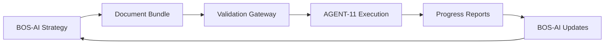

# BOS-AI ↔ AGENT-11 Integration Guide

**Version**: 1.0.0  
**Last Updated**: 2025-01-29  
**Status**: Production Ready

## Overview

The BOS-AI ↔ AGENT-11 Integration System creates a seamless bridge between business strategy (BOS-AI) and technical execution (AGENT-11) through standardized document handoffs. This guide explains how both systems work together to transform strategic vision into working software.

### Core Concept



The integration is **document-based** - no direct communication between AI systems. Instead, structured documents serve as the communication protocol, ensuring clarity, version control, and human oversight.

## Key Benefits

### For Business Users
- **Strategic Clarity**: Requirements are captured in business-friendly language before technical implementation
- **Progress Visibility**: Regular automated reports show development status in business terms
- **Change Control**: Structured process for requirement changes and scope adjustments
- **Quality Assurance**: Validation ensures complete, consistent requirements before development

### For Technical Teams  
- **Complete Context**: Receive full business rationale, not just feature lists
- **Structured Requirements**: Consistent document formats with all necessary technical details
- **Progress Tracking**: Automated reporting reduces manual status update overhead
- **Change Management**: Clear process for handling requirement changes and clarifications

### For Solo Founders
- **Reduced Context Switching**: Clear separation between strategic thinking and technical execution
- **Consistency**: Standardized approach works across multiple projects
- **Scalability**: Process scales from MVP to complex products
- **Quality**: Built-in validation prevents incomplete or inconsistent requirements

## Integration Architecture

### Document-Based Communication

The integration uses structured documents instead of direct AI-to-AI communication:

**Advantages:**
- Human oversight and control at every step
- Clear audit trail of decisions and changes
- Version control and rollback capabilities
- System independence (either system can be upgraded separately)

**Trade-offs:**
- Requires manual approval for handoffs (by design)
- Less real-time than direct integration
- Depends on document quality and completeness

### System Boundaries

```
┌─────────────────┐    Document    ┌─────────────────┐
│    BOS-AI       │    Bundle      │   AGENT-11      │
│                 │   ========>    │                 │
│ • Strategy      │                │ • Development   │
│ • Planning      │   <========    │ • Testing       │
│ • Analysis      │   Progress     │ • Deployment    │
│                 │   Reports      │                 │
└─────────────────┘                └─────────────────┘
```

**BOS-AI Responsibilities:**
- Market analysis and competitive research
- Product strategy and roadmap development
- User research and persona development
- Business requirements definition
- Success metrics and KPI definition
- Brand guidelines and design principles

**AGENT-11 Responsibilities:**
- Technical architecture design
- Software development and testing
- DevOps and deployment
- Performance optimization
- Security implementation
- Progress reporting and status updates

## Document Bundle System

### Bundle Components

Every handoff includes a complete document bundle with these components:

#### Core Requirements
- **prd.md**: Product Requirements Document with user stories and acceptance criteria
- **context.md**: Business context, market analysis, and decision rationale
- **client-blueprint.md**: Success metrics, KPIs, and measurement criteria

#### Design Specifications
- **brand-guidelines.md**: Visual identity, colors, typography, and brand voice
- **design-system.md**: UI components, patterns, and interaction guidelines (when applicable)
- **user-experience.md**: User journeys, workflows, and experience requirements

#### Strategic Direction
- **vision.md**: Long-term product vision and strategic goals
- **roadmap.md**: Feature evolution and development phases
- **market-analysis.md**: Competitive landscape and positioning

#### Bundle Metadata
- **manifest.yaml**: Bundle version, validation status, and change tracking

### Bundle Validation

Before handoff, every bundle undergoes automated validation:

1. **Schema Compliance**: YAML frontmatter structure validation
2. **Content Completeness**: Required sections and minimum content standards
3. **Cross-Reference Integrity**: Internal links and document dependencies
4. **Version Consistency**: All documents properly versioned and synchronized
5. **Business Logic**: Requirements completeness and feasibility checks

## Integration Workflow

### 1. Strategy Phase (BOS-AI)

**Inputs:**
- Market opportunity or problem statement
- Business goals and constraints
- Target user research
- Competitive landscape analysis

**Outputs:**
- Complete document bundle
- Validated requirements
- Success criteria definition
- Strategic roadmap

**Duration**: Typically 2-5 days depending on project complexity

### 2. Handoff Phase (Validation Gateway)

**Process:**
- Automated bundle validation
- Completeness verification
- Schema compliance check
- Business logic validation
- Human approval gate (optional)

**Success Criteria:**
- 95%+ validation success rate
- Zero missing required fields
- All cross-references resolved
- Bundle integrity verified

**Duration**: 5-15 minutes for automated validation

### 3. Execution Phase (AGENT-11)

**Process:**
- Bundle analysis and technical planning
- Architecture design and technology selection
- Development implementation
- Testing and quality assurance
- Deployment and monitoring

**Tracking:**
- Automated progress reports
- Issue identification and resolution
- Change requests when needed
- Success metrics monitoring

**Duration**: Varies by project scope (1-12 weeks typical)

### 4. Reporting Phase (Continuous)

**Automated Reports:**
- **Weekly**: Progress summary, completed tasks, upcoming work
- **Milestone**: Feature completion, testing results, deployment status
- **Critical**: Blockers, scope changes, timeline impacts

**Manual Reports:**
- Change requests requiring business approval
- Technical constraint discoveries
- Alternative solution proposals

## Getting Started

### For BOS-AI Users

1. **Complete Strategic Analysis**
   - Define the market opportunity clearly
   - Identify target users and their needs
   - Research competitive landscape
   - Establish success metrics

2. **Create Document Bundle**
   - Use provided templates for each document type
   - Include all required sections and metadata
   - Ensure cross-references are accurate
   - Version all documents consistently

3. **Validate and Handoff**
   - Run validation pipeline on completed bundle
   - Address any validation errors or warnings
   - Approve bundle for handoff to AGENT-11
   - Monitor handoff acknowledgment

### For AGENT-11 Users

1. **Receive and Analyze Bundle**
   - Verify bundle integrity and completeness
   - Analyze business requirements and constraints
   - Identify technical challenges and dependencies
   - Create technical implementation plan

2. **Begin Development**
   - Set up project structure and tooling
   - Implement features according to requirements
   - Maintain alignment with business goals
   - Track progress against success metrics

3. **Report Progress**
   - Generate automated status reports
   - Escalate blockers and issues promptly
   - Request clarifications when needed
   - Document lessons learned

## Success Metrics

### Integration Health
- **Bundle Validation Success**: >95% of bundles pass validation on first attempt
- **Handoff Time**: Complete handoff process in <5 minutes
- **Context Preservation**: 100% of business decisions traceable through development
- **Automation Rate**: >90% of standard operations automated

### Process Quality
- **Requirement Completeness**: <5% of projects require major scope clarification
- **Timeline Accuracy**: Delivered within 20% of estimated timeline
- **Change Request Rate**: <10% of requirements change during development
- **Stakeholder Satisfaction**: >90% satisfaction with handoff process

### Business Impact
- **Time to Market**: 30% faster than traditional handoff methods
- **Development Efficiency**: 25% fewer development iterations needed
- **Quality Score**: >95% of features meet acceptance criteria on first delivery
- **Rework Rate**: <5% of completed features require significant rework

## Common Use Cases

### MVP Development
**Scenario**: Solo founder needs to build and validate an initial product
- BOS-AI creates lean requirements focused on core value proposition
- AGENT-11 builds minimal viable product with essential features
- Rapid iteration based on user feedback and metrics

### Feature Enhancement
**Scenario**: Existing product needs new capabilities
- BOS-AI analyzes user feedback and market opportunities
- Creates focused requirements for specific enhancements
- AGENT-11 integrates new features while maintaining system stability

### Product Pivot
**Scenario**: Strategic direction change based on market learnings
- BOS-AI redefines target market and value proposition
- Updates all strategic documents with new direction
- AGENT-11 adapts existing system or rebuilds as needed

### Scale Preparation
**Scenario**: Product success requires infrastructure scaling
- BOS-AI defines performance requirements and user growth projections
- AGENT-11 redesigns architecture for scalability
- Systematic migration and performance validation

## Integration Best Practices

### For Strategic Planning
- **Start with Why**: Always document business rationale before features
- **User-Centric**: Ground all requirements in real user needs and behaviors
- **Measurable Goals**: Define specific, measurable success criteria
- **Context Rich**: Include market conditions and constraints that inform decisions

### For Technical Implementation
- **Business Alignment**: Regularly verify implementation matches business intent
- **Progress Transparency**: Report status in business-friendly language
- **Proactive Communication**: Surface issues and constraints early
- **Decision Documentation**: Record technical decisions and trade-offs

### For Process Management
- **Version Discipline**: Maintain strict version control across all documents
- **Change Control**: Use structured process for requirement modifications
- **Quality Gates**: Don't skip validation steps even under time pressure
- **Learning Capture**: Document lessons learned for future projects

## Troubleshooting Quick Reference

### Bundle Validation Failures
**Problem**: Bundle fails validation
**Solution**: Check validation report for specific errors, fix document structure or content, re-run validation

### Missing Business Context
**Problem**: Development team needs clarification on requirements
**Solution**: Create change request document, submit through proper channels, wait for BOS-AI response

### Progress Reporting Issues
**Problem**: Automated reports not generating correctly
**Solution**: Verify project structure matches expected format, check git repository status, review reporting configuration

### Integration Pipeline Failures
**Problem**: Handoff process fails or hangs
**Solution**: Check system dependencies, verify directory permissions, review integration logs

For detailed troubleshooting guidance, see [TROUBLESHOOTING.md](./TROUBLESHOOTING.md).

## Next Steps

1. **Review Architecture**: Read [BOS-AI-AGENT-11-INTEGRATION-ARCHITECTURE.md](./BOS-AI-AGENT-11-INTEGRATION-ARCHITECTURE.md) for technical details
2. **Study Workflows**: Examine [WORKFLOWS.md](./WORKFLOWS.md) for detailed process flows
3. **Plan Deployment**: Follow [DEPLOYMENT.md](./DEPLOYMENT.md) for installation and setup
4. **Understand Standards**: Review [INTEGRATION-STANDARDS.md](./INTEGRATION-STANDARDS.md) for document formats and conventions

## Support and Resources

- **Integration Architecture**: Technical system design and specifications
- **Implementation Plan**: Detailed development roadmap and milestones
- **Process Documentation**: Step-by-step workflow guides
- **Template Library**: Standardized document templates and examples
- **Validation Tools**: Automated quality assurance and checking utilities

This integration system represents a new paradigm in AI-assisted development: structured, transparent, and human-controlled collaboration between strategic AI and technical AI systems.