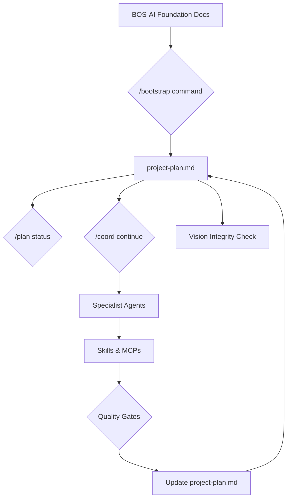

# Agent-11: The SaaS Boilerplate Killer

## Final Synthesis of 30 LLM Reviews (5 Rounds × 6 LLMs)

**Author:** Manus AI
**Date:** December 29, 2025

### 1. Executive Summary

This document represents the final, consolidated architecture for transforming Agent-11 into a "SaaS Boilerplate Killer." It is the result of an exhaustive, iterative review process involving 30 distinct analyses from 6 leading Large Language Models (LLMs) over 5 rounds of refinement. The final architecture is a robust, Claude Code-native system that leverages a `project-plan.md` as its central orchestration layer, ensuring a deterministic, vision-aligned, and highly automated development process.

The consensus from all LLMs is that the architecture is **complete and implementation-ready**. The focus should now shift from architectural design to the creation of concrete schemas, commands, and a reference implementation.

### 2. The Final Architecture: Project Plan as Orchestrator

The core innovation is the shift to `project-plan.md` as the central control system. This document is not merely a plan; it is the living state file for the entire project, driving every action Agent-11 takes.

**Key Components:**

| Component | Implementation | Purpose |
|---|---|---|
| **Project Plan** | `project-plan.md` with formal schema | The central orchestration layer |
| **Rolling Wave Planning** | `phase-N-context.yaml` files | Manages context window efficiently |
| **Quality Gates** | `project/gates/phase-N.json` | Enforces quality and correctness |
| **Skills** | `.claude/skills/saas-*/SKILL.md` | Encapsulated, reusable domain expertise |
| **Missions** | `/missions/mission-saas.md` | Defines the high-level workflow |
| **Commands** | `.claude/commands/plan.md` | The user interface for the project plan |

### 3. The "Tuesday Morning" Workflow

This architecture solves the "what do I do next?" problem for the solo founder:

1.  **Open VS Code** with the project.
2.  **Open the Claude Code panel**.
3.  **Type `/plan status`**: See current phase, task, and vision alignment.
4.  **Type `/coord continue`**: The agent resumes work, reading the plan, loading context, and delegating to specialists.
5.  **Agent-11 works**: Executes tasks, runs tests, and updates the plan.
6.  **Repeat**.

### 4. Synthesized Insights from 30 LLM Reviews

This table summarizes the most critical, validated insights from all 30 reviews, which have been integrated into the final v5 architecture.

| Category | Key Features | Originating LLMs |
|---|---|---|
| **Core Architecture** | `project-plan.md` as orchestrator, Rolling Wave Planning, `/plan` vs `/coord` ownership contract | Perplexity, Claude, Gemini |
| **Governance & Safety** | Quality Gates, Plan Locking, Adaptation Protocol, Vision Integrity Checks, Regression Memory | GPT, Gemini, DeepSeek |
| **Developer Experience** | "Tuesday Morning" workflow, Two-Tier Entry (Zero-Thinking vs Full Power), Guided First Run, Context Debugger | GPT, Perplexity, Gemini |
| **Implementation** | Formal schemas (plan, context, gates), Skill Contracts, Bootstrap command, Plan Archiving | Claude, GPT, Gemini |
| **Advanced Features** | Self-Healing CI, Multi-LLM Routing, Migration Mode, Quantitative Benchmarking | Gemini, Grok, GPT |

### 5. The Universal Consensus: Next Steps

Across all 30 reviews, a clear consensus emerged on how to proceed.

**1. Freeze Architecture:** The v5 design is complete. No further architectural iteration is needed.

**2. Prioritize Implementation Specificity:** The immediate focus must be on creating the concrete schemas and commands that define the system.

| Priority | Artifact | Purpose |
|---|---|---|
| **P0** | `schemas/project-plan.schema.yaml` | The DNA of the entire system. |
| **P0** | `commands/bootstrap.md` | The command to create the initial project plan. |
| **P1** | `commands/plan.md` | The user's primary interface to the system. |
| **P1** | `CLAUDE.md` additions for Coordinator | Teach the Coordinator to read and update the plan. |

**3. Build a "Tracer Bullet" Implementation:** Prove the core loop works end-to-end.

> "Do not build the whole system yet. Build the **Skeleton** to prove the `project-plan.md` flow works." - Gemini

This involves:
1.  Defining the `project-plan.schema.yaml`.
2.  Creating the `/bootstrap` command to generate a valid plan from a dummy `vision.md`.
3.  Running the "Tuesday Morning" test manually to validate the flow.

**4. Ship a Reference SaaS:** The ultimate proof is a real, working SaaS application built entirely with this system.

> "Freeze architecture. Move to documentation + examples. Ship a reference SaaS built entirely with agent-11." - GPT

### 6. Conclusion

The journey through 30 LLM reviews has forged a powerful, coherent, and actionable architecture. The initial vision of a "SaaS Boilerplate Killer" has evolved into something far more profound: a **disciplined, AI-native system of practice** for building high-quality software. The path forward is clear and implementation-focused.

---

### References

This document synthesizes insights from 30 unpublished reviews conducted between December 2025 and the present date, provided by the following Large Language Models: Gemini, GPT, Claude, DeepSeek, Perplexity, and Grok.
