<div align="center">

# AGENT-11™

### Your Elite AI Development Squad

[](https://claude.ai)
[](QUICK-START.md)
[](INSTALLATION.md)
[](project/agents/)
[](project/missions/)
[](project/field-manual/mcp-integration.md)
[](LICENSE)

[](https://github.com/TheWayWithin/agent-11/stargazers)
[](https://buymeacoffee.com/jamiewatters)

**One Founder. Eleven Specialists. Unlimited Potential.**

*If AGENT-11 has saved you time or helped you ship faster, consider ⭐ [starring the repo](https://github.com/TheWayWithin/agent-11) or [buying me a coffee](https://buymeacoffee.com/jamiewatters) ☕ to support development!*

[🆕 First Time?](#-first-time-start-here) · [🚀 Quick Start](#-quick-start-5-minutes) · [🎯 Workflows](#-common-workflows) · [📖 Docs](#-complete-documentation) · [💬 Support](#-join-the-elite)

</div>

---

## What is AGENT-11?

AGENT-11 deploys 11 specialized AI agents to your project, orchestrating them through proven workflows to build production-ready software. Think of it as **hiring an elite development team** - except they're AI agents working together seamlessly.

**Instead of prompting Claude Code for every task, AGENT-11 provides:**
- 🎯 **Specialized Agents** - Each with domain expertise (requirements, architecture, coding, testing, design, etc.)
- 🎖️ **Coordinated Workflows** - 20 pre-built missions that orchestrate multiple agents automatically
- 🧠 **Persistent Context** - Knowledge that survives across sessions and agent handoffs
- ✅ **Quality Assurance** - Built-in testing, verification, and security protocols

### How AGENT-11 Works with BOS-AI

AGENT-11 is the **technical execution arm** of the BOS-AI ecosystem. BOS-AI handles strategic planning (30 business agents) → AGENT-11 handles software development (11 technical agents).

**You can use AGENT-11 standalone** without BOS-AI. [→ Complete BOS-AI Integration Guide](project/field-manual/bos-ai-integration-guide.md)

---

## 🆕 First Time? Start Here

**Complete setup from scratch in 5 minutes.** If you already have a project with git initialized, skip to [Quick Start](#-quick-start-5-minutes).

### Prerequisites

- **Claude Code** installed and running ([Get Claude Code](https://claude.ai/code))
- **GitHub CLI** for repo creation: `brew install gh` (macOS) or [GitHub CLI install](https://cli.github.com/)
- **BOS-AI documents** (optional): PRD, Vision, Brand docs from BOS-AI

### Step-by-Step: New Project Setup

```bash
# 1. Create your project directory
mkdir my-project && cd my-project

# 2. Initialize git
git init

# 3. Create GitHub repository (private recommended)
gh repo create my-project --private --source=. --push

# 4. Install AGENT-11
curl -sSL https://raw.githubusercontent.com/TheWayWithin/agent-11/main/project/deployment/scripts/install.sh | bash -s full

# 5. Restart Claude Code
/exit
claude
```

### After Installation: Choose Your Path

**Path A: Using BOS-AI Documents** (recommended for new products)
```bash
# Copy your BOS-AI documents
mkdir -p documents/foundations
cp ~/path/to/bos-ai-docs/*.md documents/foundations/

# Run the full workflow
/foundations init    # Process docs into structured YAML
/architect           # Design system architecture (select "Engaged Mode")
/bootstrap           # Generate project plan (select "Engaged Mode")
/plan status         # Verify everything is ready
/coord continue      # Start autonomous execution
```

**Path B: Starting from Scratch** (no BOS-AI docs)
```bash
# Create a simple vision document
echo "# My Product\n\nDescription of what I want to build..." > vision.md

# Initialize with dev-setup mission
/coord dev-setup vision.md

# Or jump straight to MVP
/coord mvp vision.md
```

**Path C: Existing Codebase** (adding AGENT-11 to existing project)
```bash
# Analyze existing project and create docs
/coord dev-alignment
```

[→ Detailed setup guide](docs/guides/new-project-setup.md) | [→ Troubleshooting](docs/guides/essential-setup.md#troubleshooting)

---

### The Complete Workflow: Idea → Shipped Product

```
BOS-AI Documents → /foundations init → /architect → /bootstrap → /coord continue → 🚀 Shipped
```

| Step | Command | What It Does | Mode Recommendation | Time |
|------|---------|--------------|---------------------|------|
| **1. Process Docs** | `/foundations init` | Extracts PRD, Vision, ICP, Brand into structured YAML | N/A (automatic) | 2-5 min |
| **2. Design System** | `/architect` | Interactive architecture decisions → creates architecture.md | **Engaged Mode** (first time) | 10-15 min |
| **3. Generate Plan** | `/bootstrap` | Generates phased project-plan.md with tasks | **Engaged Mode** (first time) | 1-5 min |
| **4. Check Status** | `/plan status` | Shows current phase, progress, blockers | N/A | Instant |
| **5. Execute** | `/coord continue` | Autonomous execution until blocked or phase complete | N/A | Hours-Days |

#### Step-by-Step Walkthrough

<details>
<summary><strong>Step 1: /foundations init</strong> - Process your BOS-AI documents</summary>

```bash
# First, copy your BOS-AI documents to the foundations directory
mkdir -p documents/foundations
cp ~/Documents/BOS-AI/*.md documents/foundations/

# Then run the extraction
/foundations init
```

**What happens**: Scans `documents/foundations/` and extracts structured YAML from each document type (PRD → features, tech stack; Vision → goals, mission; Brand → colors, typography, etc.)

**Output**: Creates `.context/structured/*.yaml` files that agents can parse directly

**When to re-run**: After editing any foundation document, run `/foundations refresh` to sync changes

[→ Full /foundations documentation](#-foundations---document-processing)
</details>

<details>
<summary><strong>Step 2: /architect</strong> - Design your system architecture</summary>

```bash
/architect                    # Interactive mode selection (recommended)
/architect --mode engaged     # Skip selection, go straight to engaged
/architect --mode auto        # Use PRD defaults (experienced users)
```

**Mode Selection**:
- **Engaged Mode** (recommended for new projects): Walks you through 7 decision areas with explanations and trade-offs. Takes 10-15 minutes but prevents costly mistakes.
- **Auto Mode**: Uses tech stack from PRD + sensible defaults. Best for regenerating after minor changes or when you know exactly what you want.

**The 7 Decision Areas** (Engaged Mode):
1. **Application Architecture**: Monolith vs modular vs microservices
2. **Frontend Stack**: Framework version, rendering strategy, styling, component library
3. **Backend & Database**: Database config, multi-tenancy strategy, API layer approach
4. **Authentication**: Provider selection, auth methods, session strategy, user roles
5. **External Integrations**: Payments (billing model, webhooks), AI models, email service
6. **Infrastructure**: Frontend/backend hosting, CI/CD pipeline, environments
7. **Security & Observability**: API security, error tracking, analytics, logging

**Output**: Creates comprehensive `architecture.md` (~400 lines) with system diagrams, decision log, and integration patterns

**Prerequisites**: Must run `/foundations init` first

[→ Full /architect documentation](#-architect---system-design)
</details>

<details>
<summary><strong>Step 3: /bootstrap</strong> - Generate your project plan</summary>

```bash
/bootstrap                    # Interactive mode selection (recommended)
/bootstrap --mode engaged     # Review PRD assumptions with checkpoints
/bootstrap --mode auto        # Generate immediately (no questions)
/bootstrap --mode preview     # Preview without writing files
```

**Mode Selection**:
- **Engaged Mode** (recommended for new projects): Reviews 5 checkpoints to validate PRD assumptions before generating. Catches misunderstandings early.
- **Auto Mode**: Trusts your PRD completely and generates immediately. Best for validated PRDs or regeneration.
- **Preview Mode**: Shows what would be generated without creating files.

**The 5 Checkpoints** (Engaged Mode):
1. **Foundation Summary**: Verify product info and P0 features extracted correctly
2. **Tech Stack**: Confirm framework versions, integrations, AI model selections
3. **Priority Validation**: Review P0/P1/P2 feature assignments
4. **Phase Structure**: Approve phase breakdown and task distribution
5. **Final Confirmation**: Review all decisions before generating

**Output**: Creates phased `project-plan.md` with:
- Phase 1: Fully detailed with tasks, acceptance criteria, and quality gates
- Phase 2+: Outlined with key milestones (rolling wave planning)

**Prerequisites**: Must run `/foundations init` first

[→ Full /bootstrap documentation](#-bootstrap---plan-generation)
</details>

<details>
<summary><strong>Step 4: /plan status</strong> - Check progress</summary>

```bash
/plan status    # Overview of current state
/plan phase 1   # Deep dive into specific phase
/plan next      # What's coming up
```

**What it shows**: Current phase, completed tasks, blockers, next actions, quality gate status

[→ Full /plan documentation](#-plan---project-state-management)
</details>

<details>
<summary><strong>Step 5: /coord continue</strong> - Autonomous execution</summary>

```bash
/coord continue    # Execute until blocked or phase complete
```

**What happens**: The Coordinator reads `project-plan.md`, identifies the next task, delegates to the appropriate specialist (Developer, Tester, etc.), verifies completion, and moves to the next task.

**When it stops**: At phase boundaries, when blocked by a question, or when quality gates need verification.

**After phase complete**:
```bash
/coord complete phase 1    # Generate next phase context
/clear                     # Clear conversation context
/coord continue            # Resume from project-plan.md
```

[→ Full mission orchestration documentation](#-coord---mission-orchestration)
</details>

#### Quick Start Command Sequence

```bash
# 1. Copy your BOS-AI docs to the project
cp ~/Documents/BOS-AI/*.md ./documents/foundations/

# 2. Process foundation documents
/foundations init

# 3. Design architecture (FIRST TIME: select "Engaged Mode" when prompted)
/architect

# 4. Generate project plan (FIRST TIME: select "Engaged Mode" when prompted)
/bootstrap

# 5. Review what was created
/plan status

# 6. Start building (autonomous)
/coord continue
```

**Skip BOS-AI?** Start directly with `/coord dev-setup vision.md` or `/coord mvp requirements.md`

---

## 🆕 Current Version: v5.1.0

**Latest**: Structured context system with 100% data preservation in foundation processing.

[→ Full Release History](docs/RELEASE-HISTORY.md) - Complete sprint-by-sprint changelog

---

## Is AGENT-11 Right for You?

### ✅ Perfect For:
- **Solo founders** building products without technical teams
- **Developers** who want structured AI assistance with quality assurance
- **Technical projects** requiring multiple specialties (frontend, backend, DevOps, testing)
- **Long-running projects** needing context preservation across sessions

### ❌ Not Ideal For:
- Simple scripts or one-off tasks (use Claude Code directly)
- Projects requiring constant human oversight (AGENT-11 is autonomous)
- Non-technical work (use BOS-AI for business operations)

## What You Can Build

**The Ultimate Proof: AGENT-11 Built by AGENT-11**

The deployment system you just used was built by AGENT-11 itself—from concept to working system in under 1 day. Complete automated installation, agent orchestration, configuration management, and error handling. 98% success rate, <1 second deployment.

**If AGENT-11 can build itself, it can build anything.**

**Your projects can include:**
- SaaS applications with AI analysis, authentication, payment processing
- Marketplace platforms with OAuth, reviews, community features
- Web applications with Next.js, React, Tailwind CSS, modern stacks
- API services with REST/GraphQL endpoints, third-party integrations
- Business tools with analytics, automation, data pipelines

**Time to MVP**: 1-3 days with `/coord mvp` mission

[→ See 7+ Real Production Projects](docs/PROJECTS-BUILT-WITH-AGENT-11.md)

## Why AGENT-11 Works

**The SaaS Boilerplate Killer**: Why pay $300-500 for a static starter kit that still needs customization? AGENT-11 builds your entire application from scratch—authentication, payments, dashboards, APIs—all tailored to your exact requirements. No boilerplate limitations. No template constraints. Just your vision, built to spec.

**Proven Performance** (v2.0 Results):
- **100% file persistence** - Architectural solution eliminates silent failures completely
- **39% effectiveness improvement** - Extended thinking + self-verification for better decisions
- **84% token reduction** - Context editing + memory optimization enables 30+ hour missions
- **37.5% faster missions** - Zero rework from file persistence failures
- **Time to MVP**: Traditional team (3-6 months) → AGENT-11 (2-4 weeks)
- **Cost per Feature**: Traditional ($10-50k) → AGENT-11 (<$500)

[→ Complete Performance Metrics](docs/features/performance.md)

## Your Squad

**Core Squad (4 agents)**:
- 🎯 **Strategist** - Product vision and requirements analysis
- 💻 **Developer** - Code implementation at light speed
- ✅ **Tester** - Zero bugs reach production (SENTINEL Mode)
- 🚀 **Operator** - Deploy with confidence

**Specialist Squad (7 agents)**:
- 🏗️ **Architect** - Bulletproof technical decisions
- 🎨 **Designer** - Interfaces that convert (RECON Protocol)
- 📚 **Documenter** - Knowledge captured perfectly
- 💬 **Support** - Users become advocates
- 📊 **Analyst** - Data drives decisions
- 📈 **Marketer** - Growth on autopilot
- 🎖️ **Coordinator** - Mission commander (PARALLEL STRIKE)

[→ Complete Agent Reference](project/agents/full-squad.md)

## 🚀 Quick Start (5 Minutes)

### Installation

```bash
# Navigate to your project directory
cd /path/to/your/project

# Deploy AGENT-11
curl -sSL https://raw.githubusercontent.com/TheWayWithin/agent-11/main/project/deployment/scripts/install.sh | bash -s full

# Restart Claude Code
/exit
claude
```

**Prerequisites**: Project needs git repo, README, or package file (`package.json`, `requirements.txt`)

### Verification

```bash
/agents                                      # List deployed agents (should show 11)
@strategist What should we build first?     # Test an agent
```

### First Mission

**From BOS-AI docs**: `/foundations init` → `/architect` → `/bootstrap` → `/coord continue` (full workflow)
**Existing project**: `/coord dev-alignment` (analyzes codebase, creates docs)
**New project**: `/coord dev-setup vision.md` (initializes project structure)
**Build feature**: `/coord build requirements.md`

**→ Complete setup guide**: [Essential Setup Guide](docs/guides/essential-setup.md) for installation troubleshooting, MCP setup, and detailed verification steps.

## 🎯 Common Workflows

Learn the most common AGENT-11 workflows with real examples, time estimates, and expected outcomes.

### Quick Reference

| Workflow | Command | Duration | Use Case |
|----------|---------|----------|----------|
| **MVP** | `/coord mvp vision.md` | 1-3 days | Rapid prototyping with auth, payments, deployment |
| **Bug Fix** | `/coord fix bug-report.md` | 2-4 hours | Root cause analysis, fix, regression tests |
| **Design Review** | `/design-review` | 1-2 hours | 7-phase UI/UX audit (RECON Protocol) |
| **Feature** | `/coord build requirements.md` | 4-8 hours | Complete feature with tests and docs |
| **Security** | `/coord security` | 2-3 hours | Vulnerability scanning, compliance checks |
| **Refactor** | `/coord refactor target.md` | 2-4 hours | Code quality improvement, tech debt |
| **Performance** | `/coord optimize metrics.md` | 3-6 hours | Bottleneck identification, optimization |
| **Deploy** | `/coord deploy` | 1-2 hours | Production deployment with monitoring |

### Workflow Details

**1. MVP Development** - Build production-ready MVP in 1-3 days
- Full stack: auth, payments, testing, deployment
- Example: [LLM.txt Mastery](https://llmtxtmastery.com) built in 3 days
- Cost: $5-10 in API usage

**2. Bug Fixes** - Debug and resolve production issues in 2-4 hours
- Root cause analysis, fix implementation, regression tests
- Cost: $0.50-1.50 in API usage

**3. Design Review** - Comprehensive UI/UX audit in 1-2 hours
- 7-phase RECON Protocol: Interaction, responsive, visual, accessibility, robustness, performance
- Deliverables: Issues classified by severity, screenshots, compliance report
- Cost: $0.50-1 in API usage

**4. Feature Development** - Build complete features in 4-8 hours
- Strategist → Architect → Developer → Tester → Documenter workflow
- Deliverables: Code, tests, API docs, deployment checklist
- Cost: $1-3 in API usage

**5. Security Audit** - Comprehensive security review in 2-3 hours
- OWASP Top 10, dependency scanning, compliance validation (SOC2, GDPR)
- Deliverables: Vulnerability report, fixes, security documentation
- Cost: $2-4 in API usage

**6. Code Refactoring** - Improve code quality in 2-4 hours
- Technical debt reduction, performance improvements
- All tests pass (no functionality changes)
- Cost: $0.75-2 in API usage

**7. Performance Optimization** - Tune application performance in 3-6 hours
- Bottleneck identification, query optimization, caching strategy
- Deliverables: Before/after benchmarks, performance report
- Cost: $1.50-3 in API usage

**8. Production Deployment** - Safe deployment in 1-2 hours
- Pre-deployment tests, zero-downtime deploy, monitoring, rollback plan
- Deliverables: Live deployment, smoke tests, runbook
- Cost: $0.50-1 in API usage

**→ Complete workflow guide**: [Common Workflows Guide](docs/guides/common-workflows.md) for:
- Detailed mission breakdowns with agent sequences
- Real-world examples and expected outcomes
- Recovery strategies for interrupted missions
- Verification procedures and deliverable checklists

### More Workflows

AGENT-11 includes 20 pre-built missions covering every development need:

**Setup & Initialization:**
- [DEV-SETUP](project/missions/dev-setup.md) - New project initialization (30-45 min)
- [DEV-ALIGNMENT](project/missions/dev-alignment.md) - Understand existing project (45-60 min)
- [CONNECT-MCP](project/missions/connect-mcp.md) - Setup external integrations (45-90 min)

**Development Operations:**
- [REFACTOR](project/missions/mission-refactor.md) - Code quality improvement (2-4 hours)
- [DEPLOY](project/missions/mission-deploy.md) - Production deployment (1-2 hours)
- [DOCUMENT](project/missions/mission-document.md) - Documentation creation (2-4 hours)
- [MIGRATE](project/missions/mission-migrate.md) - System migration (4-8 hours)

**Performance & Quality:**
- [OPTIMIZE](project/missions/mission-optimize.md) - Performance tuning (3-6 hours)
- [INTEGRATE](project/missions/mission-integrate.md) - Third-party APIs (3-6 hours)
- [RELEASE](project/missions/mission-release.md) - Release management (2-4 hours)

[→ See all 20 missions with commands](#-mission-library-20-missions)

[→ Mission execution guide](project/field-manual/mission-execution-cheatsheet.md) - Complete execution manual

## ⚙️ Essential Setup

Beyond basic installation, configure advanced features for production readiness.

### Testing Infrastructure

Automatic setup during missions. Manual: `@tester "Set up testing infrastructure"`

[→ Testing Guide](#-testing--quality-assurance)

---

### MCP Integration

**Running out of context during long missions?** AGENT-11's MCP system optimizes context usage for your workflow.

#### 🚀 Dynamic Tool Loading (v5.2.0+ - Recommended)

The new **dynamic MCP tool loading** system eliminates manual profile switching with **93% context reduction**:

| Approach | Initial Context | Reduction |
|----------|-----------------|-----------|
| All Tools (static) | 51,000 tokens | baseline |
| Profile-based (legacy) | 3,000-15,000 tokens | 40-80% |
| **Dynamic Loading** | **3,300 tokens** | **93%** |

**How it works**: Agents discover and load tools on-demand using Tool Search. No profile switching required.

**Quick Setup (Dynamic):**
```bash
# Use dynamic MCP configuration
cp project/mcp/dynamic-mcp.json .mcp.json

# Configure API keys
cp .env.mcp.template .env.mcp
# Edit .env.mcp with your credentials

# Restart Claude Code
```

**Documentation:**
- [📖 MCP Setup Guide](docs/MCP-GUIDE.md) - Complete setup and usage instructions
- [🔄 Migration Guide](docs/MCP-MIGRATION-GUIDE.md) - Migrate from profiles to dynamic loading
- [🔧 Troubleshooting](docs/MCP-TROUBLESHOOTING.md) - Common issues and solutions

#### Legacy: Profile-Based System

Profile-based MCP switching is still supported. See [MCP-PROFILES.md](docs/MCP-PROFILES.md) for documentation.

---

### Project Initialization

**New**: `/coord dev-setup ideation.md` (30-45 min) | **Existing**: `/coord dev-alignment` (45-60 min)

[→ Greenfield](project/field-manual/greenfield-implementation.md) | [→ Brownfield](project/field-manual/brownfield-implementation.md)

## 🏗️ How AGENT-11 Works

Understanding the architecture helps you maximize effectiveness through visual diagrams and clear explanations.

### System Architecture Overview


**Three-Layer Architecture Explained:**

1. **Mission Layer** - 20 pre-built missions + custom workflows via `/coord`
2. **Coordination Layer** - Context preservation, parallel execution, dependency resolution
3. **Specialist Layer** - 11 agents with domain expertise, tool permissions, extended thinking, self-verification

[→ Complete agent reference](#your-squad)

---

### Agent Collaboration Flow

How specialists work together with zero context loss:

```mermaid
sequenceDiagram
    participant U as 👤 User
    participant C as 🎖️ Coordinator
    participant S as 🎯 Strategist
    participant A as 🏗️ Architect
    participant D as 💻 Developer
    participant T as ✅ Tester
    participant AC as 📝 agent-context.md
    participant HN as 🤝 handoff-notes.md

    U->>C: /coord build requirements.md
    C->>AC: Read mission context
    C->>HN: Initialize handoff system

    Note over C: Phase 1: Analysis
    C->>S: Analyze requirements
    S->>AC: Read existing context
    S->>S: Create user stories (30-45 min)
    S->>HN: Write findings for Architect
    S->>AC: Update with decisions

    Note over C: Phase 2: Design
    C->>A: Design solution
    A->>AC: Read strategist findings
    A->>HN: Read specific handoff
    A->>A: Create architecture (30-45 min)
    A->>HN: Write specs for Developer
    A->>AC: Update with design decisions

    Note over C: Phase 3: Implementation
    C->>D: Implement feature
    D->>AC: Read all prior context
    D->>HN: Read architect specs
    D->>D: Write code + tests (2-4 hours)
    D->>HN: Document implementation
    D->>AC: Update with code decisions

    Note over C: Phase 4: Validation
    C->>T: Validate quality
    T->>AC: Read full mission context
    T->>HN: Read developer notes
    T->>T: Run comprehensive tests (1 hour)
    T->>HN: Report test results
    T->>AC: Final quality assessment

    C->>U: Mission complete ✅

    Note over AC,HN: Zero context loss!<br/>100% knowledge preserved
```



**Key Collaboration Principles:**
- **Sequential Handoffs** - Each agent reads context from previous agents via handoff-notes.md
- **Cumulative Knowledge** - All decisions stored in agent-context.md for mission-wide awareness
- **Zero Loss** - Every finding, decision, and issue preserved across the entire mission

---

### Context Management System

How AGENT-11 preserves 100% of knowledge across sessions and agent handoffs:

```mermaid
flowchart TD
    subgraph Input["📥 Mission Input"]
        MI["/coord build requirements.md"]
    end

    subgraph Context["🧠 Context Files"]
        AC["agent-context.md<br/>━━━━━━━━━━━<br/>• Mission objectives<br/>• All findings (cumulative)<br/>• Technical decisions<br/>• Known issues<br/>• Dependencies"]
        HN["handoff-notes.md<br/>━━━━━━━━━━━<br/>• Immediate task<br/>• Critical context<br/>• Warnings/blockers<br/>• Specific instructions<br/>• Test results"]
        ER["evidence-repository.md<br/>━━━━━━━━━━━<br/>• Screenshots<br/>• Code snippets<br/>• Test results<br/>• API responses<br/>• Error logs"]
    end

    subgraph Memory["💾 Persistent Memory"]
        MEM["/memories/<br/>━━━━━━━━━━━<br/>project/<br/>  - overview.xml<br/>  - architecture.xml<br/>technical/<br/>  - patterns.xml<br/>  - decisions.xml<br/>lessons/<br/>  - insights.xml"]
    end

    subgraph Agents["🤖 Agents"]
        A1[Agent reads context]
        A2[Agent performs work]
        A3[Agent updates context]
    end

    subgraph Output["📤 Deliverables"]
        PP["project-plan.md<br/>(What we're doing)"]
        PR["progress.md<br/>(What we did)"]
        CODE["Code, Tests, Docs"]
    end

    MI --> AC
    MI --> HN

    AC --> A1
    HN --> A1
    MEM --> A1

    A1 --> A2

    A2 --> A3

    A3 --> AC
    A3 --> HN
    A3 --> ER
    A3 --> MEM

    AC --> PP
    AC --> PR
    HN --> PP
    HN --> PR

    A2 --> CODE

    style AC fill:#e3f2fd
    style HN fill:#f3e5f5
    style ER fill:#fff3e0
    style MEM fill:#e8f5e9
    style A1 fill:#fffde7
    style A2 fill:#fffde7
    style A3 fill:#fffde7
```



**Context Preservation Protocol:**

1. **Before Task** - Agent reads agent-context.md + handoff-notes.md + /memories/
2. **During Task** - Agent maintains awareness of all prior decisions
3. **After Task** - Agent updates handoff-notes.md with findings for next specialist
4. **Coordinator** - Merges findings into agent-context.md for mission-wide knowledge

**Result**: Zero context loss, 100% knowledge retention across sessions

[→ Complete context management guide](project/field-manual/memory-management.md)

---

### Mission Execution Lifecycle

From command to deliverables - the complete mission workflow:


**Mission Phases Explained:**

1. **Planning** (5-10 min) - Coordinator reads mission, creates project-plan.md with phases
2. **Analysis** (30-45 min) - Strategist analyzes requirements, creates user stories
3. **Design** (30-45 min) - Architect designs system, selects technologies
4. **Implementation** (2-4 hours) - Developer writes code, creates tests
5. **Testing** (1 hour) - Tester validates quality, runs comprehensive test suite
6. **Verification** (15 min) - Self-verification protocols ensure completeness

**Total Time**: 4-8 hours for standard feature development

---

### Key Concepts

**Context Preservation**: Zero loss via agent-context.md + handoff-notes.md + /memories/. **Extended Thinking**: Ultrathink/Think harder/Think modes (39% effectiveness improvement). **Tool Permissions**: Least-privilege security model (64% read-only agents). **Parallel Execution**: Independent tasks run simultaneously for speed.

[→ Memory Management](project/field-manual/memory-management.md) | [→ Extended Thinking](project/field-manual/extended-thinking-guide.md) | [→ Tool Permissions](project/field-manual/tool-permissions-guide.md)

---

### BOS-AI Integration

**Workflow**: BOS-AI (strategy) → AGENT-11 (execution)

```bash
# 1. Copy BOS-AI outputs to ideation/
# 2. Initialize: /coord dev-setup ideation/PRD.md
# 3. Build: /coord build ideation/PRD.md
```

[→ Complete BOS-AI Integration Guide](project/field-manual/bos-ai-integration-guide.md)

## 🚀 Features & Capabilities

Complete overview of AGENT-11's capabilities organized by category.

### Context Management

100% knowledge retention with native memory API, zero-loss context preservation (agent-context.md, handoff-notes.md), and strategic /clear usage (84% token reduction enabling 30+ hour missions).

[→ Memory Management](project/field-manual/memory-management.md) | [→ Context Editing](project/field-manual/context-editing-guide.md)

---

### Project Management

Dual-file tracking (project-plan.md, progress.md with complete fix history), 20 pre-built mission workflows via `/coord`, automatic greenfield/brownfield bootstrap with CLAUDE.md generation.

[→ Progress Tracking](docs/guides/progress-tracking.md) | [→ Bootstrap Guide](project/field-manual/bootstrap-guide.md) | [→ Mission Library](#-mission-library-20-missions)

---

### Quality Assurance

SENTINEL Mode with separation of duties (zero bugs reach production), self-verification protocols (50% rework reduction), comprehensive testing (mcp__playwright, cross-browser, WCAG AA+).

[→ Testing Guide](#-testing--quality-assurance) | [→ Enhanced Prompting](project/field-manual/enhanced-prompting-guide.md)

---

### Advanced Capabilities

Extended thinking modes (Ultrathink/Think harder/Think hard/Think - 39% effectiveness improvement), 15+ MCP integrations (GitHub, Playwright, Context7, Firecrawl, Supabase), RECON Protocol design reviews with 7-phase audit, OpsDev workflow with staging validation.

[→ Extended Thinking](project/field-manual/extended-thinking-guide.md) | [→ Tool Permissions](project/field-manual/tool-permissions-guide.md) | [→ UI Doctrine](project/field-manual/ui-doctrine.md)

---

### Performance Metrics

<div align="center">

| Capability | Measurement | Impact |
|------------|-------------|--------|
| **Mission Success** | +15% (v4.0) | Opus 4.5 coordinator intelligence |
| **Cost Efficiency** | -24% total cost | Opus iterations offset token cost |
| **Agent Effectiveness** | 39% improvement | Extended thinking + self-verification |
| **Token Efficiency** | 84% reduction | Context editing + memory optimization |
| **MCP Context** | 60-90% reduction | Lean profile system (v4.1) |
| **Autonomous Operation** | 30+ hours | Multi-day missions without intervention |
| **Rework Reduction** | 50% fewer errors | Pre-handoff verification catches issues |
| **Context Retention** | 100% persistence | Zero knowledge loss across sessions |
| **Time to MVP** | 2-4 weeks | vs 3-6 months traditional |
| **Cost per Feature** | <$500 | vs $10-50k traditional |

</div>

[→ Complete Performance Analysis](docs/features/performance.md)

### Known Limitations

AGENT-11 is powerful but not unlimited. Understanding these constraints helps you work effectively within the system.

#### 1. Large Codebases
- **Issue**: Projects with >50 files may exceed context window during analysis
- **Workaround**: Break work into modules, use phased approach with multiple missions
- **Command**: `@coordinator "Focus only on [specific module/feature]"`

#### 2. Complex Dependencies
- **Issue**: Some packages require manual configuration (native bindings, platform-specific tools)
- **Workaround**: Let agents set up what they can, complete manual steps with provided instructions
- **Example**: Database setup, API key configuration, external service accounts

#### 3. Mission Interruptions
- **Issue**: If mission fails mid-way, context may be partially lost
- **Workaround**: Check progress.md for completed work, resume from last checkpoint
- **Command**: `@coordinator "Resume from last checkpoint in progress.md"`

#### 4. API Rate Limits
- **Issue**: Claude API rate limits may pause long-running missions (>2 hours)
- **Workaround**: Break into smaller phases, use `/clear` between phases to reset context
- **Recovery**: Wait 1-5 minutes, then continue with next phase

#### 5. Context Size Management
- **Issue**: Very large files (>2000 lines) or long conversations exceed context window
- **Workaround**: Use Glob/Grep for targeted searches instead of reading entire files
- **Command**: `@coordinator "Search for [specific pattern] instead of reading whole file"`

#### 6. Browser Automation Limitations
- **Issue**: Some JavaScript-heavy sites may not work with Playwright automation
- **Workaround**: Use manual testing for complex UI, automated for standard paths
- **When**: Design reviews of SPAs, PWAs, or sites with heavy client-side rendering

#### 7. Platform-Specific Issues
- **Issue**: Some commands work differently on Windows vs Mac vs Linux
- **Workaround**: Use cross-platform alternatives (npm scripts vs shell scripts)
- **Example**: Prefer `npx` over direct binary calls, Node.js scripts over bash

#### 8. Agent Specialization Boundaries
- **Issue**: Some tasks don't fit cleanly into one agent's role
- **Workaround**: Use `/coord` missions for cross-functional work requiring multiple agents
- **Example**: Security audit needs @architect + @developer + @tester coordination

#### 9. Learning Curve
- **Issue**: First-time users need 1-2 hours to understand agent system and workflows
- **Workaround**: Start simple - use `/meeting` for conversations, progress to single @agent commands, then to `/coord` missions
- **Progression**: Individual agents → simple missions → complex orchestration

#### 10. Single-User Operation
- **Issue**: No real-time collaboration between multiple humans on same project
- **Workaround**: Use git branches for parallel work, merge through standard PR process
- **Best Practice**: One person runs missions, team reviews results via PR

#### 11. Internet Dependency
- **Issue**: Requires active internet connection for Claude API access
- **Workaround**: Work offline on manual tasks, run missions when connection available
- **Impact**: No offline development assistance

#### 12. Token Costs
- **Issue**: API usage costs vary by mission complexity ($0.50-$10 per mission)
- **Workaround**: Start with smaller missions to estimate costs, use `/coord` efficiently
- **Monitoring**: Check API usage in Claude dashboard, set budget alerts

[→ Complete capabilities and limitations guide](docs/features/capabilities.md)

---

### Feature Documentation

3,750+ lines of comprehensive guides: [Memory Management](project/field-manual/memory-management.md) | [Bootstrap](project/field-manual/bootstrap-guide.md) | [Context Editing](project/field-manual/context-editing-guide.md) | [Extended Thinking](project/field-manual/extended-thinking-guide.md) | [Tool Permissions](project/field-manual/tool-permissions-guide.md) | [Enhanced Prompting](project/field-manual/enhanced-prompting-guide.md)

## 🆘 Getting Unstuck Protocol

**Quick Recovery**: `/clear` + `@coordinator "I'm stuck"` | **System Check**: `/agents`, `ls .claude/agents/` | **Test**: `@developer "Create hello world HTML"` | **Escalation**: [Troubleshooting](project/docs/TROUBLESHOOTING.md) | `@support` | [GitHub Issues](https://github.com/TheWayWithin/agent-11/issues) | [Discord](https://discord.gg/agent11)

---

## 📚 Complete Documentation

### 🚀 Quick Start
- [5-Minute Quick Start](QUICK-START.md) | [Installation](INSTALLATION.md) | [User Guide](project/docs/USER-GUIDE.md) | [Troubleshooting](project/docs/TROUBLESHOOTING.md)

### 📖 Setup & Configuration
- [Project Deployment](INSTALLATION.md) | [Update Installation](project/docs/UPDATING.md) | [MCP Integration](project/field-manual/mcp-integration.md) | [MCP Troubleshooting](project/field-manual/mcp-troubleshooting.md) | [Greenfield](project/field-manual/greenfield-implementation.md) | [Brownfield](project/field-manual/brownfield-implementation.md)

### 🎯 Mission Execution
- [Mission Cheatsheet](project/field-manual/mission-execution-cheatsheet.md) | [Custom Missions](project/field-manual/creating-missions.md) | [Coordinator Commands](project/field-manual/coordinator-commands.md) | [Mission Library](project/missions/library.md)

### 🏗️ Architecture & Planning
- [Architecture SOP](project/field-manual/architecture-sop.md) | [Architecture Template](templates/architecture.md) | [Getting Started](project/field-manual/getting-started.md) | [BOS-AI Integration](project/field-manual/bos-ai-integration-guide.md)

### 🆕 Modernization Guides (v2.0-v4.1)
- [Memory Management](project/field-manual/memory-management.md) | [Bootstrap Guide](project/field-manual/bootstrap-guide.md) | [Context Editing](project/field-manual/context-editing-guide.md) | [Extended Thinking](project/field-manual/extended-thinking-guide.md) | [Tool Permissions](project/field-manual/tool-permissions-guide.md) | [Enhanced Prompting](project/field-manual/enhanced-prompting-guide.md)
- **v4.0+**: [Model Selection Guide](project/field-manual/model-selection-guide.md) | [MCP Optimization Guide](project/field-manual/mcp-optimization-guide.md)

### 🎨 Quality & Design
- [UI Doctrine](project/field-manual/ui-doctrine.md) | [Testing & QA](#-testing--quality-assurance) | [Design Review](#-design-review-system-new)

### 📚 Agent & Mission Reference
- [Full Squad](project/agents/full-squad.md) | [Core Squad](project/agents/core-squad.md) | [Specialists](project/agents/specialists/) | [Mission Library](project/missions/library.md) | [Performance Metrics](docs/features/performance.md)

### 🛠️ Templates
- [Architecture](templates/architecture.md) | [Project Plan](templates/project-plan-template.md) | [Progress](templates/progress-template.md) | [Cleanup Checklist](templates/cleanup-checklist.md) | [Agent Context](templates/agent-context-template.md) | [Handoff Notes](templates/handoff-notes-template.md)

### 💬 Getting Help
- `@support` | [Troubleshooting](project/docs/TROUBLESHOOTING.md) | [Success Stories](project/community/SUCCESS-STORIES.md) | [GitHub Issues](https://github.com/TheWayWithin/agent-11/issues) | [Discord](https://discord.gg/agent11)

---

## 📊 Mission Progress Tracking System

AGENT-11 uses a dual-file tracking system: **project-plan.md** (forward-looking roadmap) and **progress.md** (backward-looking changelog with complete issue history including all fix attempts). This approach enables 10-40x faster resolution of similar future issues.

[→ Complete Progress Tracking Guide](docs/guides/progress-tracking.md)

## 🔄 Project Lifecycle Management

Three-tier cleanup strategy prevents context pollution: **Milestone Transition** (every 2-4 weeks), **Project Completion** (when shipping), or **Continue Active Work**. Lessons extracted to searchable repository while keeping active context lean (200 lines vs 20,000+).

[→ Complete Lifecycle Management Guide](docs/guides/lifecycle-management.md) | [→ Cleanup Checklist](templates/cleanup-checklist.md)

## 🧪 Testing & Quality Assurance

Separation of duties: **Tester** analyzes (read-only), **Developer** implements tests, **Tester** validates. **SENTINEL Mode** runs 7-phase protocol for critical releases. Zero bugs reach production with 80%+ coverage on critical paths.

[→ Complete Testing Guide](project/field-manual/testing-setup.md)


## 🚀 Your First Mission

Pattern: `/coord [mission] [input-file.md]` or `@agent` for direct access. Examples: `/coord build requirements.md` | `/coord fix bug-report.md` | `/coord mvp vision.md`

[→ Mission Execution Guide](project/field-manual/mission-execution-cheatsheet.md) | [→ Mission Library](#-mission-library-20-missions)

---

## 🎮 Command Reference

AGENT-11 provides 12 slash commands for the complete development workflow:

### 📋 Planning Commands (BOS-AI → Execution)

These commands transform foundation documents into executable project plans:

---

### 📥 `/foundations` - Document Processing
**Extract structured data from BOS-AI foundation documents into agent-consumable YAML**

```bash
/foundations init       # Initial extraction of all documents
/foundations refresh    # Sync changes (new, modified, removed docs)
/foundations status     # Show document states and checksums
/foundations validate   # Verify completeness before building
```

**Subcommands:**

| Command | When to Use | What It Does |
|---------|-------------|--------------|
| `init` | First time setup | Scans `documents/foundations/`, extracts ALL to structured YAML |
| `refresh` | After any document changes | Syncs directory → detects new, modified, removed documents |
| `status` | Check current state | Shows all documents with checksums and modification status |
| `validate` | Before `/bootstrap` | Verifies required docs present and extractions complete |

**Foundation → YAML Mapping** (9 categories):

| Foundation Document | Output YAML | Schema Contains |
|---------------------|-------------|-----------------|
| prd.md, *-prd-*.md, requirements.md | `prd.yaml` | Features, tech stack, metrics, business rules, state machines |
| vision-mission.md, vision.md | `vision.yaml` | Vision, mission, hedgehog concept, core values |
| strategic-roadmap.md, roadmap.md | `roadmap.yaml` | Phases, deliverables, milestones, success criteria |
| client-success-blueprint.md, icp.md | `icp.yaml` | Personas, pain points, JTBD, anti-personas |
| market-and-client-research.md, research.md | `research.yaml` | Competitive analysis, market research |
| brand-style-guidelines.md, brand.md | `brand.yaml` | Colors, typography, components, shadows, animations |
| positioning-statement.md, positioning.md | `positioning.yaml` | Core positioning, competitive differentiation, messaging |
| marketing-bible.md, go-to-market.md | `marketing.yaml`* | Go-to-market, channels, launch strategy |
| pricing-strategy.md, pricing.md | `pricing.yaml` | Tiers, Marketing Physics, value ladder, upgrade triggers |

*`marketing.yaml` only generated if dedicated marketing document exists (not positioning)

**Common Workflows:**

```bash
# Initial setup (first time)
cp ~/BOS-AI-output/*.md documents/foundations/
/foundations init

# After editing documents
/foundations refresh    # Only re-extracts what changed

# After adding new document (e.g., pricing)
cp ~/BOS-AI-output/pricing-strategy.md documents/foundations/
/foundations refresh    # Detects and extracts new document

# Before building
/foundations validate   # Ensures everything is ready
```

**Output**: `.context/structured/*.yaml` files + `handoff-manifest.yaml`

[→ Detailed Spec](project/commands/foundations.md)

---

### 🏛️ `/architect` - System Design
**Generate architecture.md with all technical decisions before planning**

```bash
/architect                      # Interactive mode selection (recommended)
/architect --mode engaged       # Walk through 7 decision areas
/architect --mode auto          # Use PRD defaults
/architect --stack nextjs-supabase  # Use predefined stack profile
```

**When to Use Each Mode**:

| Mode | Best For | Time | Recommended When |
|------|----------|------|------------------|
| **Engaged** | New projects, first-time users | 10-15 min | You want to understand trade-offs and make informed decisions |
| **Auto** | Regeneration, experienced users | 1-2 min | Your PRD is detailed and you trust the defaults |

**Mode Selection** (when you run `/architect` without flags):
```
How would you like to proceed?

  1. Auto Mode - Use PRD defaults
  2. Engaged Mode - Walk through decisions (recommended)
```

**Engaged Mode** - What You'll Decide (7 areas):

| Decision | What You Choose | Example Options |
|----------|-----------------|-----------------|
| 1. **Application Architecture** | Overall structure | Monolith (MVP), Modular Monolith, Microservices |
| 2. **Frontend Stack** | Framework + styling | Next.js 14 + Tailwind + shadcn/ui |
| 3. **Backend & Database** | Database + API approach | Supabase + RLS, multi-tenancy strategy |
| 4. **Authentication** | Auth provider + methods | Clerk/Supabase Auth, OAuth providers, roles |
| 5. **External Integrations** | Services + billing model | Stripe subscription, AI models, email (Resend) |
| 6. **Infrastructure** | Hosting + CI/CD | Vercel, Railway, GitHub Actions |
| 7. **Security & Observability** | Monitoring + security | Sentry, PostHog, rate limiting |

**What it generates**:
- Comprehensive `architecture.md` (~400 lines)
- System diagrams and component relationships
- Decision log with rationale for each choice
- Integration patterns and security policies

**Prerequisites**: Run `/foundations init` first

**Example Engaged Mode Question**:
```
🏗️ Decision 1/7: Application Architecture

Your PRD indicates a web application with these features:
  - User authentication
  - Dashboard with data visualization
  - AI-powered features

Options:
  1. Monolith (Recommended for MVP)
     Fast to build, easy to deploy, refactor later

  2. Modular Monolith
     Clear boundaries, easier to split later

  3. Microservices
     ⚠️ Overkill for MVP - adds operational complexity

Select [1/2/3]:
```

[→ Detailed Spec](project/commands/architect.md)

---

### 🏗️ `/bootstrap` - Plan Generation
**Transform foundation documents + architecture.md into executable project-plan.md**

```bash
/bootstrap                          # Interactive mode selection (recommended)
/bootstrap --mode engaged           # Review PRD assumptions with checkpoints
/bootstrap --mode auto              # Generate immediately (no questions)
/bootstrap --mode preview           # Preview without writing files
/bootstrap --mode auto --type api   # Auto mode with explicit project type
```

**When to Use Each Mode**:

| Mode | Best For | Time | Recommended When |
|------|----------|------|------------------|
| **Engaged** | New projects, first-time users | 3-5 min | You want to validate PRD extraction and priorities |
| **Auto** | Regeneration, trusted PRDs | 30 sec | Your PRD is validated and you want speed |
| **Preview** | Inspection | 30 sec | You want to see the plan before committing |

**Mode Selection** (when you run `/bootstrap` without flags):
```
How would you like to proceed?

  1. Auto Mode - Generate immediately (fast, no questions)
  2. Engaged Mode - Review assumptions first (recommended for new users)
  3. Preview Mode - Show what would be generated
```

**Engaged Mode** - What You'll Review (5 checkpoints):

| Checkpoint | What You Verify | Why It Matters |
|------------|-----------------|----------------|
| 1. **Foundation Summary** | Product name, description, P0 features | Catches extraction errors early |
| 2. **Tech Stack** | Framework versions, integrations | Ensures correct dependencies |
| 3. **Priority Validation** | P0/P1/P2 feature assignments | Controls MVP scope |
| 4. **Phase Structure** | Phase breakdown, task count | Validates effort estimates |
| 5. **Final Confirmation** | All decisions summary | Last chance before generation |

**What it generates**:
- Phased `project-plan.md` with rolling wave detail
- Phase 1: Fully detailed with tasks, acceptance criteria, and quality gates
- Phase 2+: Outlined with key milestones (detailed when you reach them)
- Quality gates configured per project type (blocking/warning/info)

**Prerequisites**: Run `/foundations init` and `/architect` first

**Example Engaged Mode Checkpoint**:
```
📋 Checkpoint 2/5: Tech Stack Confirmation

From your PRD and architecture.md:
  Frontend: Next.js 14 (App Router)
  Styling: Tailwind CSS + shadcn/ui
  Backend: Supabase (PostgreSQL + RLS)
  Auth: Clerk
  Payments: Stripe

Is this correct? [Y/n/edit]:
```

[→ Detailed Spec](project/commands/bootstrap.md)

---

### 📊 `/plan` - Project State Management
**View and manage project state, phases, and quality gates**

```bash
/plan status              # Current phase, progress, blockers
/plan next                # What's coming up
/plan phase 2             # Deep dive into Phase 2
/plan gate 2              # Quality gate status for Phase 2
/plan update task 3 complete   # Mark task complete
/plan archive             # Archive completed phases
```

**Subcommands**:
| Command | Purpose |
|---------|---------|
| `status` | Progress overview, blockers, next action |
| `next` | Upcoming tasks and phase previews |
| `phase N` | Detailed phase breakdown |
| `gate N` | Quality gate validation status |
| `update` | Update task status, add blockers |
| `archive` | Archive completed phases for context savings |

[→ Detailed Spec](project/commands/plan.md)

---

### 🧰 `/skills` - SaaS Skill Discovery
**Discover and manage production-ready SaaS code patterns**

```bash
/skills                           # List all available skills
/skills saas-auth                 # Show auth skill details
/skills match "stripe payments"   # Find matching skills
/skills stack                     # Show current stack profile
```

**Available Skills** (auto-loaded by Coordinator based on task keywords):

| Skill | Triggers | Tokens |
|-------|----------|--------|
| `saas-auth` | auth, login, oauth | ~3,800 |
| `saas-payments` | stripe, checkout, subscription | ~4,200 |
| `saas-multitenancy` | tenant, org, rls | ~4,100 |
| `saas-billing` | billing, plan, quota | ~3,900 |
| `saas-email` | email, resend, notification | ~3,200 |
| `saas-onboarding` | onboarding, wizard | ~3,500 |
| `saas-analytics` | analytics, posthog | ~3,600 |

**How it works**: When task descriptions contain trigger keywords, the Coordinator automatically loads the relevant skill and delegates to the appropriate specialist with production-ready patterns.

[→ Complete Skills Guide](project/field-manual/skills-guide.md)

---

### 🚀 Execution Commands

---

### 🎖️ `/coord` - Mission Orchestration
**Orchestrate multi-agent missions with automatic specialist coordination**

```bash
# Pattern: /coord [mission] [input-file.md]
/coord build requirements.md      # Feature development (4-8 hours)
/coord fix bug-report.md          # Bug resolution (1-3 hours)
/coord mvp vision.md              # Build MVP (1-3 days)
/coord dev-setup ideation.md      # Project initialization (30-45 min)
/coord dev-alignment              # Analyze existing project (45-60 min)
```

**What it does**:
- Automatically delegates to appropriate specialists
- Maintains context across agent handoffs
- Updates project-plan.md and progress.md
- Ensures quality through built-in verification

[→ See all 20 missions](#-mission-library-20-missions)

---

### 🤝 `/meeting` - Strategic Conversations
**Have natural, conversational discussions with specialists for brainstorming and planning**

```bash
# Pattern: /meeting @agent [topic]
/meeting @strategist                                    # Product strategy discussion
/meeting @architect "microservices vs monolith"         # Architecture consultation
/meeting @designer "improving user onboarding"          # Design brainstorming
/meeting @developer "real-time data synchronization"    # Technical problem-solving
```

**When to use**:
- Brainstorming new features or approaches
- Getting expert advice before formal missions
- Exploring technical decisions and trade-offs
- Creative collaboration and idea generation

**Available specialists**: @strategist, @architect, @coordinator, @developer, @tester, @designer, @operator, @marketer, @analyst, @documenter, @support

---

### 🎨 `/design-review` - UI/UX Audit
**Comprehensive design audit using RECON Protocol with automated testing**

```bash
/design-review    # Full 7-phase UI/UX audit with evidence
```

**What it analyzes** (7-phase RECON Protocol):
1. **Preparation** - Environment setup, baseline screenshots
2. **Interaction** - User flows, micro-interactions, navigation
3. **Responsive** - Mobile, tablet, desktop compatibility
4. **Visual** - Typography, spacing, hierarchy, consistency
5. **Accessibility** - WCAG AA+ compliance, screen readers
6. **Robustness** - Edge cases, error states, loading
7. **Performance** - Load times, console errors

**Deliverables**:
- Issues classified by severity (BLOCKER/HIGH/MEDIUM/NITPICK)
- Screenshots and reproduction steps
- Accessibility compliance report
- Specific recommendations with examples

[→ Complete UI Doctrine Guide](project/field-manual/ui-doctrine.md)

---

### 🔍 `/recon` - Design Intelligence
**Quick design reconnaissance for understanding existing UI/UX patterns**

```bash
/recon    # Rapid design analysis and pattern identification
```

**What it does**:
- Analyzes current design system and patterns
- Identifies UI/UX strengths and weaknesses
- Documents design decisions and rationale
- Provides strategic design recommendations

**Use when**: Need quick design assessment before major changes or starting new features

---

### 📊 `/report` - Progress Reports
**Generate stakeholder-ready progress reports automatically**

```bash
# Pattern: /report [since_date]
/report                  # Last 7 days (default)
/report 2025-08-20      # Since specific date
```

**Report includes**:
- Executive summary of progress
- Completed tasks with business impact
- Issues encountered and resolutions
- Current project status and health
- Key metrics and trends
- Next milestones and resource needs
- BOS-AI alignment (if integrated)

**Output**: Creates `progress-report.md` with professional formatting suitable for stakeholders, clients, or management

---

### 🔬 `/pmd` - Post Mortem Analysis
**Systematic root cause analysis of failures to prevent recurrence**

```bash
# Pattern: /pmd [issue_description]
/pmd                                          # Analyze recent failures from progress.md
/pmd "Coordinator not using Task tool"        # Analyze specific issue
/pmd "Installation failing on Windows"        # Analyze deployment failure
```

**Analysis covers**:
- **Agent Performance** - Prompt clarity, scope compliance, tool usage
- **Documentation Quality** - CLAUDE.md accuracy, task definitions
- **Tool Usage** - MCP prioritization, error handling
- **Process Issues** - Planning, communication, testing coverage

**Deliverables**:
- Timeline of events leading to failure
- Root cause analysis with evidence
- Immediate fixes (do now)
- Short-term improvements (this week)
- Long-term enhancements (this month)
- Prevention strategies and detection mechanisms

**Output**: Creates `post-mortem-analysis.md` with actionable recommendations

---

### 📅 `/dailyreport` - Daily Progress Reports + Social Media Posts
**Generate consolidated daily summaries with AI-enhanced blog and social media posts for build-in-public updates**

```bash
/dailyreport    # Extract today's work from progress.md + generate social posts
```

**Report includes**:
- **Completed Milestones** - Grouped by context (features, fixes, infrastructure)
- **Issues & Learnings** - Root cause analysis and prevention strategies
- **Impact Summary** - 2-3 sentence summary of achievements
- **Next Steps** - Key priorities for tomorrow

**Output Files** (4 files per day):
```
progress/
├── 2025-11-19.md           # Raw daily report (source of truth)
├── 2025-11-19-blog.md      # Blog post (AI-enhanced narrative)
├── 2025-11-19-twitter.md   # Twitter/X post (280 char, copy-paste ready)
└── 2025-11-19-linkedin.md  # LinkedIn post (800-1000 char, copy-paste ready)
```

**Social Media Features**:
- **Twitter/X**: 280 char limit, optimized 71-100 chars, hashtags (#buildinpublic, #solofounder)
- **LinkedIn**: 800-1000 char sweet spot, hook-optimized first 140 chars, engagement question
- **Copy-paste ready**: Character count validated, ready to publish
- **Platform-optimized tone**: Authentic developer/founder voice

**Example Output**:
```
✅ Daily report created: /progress/2025-11-19.md
🤖 Generating blog-ready version...
✨ Blog post created: /progress/2025-11-19-blog.md
🐦 Generating social media posts...
✨ Twitter post created: /progress/2025-11-19-twitter.md
✨ LinkedIn post created: /progress/2025-11-19-linkedin.md

Twitter Preview (copy-paste ready):
━━━━━━━━━━━━━━━━━━━━━━━━━━━━━━━━━━━━━━━━━━━━━━━━━━━━━━━━━━━━
Shipped bulletproof file persistence today 🚀

Learned that agents can silently fail - fixed it for good.

Full writeup: jamiewatters.work/progress/2025-11-19

#buildinpublic
━━━━━━━━━━━━━━━━━━━━━━━━━━━━━━━━━━━━━━━━━━━━━━━━━━━━━━━━━━━━
```

**Use when**:
- End of work day for daily update blog posts
- After major milestone completion
- When switching between multiple projects
- For authentic build-in-public transparency

**Benefits**:
- Blog-ready markdown format
- Platform-optimized social posts (Twitter/X + LinkedIn)
- Shows both wins and challenges
- Documents learnings for future reference
- ~$0.002 per complete report (blog + social)

**AI Enhancement** (Required for social posts): Add `OPENAI_API_KEY` to `.env.mcp`. See [Full Setup](project/commands/dailyreport.md#ai-enhancement).

---

### 📦 `/planarchive` - Intelligent Context Management
**Automatically archive completed work from tracking files using semantic analysis and smart triggers**

```bash
# Pattern: /planarchive [options]
/planarchive                        # Interactive mode with analysis
/planarchive --analyze              # Show what would be archived with reasoning
/planarchive --aggressive           # Archive ALL completed work
/planarchive --target-lines=1200    # Archive until reaching specific size
/planarchive --check-duplicates     # Find duplicated content
```

**What it analyzes** (5 intelligent triggers):
1. **Completed Sprint Rule** - Sprints marked COMPLETE + >7 days old
2. **Size-Based Rule** - Sections >500 lines that are complete
3. **Dated Phase Rule** - Phases with COMPLETE status + old dates
4. **Duplication Rule** - Content duplicated in .env.example, architecture.md
5. **Historical Detail Rule** - Code snippets/guides from completed work

**Archival Scoring System**:
```
Score = (age_days × 0.3) + (size_lines × 0.2) + (completion_status × 0.5)
```
- Score ≥0.8: High priority (archive immediately)
- Score 0.5-0.8: Medium priority
- Score <0.5: Low priority (keep active)

**What gets archived**:
- **project-plan.md**: Completed sprints, resolved risks, locked decisions
- **progress.md**: Entries older than threshold (default: 14 days), resolved issues

**What stays active**:
- Executive summary and current objectives
- Active work (pending tasks, unresolved issues)
- Last 7 entries minimum
- Content from last 7 days (unless --aggressive)

**Key Features**:
- **Semantic Analysis** - Understands completion status, dates, section hierarchy
- **Auto-Summaries** - Generates 2-3 sentence summaries for archived content
- **Token Optimization** - Reports estimated token savings
- **Safety First** - Automatic backups, reversible operations, validation checks

**Token Budget Levels**:
- ✅ **Optimal**: <15,000 tokens
- ⚠️ **Warning**: 25,000-35,000 tokens (should archive)
- 🚨 **Critical**: >35,000 tokens (mandatory archival)

**Command Options**:
- `--analyze` - Show archival analysis with scores and reasoning (dry run)
- `--aggressive` - Archive ALL completed work regardless of age
- `--target-lines=N` - Archive until reaching specific line count
- `--check-duplicates` - Identify content duplicated across files
- `--days=N` - Archive entries older than N days (default: 14)
- `--no-summaries` - Keep full content instead of generating summaries

**Output**:
```
📊 Archive Analysis Complete

project-plan.md:
- Sprint 1: 692 lines, age 25d, score 0.92 → ARCHIVE
- Sprint 2: 487 lines, age 18d, score 0.85 → ARCHIVE
Total: 1,179 lines (61% reduction)

progress.md:
- 28 entries >14 days (890 lines) → ARCHIVE
Total: 890 lines (47% reduction)

Estimated token savings: ~4,250 tokens (63% reduction)
```

**Archive Locations**:
- `project-plan-archive.md` - Archived phases, sprints, completed tasks
- `progress-archive.md` - Archived progress entries, resolved issues

**Use when**:
- End of sprint/phase (natural archive point)
- Before major mission (start with clean context)
- Files exceed 25,000 tokens (context overhead)
- Monthly maintenance (regular hygiene)

**Benefits**:
- Keeps tracking files lean and efficient (<1,200 lines ideal)
- Reduces token overhead for faster agent reads
- Preserves complete history in archive files
- Zero data loss - all content preserved

---

### Command Comparison

**Planning Commands** (BOS-AI → Project Plan):

| Command | Purpose | Duration | Output | Best For |
|---------|---------|----------|--------|----------|
| `/foundations` | Process & sync BOS-AI documents (init/refresh/status/validate) | 2-5 min | Structured YAML | Starting from BOS-AI |
| `/architect` | Design system architecture (Auto/Engaged modes) | 10-15 min | architecture.md | Technical decisions before building |
| `/bootstrap` | Generate project plan (Auto/Engaged/Preview modes) | 1-5 min | project-plan.md | Plan-driven development |
| `/plan` | View/manage project state | Instant | Status, gates, progress | Tracking & management |
| `/skills` | Discover SaaS patterns | Instant | Skill details | Finding code patterns |

**Execution Commands** (Building & Shipping):

| Command | Purpose | Duration | Output | Best For |
|---------|---------|----------|--------|----------|
| `/coord` | Execute missions with specialists | 1-8 hours | Code, tests, docs | Building, fixing, deploying |
| `/meeting` | Strategic conversations | 15-60 min | Discussion, ideas | Brainstorming, planning |
| `/design-review` | Full UI/UX audit | 1-2 hours | Design report | Pre-launch quality checks |
| `/recon` | Quick design analysis | 30-45 min | Design insights | Understanding existing UI |
| `/report` | Stakeholder updates | 5-10 min | Progress report | Communication, tracking |
| `/pmd` | Failure analysis | 30-60 min | Root cause analysis | Learning from mistakes |
| `/dailyreport` | Daily progress + social posts | 2-5 min | Blog + Twitter + LinkedIn | Build-in-public updates |
| `/planarchive` | Intelligent tracking file cleanup | 2-5 min | Archive files | Token optimization, context management |

---

## 🎖️ Community Success Stories

> "Each project gets its own elite team that understands the codebase perfectly. Game changer."
> — *Alex Chen, Solo Founder ($15k MRR)*

> "Project-local agents mean no confusion, no context switching. They just get it."
> — *Sarah Martinez, Technical Founder*

> "Clean deployments, isolated teams per project. Finally, AI that scales with my workflow."
> — *David Kim, Multi-Project Founder*

> "The v2.0 memory system is incredible - agents remember decisions from days ago. No more context loss."
> — *AGENT-11 Beta Tester*

[Read more success stories →](project/community/SUCCESS-STORIES.md)

## 🔥 Mission Library (20 Missions)

### Setup Missions (NEW!)
- **[🚀 DEV-SETUP](project/missions/dev-setup.md)** - Greenfield project initialization (30-45 min)
- **[🎯 DEV-ALIGNMENT](project/missions/dev-alignment.md)** - Existing project understanding (45-60 min)
- **[⚙️ OPSDEV-SETUP](project/missions/mission-opsdev-setup.md)** - DevOps & environment configuration (20-30 min)
- **[📋 CLAUDE-SETUP](project/missions/mission-claude-setup.md)** - CLAUDE.md creation & sync (15-25 min)
- **[🔌 CONNECT-MCP](project/missions/connect-mcp.md)** - MCP discovery and connection (45-90 min)

### Development Missions
- **[🏗️ BUILD](project/missions/mission-build.md)** - New feature development (4-8 hours)
- **[🐛 FIX](project/missions/mission-fix.md)** - Emergency bug resolution (1-3 hours)  
- **[♻️ REFACTOR](project/missions/mission-refactor.md)** - Code quality improvement (2-4 hours)
- **[🚀 DEPLOY](project/missions/mission-deploy.md)** - Production deployment (1-2 hours)
- **[📚 DOCUMENT](project/missions/mission-document.md)** - Documentation creation (2-4 hours)
- **[📐 ARCHITECTURE](project/missions/mission-architecture.md)** - System architecture documentation (2-3 hours)

### Strategic Missions  
- **[📋 PRODUCT-DESCRIPTION](project/missions/mission-product-description.md)** - Product definition with risk management (2-3 hours)
- **[💡 MVP](project/missions/mission-mvp.md)** - Minimum viable product (1-3 days)
- **[🔄 MIGRATE](project/missions/mission-migrate.md)** - System migration (4-8 hours)
- **[⚡ OPTIMIZE](project/missions/mission-optimize.md)** - Performance optimization (3-6 hours)
- **[🔒 SECURITY](project/missions/mission-security.md)** - Security audit & fixes (4-6 hours)
- **[🔌 INTEGRATE](project/missions/mission-integrate.md)** - Third-party integration (3-6 hours)
- **[🎯 RELEASE](project/missions/mission-release.md)** - Release management (2-4 hours)

### Mission Command Quick Reference

| Mission | Command | Input Required | Duration | Use Case |
|---------|---------|----------------|----------|----------|
| **Setup Missions** |
| DEV-SETUP | `/coord dev-setup ideation.md` | ✅ Ideation | 30-45 min | New project initialization |
| DEV-ALIGNMENT | `/coord dev-alignment` | ❌ None | 45-60 min | Understand existing project |
| CONNECT-MCP | `/coord connect-mcp` | ❌ None | 45-90 min | Setup external integrations |
| **Core Development** |
| BUILD | `/coord build requirements.md` | ✅ Requirements | 3-8 hours | Feature development |
| MVP | `/coord mvp vision.md` | ✅ Vision | 6-12 hours | Minimum viable product |
| FIX | `/coord fix bug-report.md` | ✅ Bug Report | 1-4 hours | Bug resolution |
| REFACTOR | `/coord refactor` | ❌ None | 2-4 hours | Code improvement |
| DEPLOY | `/coord deploy` | ❌ None | 1-2 hours | Production deployment |
| DOCUMENT | `/coord document` | ❌ None | 2-4 hours | Documentation creation |
| MIGRATE | `/coord migrate requirements.md` | ✅ Requirements | 4-8 hours | System migration |
| **Specialized Operations** |
| ARCHITECTURE | `/coord architecture vision.md` | ✅ Vision | 2-4 hours | System design |
| OPTIMIZE | `/coord optimize` | ❌ None | 3-6 hours | Performance tuning |
| SECURITY | `/coord security` | ❌ None | 4-6 hours | Security audit |
| INTEGRATE | `/coord integrate requirements.md` | ✅ Requirements | 3-6 hours | Third-party APIs |
| RELEASE | `/coord release` | ❌ None | 2-4 hours | Deployment prep |
| **Business & Growth** |
| PRODUCT-DESCRIPTION | `/coord product-description vision.md` | ✅ Vision | 2-3 hours | Marketing copy |
| **Operations** |
| GENESIS | `/coord genesis` | ❌ None | 1-2 hours | Project reconnaissance |
| RECON | `/coord recon` | ❌ None | 1-3 hours | Design intelligence |

**Input File Templates**: Available in `/templates/mission-inputs/`
**Legend**: ✅ Required input file | ❌ No input needed

### Mission MCP Profile Guide

Some missions benefit from specific MCP profiles for optimal performance and context efficiency:

- **Testing missions** (BUILD with E2E tests, QA phases) → `/mcp-switch testing` (adds Playwright)
- **Deployment missions** (DEPLOY, RELEASE) → `/mcp-switch deployment` (Netlify + Railway access)
- **Database work** (MIGRATE, schema changes) → `/mcp-switch database-staging` or `/mcp-switch database-production`
- **Full-stack development** (complex features) → `/mcp-switch fullstack` (all development MCPs)
- **General development** (BUILD, FIX, REFACTOR) → `/mcp-switch core` (lightweight, 80% less context)

**Quick Commands**:
- Switch profiles: `/mcp-switch [profile-name]`
- See all profiles: `/mcp-list`
- Check current: `/mcp-status`

[→ Complete MCP Profile Guide](docs/MCP-GUIDE.md)

[📋 Complete Mission Library →](project/missions/library.md)

## 🔄 Updating Existing Installation

**Already have AGENT-11?** Get the latest features including the `/coord` mission system:

```bash
# Single command to update your project
cd /path/to/your/project
curl -sSL https://raw.githubusercontent.com/TheWayWithin/agent-11/main/project/deployment/scripts/install.sh | bash -s core
```

**🛡️ Your CLAUDE.md is Safe!** AGENT-11 uses a two-file architecture:

```
Your Project
├── CLAUDE.md              ← Your personal preferences (NEVER touched)
└── .claude/
    └── CLAUDE.md          ← AGENT-11 library instructions (managed by installer)
```

- ✅ Your root `/CLAUDE.md` is **never modified or overwritten**
- ✅ AGENT-11 installs to `.claude/CLAUDE.md` only
- ✅ Existing `.claude/CLAUDE.md` is backed up before updating
- ✅ Both files are read automatically by Claude Code

**[📋 CLAUDE.md Architecture Guide →](CLAUDE-MD-INTEGRATION-GUIDE.md)** - Full details on the two-file system

## 🛠️ Troubleshooting

[Complete Troubleshooting Guide →](project/docs/TROUBLESHOOTING.md)

## 💖 Support AGENT-11

AGENT-11 is a passion project that's 100% free and always will be. If this framework has:

- ⚡ Saved you weeks of development time
- 🚀 Helped you ship your MVP faster
- 💰 Eliminated the need for expensive contractors

Consider supporting its development:

<a href="https://buymeacoffee.com/jamiewatters" target="_blank">
  
</a>

Your support keeps AGENT-11 free, actively maintained, and growing with new capabilities!

**Other ways to support**:
- ⭐ [Star the repo](https://github.com/TheWayWithin/agent-11/stargazers) to help others discover it
- 📢 Share AGENT-11 with fellow founders and developers
- 🐛 Report bugs and suggest features
- 📝 Contribute to documentation

---

## 🤝 Join the Elite

AGENT-11 is open source and community-driven. We welcome contributions from fellow operators.

- 🐛 [Report Issues](https://github.com/TheWayWithin/agent-11/issues)
- 💡 [Request Features](https://github.com/TheWayWithin/agent-11/issues/new?template=feature_request.md)
- 🔧 [Contribute Code](project/docs/CONTRIBUTING.md)
- 💬 [Join Discord](https://discord.gg/agent11)

## 📜 License

MIT - Use AGENT-11 to build your empire.

---

<div align="center">

**Ready to deploy your project squad?**

[🚀 Project Setup](#-project-only-deployment) · [📖 Quick Start](QUICK-START.md) · [📚 Full Documentation](project/docs/DOCUMENTATION-INDEX.md)

*"One project. One founder. Eleven specialists. Unlimited potential."*

</div>
