<div align="center">

# AGENT-11™

### Your Elite AI Development Squad

[](https://claude.ai)
[](QUICK-START.md)
[](INSTALLATION.md)
[](project/agents/)
[](project/missions/)
[](project/field-manual/mcp-integration.md)
[](LICENSE)

**One Founder. Eleven Specialists. Unlimited Potential.**

[🚀 Quick Start](#-quick-start-5-minutes) · [📖 Documentation](#-complete-documentation) · [🎯 Workflows](#-common-workflows) · [💬 Support](#-join-the-elite)

</div>

---

## What is AGENT-11?

AGENT-11 deploys 11 specialized AI agents to your project, orchestrating them through proven workflows to build production-ready software. Think of it as **hiring an elite development team** - except they're AI agents working together seamlessly.

**Instead of prompting Claude Code for every task, AGENT-11 provides:**
- 🎯 **Specialized Agents** - Each with domain expertise (requirements, architecture, coding, testing, design, etc.)
- 🎖️ **Coordinated Workflows** - 20 pre-built missions that orchestrate multiple agents automatically
- 🧠 **Persistent Context** - Knowledge that survives across sessions and agent handoffs
- ✅ **Quality Assurance** - Built-in testing, verification, and security protocols

### How AGENT-11 Works with BOS-AI

AGENT-11 is the **technical execution arm** of the BOS-AI ecosystem. BOS-AI handles strategic planning (30 business agents) → AGENT-11 handles software development (11 technical agents).

**You can use AGENT-11 standalone** without BOS-AI. [→ Complete BOS-AI Integration Guide](project/field-manual/bos-ai-integration-guide.md)

## Is AGENT-11 Right for You?

### ✅ Perfect For:
- **Solo founders** building products without technical teams
- **Developers** who want structured AI assistance with quality assurance
- **Technical projects** requiring multiple specialties (frontend, backend, DevOps, testing)
- **Long-running projects** needing context preservation across sessions

### ❌ Not Ideal For:
- Simple scripts or one-off tasks (use Claude Code directly)
- Projects requiring constant human oversight (AGENT-11 is autonomous)
- Non-technical work (use BOS-AI for business operations)

## What You Can Build

**The Ultimate Proof: AGENT-11 Built by AGENT-11**

The deployment system you just used was built by AGENT-11 itself—from concept to working system in under 1 day. Complete automated installation, agent orchestration, configuration management, and error handling. 98% success rate, <1 second deployment.

**If AGENT-11 can build itself, it can build anything.**

**Your projects can include:**
- SaaS applications with AI analysis, authentication, payment processing
- Marketplace platforms with OAuth, reviews, community features
- Web applications with Next.js, React, Tailwind CSS, modern stacks
- API services with REST/GraphQL endpoints, third-party integrations
- Business tools with analytics, automation, data pipelines

**Time to MVP**: 1-3 days with `/coord mvp` mission

[→ See 7+ Real Production Projects](docs/PROJECTS-BUILT-WITH-AGENT-11.md)

## Why AGENT-11 Works

**Proven Performance** (v2.0 Modernization Results):
- **39% effectiveness improvement** - Extended thinking + self-verification for better decisions
- **84% token reduction** - Context editing + memory optimization enables 30+ hour missions
- **Time to MVP**: Traditional team (3-6 months) → AGENT-11 (2-4 weeks)
- **Cost per Feature**: Traditional ($10-50k) → AGENT-11 (<$500)

[→ Complete Performance Metrics](docs/features/performance.md)

## Your Squad

**Core Squad (4 agents)**:
- 🎯 **Strategist** - Product vision and requirements analysis
- 💻 **Developer** - Code implementation at light speed
- ✅ **Tester** - Zero bugs reach production (SENTINEL Mode)
- 🚀 **Operator** - Deploy with confidence

**Specialist Squad (7 agents)**:
- 🏗️ **Architect** - Bulletproof technical decisions
- 🎨 **Designer** - Interfaces that convert (RECON Protocol)
- 📚 **Documenter** - Knowledge captured perfectly
- 💬 **Support** - Users become advocates
- 📊 **Analyst** - Data drives decisions
- 📈 **Marketer** - Growth on autopilot
- 🎖️ **Coordinator** - Mission commander (PARALLEL STRIKE)

[→ Complete Agent Reference](docs/reference/agents.md)

## 🚀 Quick Start (5 Minutes)

### Prerequisites
**AGENT-11 requires a project context to deploy.** Your directory needs at least ONE of:
- 🔧 **Git repository** (recommended): `git init`
- 📄 **README file**: `README.md`
- 📦 **Package file**: `package.json`, `requirements.txt`, etc.

[→ Detailed prerequisites](#detailed-prerequisites)

### Step 1: Deploy Your Squad (30 seconds)

```bash
# Navigate to your project
cd /path/to/your/project

# Deploy full squad (recommended)
curl -sSL https://raw.githubusercontent.com/TheWayWithin/agent-11/main/project/deployment/scripts/install.sh | bash -s full

# Restart Claude Code
/exit
claude
```

**Success indicator**: You should see "✅ AGENT-11 deployed successfully" message

**What gets installed**:
- 11 specialized agent prompts in `.claude/agents/`
- 20+ mission workflows
- Context management system
- Project templates

### Installation Issues?

**"Command not found" after install?**
```bash
# Restart Claude Code completely
/exit
claude
```

**"Permission denied"?**
```bash
chmod +x ./project/deployment/scripts/install.sh
./project/deployment/scripts/install.sh full
```

**Agents not appearing?**
```bash
# Check installation
ls -la .claude/agents/
# Should show 11 .md files
```

**Expected output after `/agents` command:**
```
Project agents (.claude/agents):
- coordinator.md
- strategist.md
- developer.md
- tester.md
- operator.md
- architect.md
- designer.md
- documenter.md
- support.md
- analyst.md
- marketer.md
```

**Success indicator:** You see 11 agents listed

**If agents don't appear:**
1. Check `.claude/agents/` directory exists: `ls -la .claude/agents/`
2. Restart Claude Code: `/exit` then `claude`
3. Re-run installation if needed

[→ Complete troubleshooting guide](#-troubleshooting)

### Step 2: Verify Deployment (30 seconds)

```bash
# List your agents
/agents
```

**Expected output:**
```
Project agents (.claude/agents):
- coordinator.md
- strategist.md
- developer.md
- tester.md
- operator.md
- architect.md
- designer.md
- documenter.md
- support.md
- analyst.md
- marketer.md
```

**Success indicator:** You see 11 agents listed

```bash
# Test your first specialist
@strategist What should we build first?
```

**Success indicator:** Strategist responds with analysis and questions

### Step 3: Run Your First Mission (2-3 minutes)

**For existing projects**:
```bash
/coord dev-alignment
```
Analyzes your codebase, creates documentation, sets up context system.

**For new projects**:

**Step 1: Create your vision document**
```bash
# Copy template
cp templates/mission-inputs/vision.md my-project-vision.md

# Edit with your details (example below)
nano my-project-vision.md
```

**Example vision.md content:**
```markdown
# Project: Task Manager MVP

## Goal
Simple web-based task management for small teams

## Target Users
Small teams (3-10 people) needing basic task tracking

## Core Features (MVP)
1. Create, edit, delete tasks
2. Assign tasks to team members
3. Mark complete/incomplete
4. Basic search and filtering
5. Simple dashboard view

## Technical Preferences
- Frontend: React with TypeScript
- Backend: Node.js with Express
- Database: PostgreSQL
- Hosting: Vercel + Railway

## Timeline
2-day MVP for initial testing

## Success Criteria
- 5 team members can use simultaneously
- Tasks persist across sessions
- Mobile-responsive interface
```

**Step 2: Initialize project**
```bash
/coord dev-setup my-project-vision.md
```

**What happens (30-45 minutes):**
- Strategist analyzes vision → creates requirements
- Architect designs system → creates architecture.md
- Developer sets up structure → initializes codebase
- Tester configures testing → sets up test framework

**Expected deliverables:**
- `architecture.md` - System design
- `project-plan.md` - Development roadmap
- `CLAUDE.md` - Project-specific instructions
- `/memories/` - Persistent knowledge
- Basic project structure

**Time:** 30-45 minutes

**Success indicator**: Mission completes with `project-plan.md` and `progress.md` created

### Step 4: Build Something (30 minutes)

```bash
# Build a feature
/coord build requirements.md

# Fix a bug
/coord fix bug-report.md

# Create MVP
/coord mvp vision.md
```

**Congratulations!** You're now using AGENT-11.

## 🎯 Common Workflows

Learn the most common AGENT-11 workflows with real examples, time estimates, and expected outcomes.

### 1. Building an MVP (1-3 days)

**When to use**: You have a product vision and need to ship fast

**What you'll get**: Production-ready MVP with auth, payments, testing, and deployment

**Time estimate**: 1-3 days depending on complexity

```bash
# Step 1: Create your vision document
/coord dev-setup ideation/vision.md

# Step 2: Build core features
/coord build ideation/requirements.md

# Step 3: Quality assurance
/coord test

# Step 4: Deploy to production
/coord deploy
```

**What happens**:
- Strategist analyzes vision → creates product requirements
- Architect designs system → creates architecture.md
- Developer implements features → writes code
- Tester validates quality → runs comprehensive tests
- Operator deploys safely → sets up staging + production

**Deliverables**: Working MVP, tests, documentation, deployment guides

**Real example**: [LLM.txt Mastery](https://llmtxtmastery.com) built in 3 days

**Cost estimate:** $5-10 in API usage

**Recovery Protocols:**

**MVP too complex?**
```bash
@strategist "Review my MVP scope and identify what can be cut to ship faster"
```

**Tests failing?**
```bash
/coord fix test-failures.md
```

**Need to add feature after MVP?**
```bash
/coord build feature-requirements.md
```

**Verify deliverables:**
```bash
# Check these files were created:
ls architecture.md project-plan.md progress.md README.md
ls -la src/ tests/ deployment-config/
```

---

### 2. Fixing Critical Issues (2-4 hours)

**When to use**: Production bug that needs immediate attention

**What you'll get**: Root cause identified, fix implemented, tests added

**Time estimate**: 2-4 hours average

```bash
# Analyze and fix the issue
/coord fix bug-report.md
```

**What happens**:
- Coordinator reads bug report → creates fix plan
- Developer identifies root cause → implements fix
- Tester validates fix → ensures no regressions
- Documenter updates docs → prevents recurrence

**Deliverables**: Bug fix, regression tests, updated documentation

**Cost estimate:** $0.50-1.50 in API usage

**Recovery Protocols:**

**Can't reproduce the bug?**
```bash
@tester "Help me create a minimal reproduction case for this bug"
```

**Fix causes other issues?**
```bash
/coord test  # Run full test suite
@tester "Identify regressions from recent fix"
```

**Need emergency rollback?**
```bash
@operator "Rollback to previous deployment"
```

**Verify deliverables:**
```bash
# Confirm fix is deployed:
git log -1  # See commit
npm test    # Tests pass
```

---

### 3. UI/UX Design Review (1-2 hours)

**When to use**: Need professional design audit before launch

**What you'll get**: Comprehensive UI/UX analysis with specific improvements

**Time estimate**: 1-2 hours for full site review

```bash
# Run design review
/design-review
```

**What happens**:
7-phase systematic audit using RECON Protocol:
1. **Preparation** - Environment setup, baseline screenshots
2. **Interaction Testing** - User flows and micro-interactions
3. **Responsive Validation** - Cross-device compatibility (mobile, tablet, desktop)
4. **Visual Polish** - Typography, spacing, hierarchy
5. **Accessibility Audit** - WCAG AA+ compliance, screen readers
6. **Robustness Testing** - Edge cases, error states, loading states
7. **Performance Check** - Load times, console errors

**Deliverables**:
- ✅ Issues classified by severity (BLOCKER/HIGH/MEDIUM/NITPICK)
- ✅ Screenshots and evidence for each issue
- ✅ Reproduction steps for developers
- ✅ Accessibility compliance report

**Real example**: "Identified 12 accessibility issues before launch, preventing legal compliance problems"

**Cost estimate:** $0.50-1 in API usage

**Recovery Protocols:**

**Too many issues to fix?**
```bash
@designer "Prioritize design issues by business impact"
```

**Need design implementation help?**
```bash
@developer "Implement the HIGH priority design fixes"
```

**Accessibility issues found?**
```bash
@designer "Create accessibility remediation plan"
```

**Verify deliverables:**
```bash
# Check report was created:
ls design-review-report.md
# Review evidence:
ls evidence-repository.md
```

---

### 4. Feature Development (4-8 hours)

**When to use**: Building production-quality feature from requirements

**What you'll get**: Feature built, tested, documented, deployed

**Time estimate**: 4-8 hours for standard features

```bash
# Build new feature
/coord build requirements.md
```

**What happens**:
1. **@strategist** analyzes requirements → user stories (30-45 min)
2. **@architect** designs solution → technical approach (30-45 min)
3. **@developer** implements → code + unit tests (2-4 hours)
4. **@tester** validates → E2E tests and quality assurance (1 hour)
5. **@documenter** documents → API docs, user guides (optional, 1 hour)

**Deliverables**:
- ✅ Production-ready feature code
- ✅ Comprehensive test coverage (unit + E2E)
- ✅ Documentation (API, user guide)
- ✅ Updated project-plan.md and progress.md

**Real example**: "Implemented payment processing with Stripe in 6 hours including tests and error handling"

**Cost estimate:** $1-3 in API usage

**Recovery Protocols:**

**Feature too complex?**
```bash
@architect "Break this feature into smaller incremental phases"
```

**Implementation stuck?**
```bash
@developer "Review current implementation and suggest alternative approach"
```

**Tests not passing?**
```bash
@tester "Debug test failures and identify root cause"
```

**Verify deliverables:**
```bash
# Check feature is complete:
git log --oneline -5  # Recent commits
npm test             # Tests pass
ls src/features/     # New feature code
```

---

### 5. Security Audit (2-3 hours)

**When to use**: Before production, after security-related changes, periodic reviews

**What you'll get**: Security vulnerabilities identified and fixed

**Time estimate**: 2-3 hours for comprehensive audit

```bash
# Run security audit
/coord security
```

**What happens**:
1. **@architect** reviews architecture → security assessment
2. **@developer** audits code → vulnerability scan (OWASP Top 10)
3. **@tester** runs security tests → penetration testing
4. **@operator** reviews infrastructure → deployment security (CSP, CORS, HTTPS)
5. **@documenter** logs → security documentation and compliance

**Deliverables**:
- ✅ Vulnerability assessment with severity ratings
- ✅ Security fixes implemented and tested
- ✅ Compliance validation (GDPR, SOC2, etc.)
- ✅ Security documentation and prevention strategies

**Real example**: "Identified and fixed XSS vulnerability before launch, prevented potential data breach"

**Cost estimate:** $2-4 in API usage

**Recovery Protocols:**

**Critical vulnerabilities found?**
```bash
@developer "Implement immediate patches for CRITICAL security issues"
@operator "Review production security posture"
```

**False positives in scan?**
```bash
@architect "Review security findings and filter false positives"
```

**Need compliance documentation?**
```bash
@documenter "Create security compliance documentation for [GDPR/SOC2/etc]"
```

**Verify deliverables:**
```bash
# Check security is improved:
ls security-audit-report.md
npm audit  # No critical vulnerabilities
grep -r "TODO.*security" src/  # All TODOs addressed
```

---

### 6. Code Refactoring (2-4 hours)

**When to use**: Technical debt accumulated, code quality degraded, or preparing for major features

**What you'll get**: Clean, maintainable code with improved architecture and reduced complexity

**Time estimate**: 2-4 hours for standard refactoring

```bash
# Run refactoring mission
/coord refactor
```

**What happens**:
1. **@architect** audits codebase → identifies tech debt and patterns (30-45 min)
2. **@developer** refactors code → improves structure, removes duplication (1-2 hours)
3. **@tester** validates → ensures no regressions with comprehensive tests (30-45 min)
4. **@documenter** updates → reflects architectural changes in docs (optional, 30 min)

**Deliverables**:
- ✅ Refactored codebase with improved architecture
- ✅ Reduced complexity and code duplication
- ✅ Updated tests ensuring no functional changes
- ✅ Technical debt documentation and justification

**Real example**: "Refactored authentication system from 800 lines to 400 lines, improved testability by 60%"

**Cost estimate:** $0.75-2 in API usage

**Recovery Protocols:**

**Refactoring breaks functionality?**
```bash
git revert HEAD  # Roll back changes
@tester "Identify which refactoring caused regression"
@developer "Apply refactoring incrementally with tests"
```

**Too much tech debt to tackle?**
```bash
@architect "Prioritize refactoring by business impact and risk"
@strategist "Create phased refactoring plan over multiple sprints"
```

**Tests insufficient for safe refactoring?**
```bash
@tester "Create characterization tests before refactoring"
@developer "Add test coverage to critical paths first"
```

**Verify deliverables:**
```bash
# Check refactoring is safe:
npm test              # All tests pass
git diff --stat       # Review changes
npm run lint          # Code quality improved
grep -r "TODO" src/   # Tech debt items addressed
```

---

### 7. Performance Optimization (3-6 hours)

**When to use**: Slow load times, high resource usage, scalability bottlenecks, or poor user experience

**What you'll get**: Faster application with reduced resource usage and improved scalability

**Time estimate**: 3-6 hours for comprehensive optimization

```bash
# Run performance optimization
/coord optimize
```

**What happens**:
1. **@analyst** benchmarks performance → identifies bottlenecks (45-60 min)
2. **@architect** reviews architecture → proposes optimization strategies (30-45 min)
3. **@developer** implements optimizations → code, queries, caching (1-3 hours)
4. **@tester** validates performance → benchmarks before/after (30-45 min)
5. **@operator** tunes infrastructure → server config, CDN, compression (30 min)

**Deliverables**:
- ✅ Performance benchmarks (before/after metrics)
- ✅ Optimized code with faster execution
- ✅ Database query optimization and indexing
- ✅ Caching strategy implementation
- ✅ Infrastructure tuning recommendations

**Real example**: "Reduced page load time from 4.2s to 1.1s (74% improvement), decreased server costs by 40%"

**Cost estimate:** $1.50-3 in API usage

**Recovery Protocols:**

**Optimization breaks functionality?**
```bash
@tester "Identify which optimization caused issue"
@developer "Roll back specific optimization, apply fix"
```

**Can't identify bottleneck?**
```bash
@analyst "Set up comprehensive performance monitoring"
@developer "Add profiling and instrumentation to critical paths"
```

**Optimizations show minimal improvement?**
```bash
@architect "Review architecture for fundamental scalability issues"
@operator "Analyze infrastructure constraints (CPU, memory, network)"
```

**Need to prove ROI?**
```bash
@analyst "Generate performance report with business impact metrics"
# Metrics: load time reduction, bounce rate, conversion improvement
```

**Verify deliverables:**
```bash
# Check performance improvements:
npm run benchmark  # Compare before/after
ls performance-report.md  # Review metrics
npm test  # Functionality preserved
# Check specific metrics:
# - Page load time < 2s
# - Time to First Byte < 200ms
# - Lighthouse score > 90
```

---

### 8. Production Deployment (1-2 hours)

**When to use**: Ready to ship features, security patches deployed, or scheduled releases

**What you'll get**: Safe, verified production deployment with rollback capability

**Time estimate**: 1-2 hours for standard deployment

```bash
# Deploy to production
/coord deploy
```

**What happens**:
1. **@tester** runs pre-deployment checks → full test suite (15-20 min)
2. **@operator** prepares deployment → backup, staging validation (15-20 min)
3. **@operator** deploys to production → zero-downtime deployment (10-15 min)
4. **@tester** validates production → smoke tests, monitoring (15-20 min)
5. **@documenter** logs deployment → changelog, rollback procedures (10-15 min)

**Deliverables**:
- ✅ Production deployment with zero downtime
- ✅ Database backup and rollback procedures
- ✅ Smoke test results confirming functionality
- ✅ Monitoring dashboards and alerting configured
- ✅ Deployment documentation and changelog

**Real example**: "Deployed payment system update to 10,000 active users with zero downtime, 0% error rate"

**Cost estimate:** $0.50-1 in API usage

**Recovery Protocols:**

**Deployment fails mid-process?**
```bash
@operator "Execute rollback procedure immediately"
@developer "Investigate deployment failure in staging"
```

**Production errors after deployment?**
```bash
@operator "Check error rates and logs"
# If critical (>5% error rate):
@operator "Rollback to previous version immediately"
# If minor (<1% error rate):
@developer "Prepare hotfix for next deployment window"
```

**Database migration issues?**
```bash
@operator "Verify database backup exists and is restorable"
@developer "Test migration rollback procedure in staging"
```

**Need emergency hotfix?**
```bash
@developer "Create hotfix branch from production tag"
@tester "Run critical path tests only (15 min max)"
@operator "Deploy hotfix with expedited process"
```

**Verify deliverables:**
```bash
# Check deployment success:
curl https://your-app.com/health  # Health check passes
@operator "Verify monitoring shows no errors"
git tag -l  # Deployment tagged
ls deployment-report.md  # Deployment documented

# Critical checks:
# - Error rate < 0.1%
# - Response time < 500ms
# - All critical paths functional
# - Database migrations applied
# - Rollback tested and ready
```

---

### More Workflows

AGENT-11 includes 20 pre-built missions covering every development need:

**Setup & Initialization:**
- [DEV-SETUP](project/missions/dev-setup.md) - New project initialization (30-45 min)
- [DEV-ALIGNMENT](project/missions/dev-alignment.md) - Understand existing project (45-60 min)
- [CONNECT-MCP](project/missions/connect-mcp.md) - Setup external integrations (45-90 min)

**Development Operations:**
- [REFACTOR](project/missions/mission-refactor.md) - Code quality improvement (2-4 hours)
- [DEPLOY](project/missions/mission-deploy.md) - Production deployment (1-2 hours)
- [DOCUMENT](project/missions/mission-document.md) - Documentation creation (2-4 hours)
- [MIGRATE](project/missions/mission-migrate.md) - System migration (4-8 hours)

**Performance & Quality:**
- [OPTIMIZE](project/missions/mission-optimize.md) - Performance tuning (3-6 hours)
- [INTEGRATE](project/missions/mission-integrate.md) - Third-party APIs (3-6 hours)
- [RELEASE](project/missions/mission-release.md) - Release management (2-4 hours)

[→ See all 20 missions with commands](#-mission-library-20-missions)

[→ Mission execution guide](project/field-manual/mission-execution-cheatsheet.md) - Complete execution manual

## ⚙️ Essential Setup

Beyond basic installation, configure advanced features for production readiness.

### Testing Infrastructure

Automatic setup during missions. Manual: `@tester "Set up testing infrastructure"`

[→ Testing Guide](#-testing--quality-assurance)

---

### MCP Integration (Optional)

```bash
npm install -g @playwright/mcp @upstash/context7-mcp firecrawl-mcp @edjl/github-mcp @supabase/mcp-server-supabase
cp .env.mcp.template .env.mcp && nano .env.mcp
./project/deployment/scripts/mcp-setup-v2.sh
/exit && claude  # Restart required
```

[→ Complete MCP Setup Guide](project/field-manual/mcp-integration.md)

---

### Project Initialization

**New**: `/coord dev-setup ideation.md` (30-45 min) | **Existing**: `/coord dev-alignment` (45-60 min)

[→ Greenfield](project/field-manual/greenfield-implementation.md) | [→ Brownfield](project/field-manual/brownfield-implementation.md)

## 🏗️ How AGENT-11 Works

Understanding the architecture helps you maximize effectiveness through visual diagrams and clear explanations.

### System Architecture Overview


**Three-Layer Architecture Explained:**

1. **Mission Layer** - 20 pre-built missions + custom workflows via `/coord`
2. **Coordination Layer** - Context preservation, parallel execution, dependency resolution
3. **Specialist Layer** - 11 agents with domain expertise, tool permissions, extended thinking, self-verification

[→ Complete agent reference](#your-squad)

---

### Agent Collaboration Flow

How specialists work together with zero context loss:

```mermaid
sequenceDiagram
    participant U as 👤 User
    participant C as 🎖️ Coordinator
    participant S as 🎯 Strategist
    participant A as 🏗️ Architect
    participant D as 💻 Developer
    participant T as ✅ Tester
    participant AC as 📝 agent-context.md
    participant HN as 🤝 handoff-notes.md

    U->>C: /coord build requirements.md
    C->>AC: Read mission context
    C->>HN: Initialize handoff system

    Note over C: Phase 1: Analysis
    C->>S: Analyze requirements
    S->>AC: Read existing context
    S->>S: Create user stories (30-45 min)
    S->>HN: Write findings for Architect
    S->>AC: Update with decisions

    Note over C: Phase 2: Design
    C->>A: Design solution
    A->>AC: Read strategist findings
    A->>HN: Read specific handoff
    A->>A: Create architecture (30-45 min)
    A->>HN: Write specs for Developer
    A->>AC: Update with design decisions

    Note over C: Phase 3: Implementation
    C->>D: Implement feature
    D->>AC: Read all prior context
    D->>HN: Read architect specs
    D->>D: Write code + tests (2-4 hours)
    D->>HN: Document implementation
    D->>AC: Update with code decisions

    Note over C: Phase 4: Validation
    C->>T: Validate quality
    T->>AC: Read full mission context
    T->>HN: Read developer notes
    T->>T: Run comprehensive tests (1 hour)
    T->>HN: Report test results
    T->>AC: Final quality assessment

    C->>U: Mission complete ✅

    Note over AC,HN: Zero context loss!<br/>100% knowledge preserved
```



**Key Collaboration Principles:**
- **Sequential Handoffs** - Each agent reads context from previous agents via handoff-notes.md
- **Cumulative Knowledge** - All decisions stored in agent-context.md for mission-wide awareness
- **Zero Loss** - Every finding, decision, and issue preserved across the entire mission

---

### Context Management System

How AGENT-11 preserves 100% of knowledge across sessions and agent handoffs:

```mermaid
flowchart TD
    subgraph Input["📥 Mission Input"]
        MI["/coord build requirements.md"]
    end

    subgraph Context["🧠 Context Files"]
        AC["agent-context.md<br/>━━━━━━━━━━━<br/>• Mission objectives<br/>• All findings (cumulative)<br/>• Technical decisions<br/>• Known issues<br/>• Dependencies"]
        HN["handoff-notes.md<br/>━━━━━━━━━━━<br/>• Immediate task<br/>• Critical context<br/>• Warnings/blockers<br/>• Specific instructions<br/>• Test results"]
        ER["evidence-repository.md<br/>━━━━━━━━━━━<br/>• Screenshots<br/>• Code snippets<br/>• Test results<br/>• API responses<br/>• Error logs"]
    end

    subgraph Memory["💾 Persistent Memory"]
        MEM["/memories/<br/>━━━━━━━━━━━<br/>project/<br/>  - overview.xml<br/>  - architecture.xml<br/>technical/<br/>  - patterns.xml<br/>  - decisions.xml<br/>lessons/<br/>  - insights.xml"]
    end

    subgraph Agents["🤖 Agents"]
        A1[Agent reads context]
        A2[Agent performs work]
        A3[Agent updates context]
    end

    subgraph Output["📤 Deliverables"]
        PP["project-plan.md<br/>(What we're doing)"]
        PR["progress.md<br/>(What we did)"]
        CODE["Code, Tests, Docs"]
    end

    MI --> AC
    MI --> HN

    AC --> A1
    HN --> A1
    MEM --> A1

    A1 --> A2

    A2 --> A3

    A3 --> AC
    A3 --> HN
    A3 --> ER
    A3 --> MEM

    AC --> PP
    AC --> PR
    HN --> PP
    HN --> PR

    A2 --> CODE

    style AC fill:#e3f2fd
    style HN fill:#f3e5f5
    style ER fill:#fff3e0
    style MEM fill:#e8f5e9
    style A1 fill:#fffde7
    style A2 fill:#fffde7
    style A3 fill:#fffde7
```



**Context Preservation Protocol:**

1. **Before Task** - Agent reads agent-context.md + handoff-notes.md + /memories/
2. **During Task** - Agent maintains awareness of all prior decisions
3. **After Task** - Agent updates handoff-notes.md with findings for next specialist
4. **Coordinator** - Merges findings into agent-context.md for mission-wide knowledge

**Result**: Zero context loss, 100% knowledge retention across sessions

[→ Complete context management guide](project/field-manual/memory-management.md)

---

### Mission Execution Lifecycle

From command to deliverables - the complete mission workflow:


**Mission Phases Explained:**

1. **Planning** (5-10 min) - Coordinator reads mission, creates project-plan.md with phases
2. **Analysis** (30-45 min) - Strategist analyzes requirements, creates user stories
3. **Design** (30-45 min) - Architect designs system, selects technologies
4. **Implementation** (2-4 hours) - Developer writes code, creates tests
5. **Testing** (1 hour) - Tester validates quality, runs comprehensive test suite
6. **Verification** (15 min) - Self-verification protocols ensure completeness

**Total Time**: 4-8 hours for standard feature development

---

### Key Concepts

**Context Preservation**: Zero loss via agent-context.md + handoff-notes.md + /memories/. **Extended Thinking**: Ultrathink/Think harder/Think modes (39% effectiveness improvement). **Tool Permissions**: Least-privilege security model (64% read-only agents). **Parallel Execution**: Independent tasks run simultaneously for speed.

[→ Memory Management](project/field-manual/memory-management.md) | [→ Extended Thinking](project/field-manual/extended-thinking-guide.md) | [→ Tool Permissions](project/field-manual/tool-permissions-guide.md)

---

### BOS-AI Integration

**Workflow**: BOS-AI (strategy) → AGENT-11 (execution)

```bash
# 1. Copy BOS-AI outputs to ideation/
# 2. Initialize: /coord dev-setup ideation/PRD.md
# 3. Build: /coord build ideation/PRD.md
```

[→ Complete BOS-AI Integration Guide](project/field-manual/bos-ai-integration-guide.md)

## 🚀 Features & Capabilities

Complete overview of AGENT-11's capabilities organized by category.

### Context Management

100% knowledge retention with native memory API, zero-loss context preservation (agent-context.md, handoff-notes.md), and strategic /clear usage (84% token reduction enabling 30+ hour missions).

[→ Memory Management](project/field-manual/memory-management.md) | [→ Context Editing](project/field-manual/context-editing-guide.md)

---

### Project Management

Dual-file tracking (project-plan.md, progress.md with complete fix history), 20 pre-built mission workflows via `/coord`, automatic greenfield/brownfield bootstrap with CLAUDE.md generation.

[→ Progress Tracking](docs/guides/progress-tracking.md) | [→ Bootstrap Guide](project/field-manual/bootstrap-guide.md) | [→ Mission Library](#-mission-library-20-missions)

---

### Quality Assurance

SENTINEL Mode with separation of duties (zero bugs reach production), self-verification protocols (50% rework reduction), comprehensive testing (mcp__playwright, cross-browser, WCAG AA+).

[→ Testing Guide](#-testing--quality-assurance) | [→ Enhanced Prompting](project/field-manual/enhanced-prompting-guide.md)

---

### Advanced Capabilities

Extended thinking modes (Ultrathink/Think harder/Think hard/Think - 39% effectiveness improvement), 15+ MCP integrations (GitHub, Playwright, Context7, Firecrawl, Supabase), RECON Protocol design reviews with 7-phase audit, OpsDev workflow with staging validation.

[→ Extended Thinking](project/field-manual/extended-thinking-guide.md) | [→ Tool Permissions](project/field-manual/tool-permissions-guide.md) | [→ UI Doctrine](project/field-manual/ui-doctrine.md)

---

### Performance Metrics

<div align="center">

| Capability | Measurement | Impact |
|------------|-------------|--------|
| **Agent Effectiveness** | 39% improvement | Extended thinking + self-verification |
| **Token Efficiency** | 84% reduction | Context editing + memory optimization |
| **Autonomous Operation** | 30+ hours | Multi-day missions without intervention |
| **Rework Reduction** | 50% fewer errors | Pre-handoff verification catches issues |
| **Context Retention** | 100% persistence | Zero knowledge loss across sessions |
| **Security Model** | 64% read-only agents | Least-privilege tool permissions |
| **Time to MVP** | 2-4 weeks | vs 3-6 months traditional |
| **Cost per Feature** | <$500 | vs $10-50k traditional |

</div>

[→ Complete Performance Analysis](docs/features/performance.md)

### Known Limitations

AGENT-11 is powerful but not unlimited. Understanding these constraints helps you work effectively within the system.

#### 1. Large Codebases
- **Issue**: Projects with >50 files may exceed context window during analysis
- **Workaround**: Break work into modules, use phased approach with multiple missions
- **Command**: `@coordinator "Focus only on [specific module/feature]"`

#### 2. Complex Dependencies
- **Issue**: Some packages require manual configuration (native bindings, platform-specific tools)
- **Workaround**: Let agents set up what they can, complete manual steps with provided instructions
- **Example**: Database setup, API key configuration, external service accounts

#### 3. Mission Interruptions
- **Issue**: If mission fails mid-way, context may be partially lost
- **Workaround**: Check progress.md for completed work, resume from last checkpoint
- **Command**: `@coordinator "Resume from last checkpoint in progress.md"`

#### 4. API Rate Limits
- **Issue**: Claude API rate limits may pause long-running missions (>2 hours)
- **Workaround**: Break into smaller phases, use `/clear` between phases to reset context
- **Recovery**: Wait 1-5 minutes, then continue with next phase

#### 5. Context Size Management
- **Issue**: Very large files (>2000 lines) or long conversations exceed context window
- **Workaround**: Use Glob/Grep for targeted searches instead of reading entire files
- **Command**: `@coordinator "Search for [specific pattern] instead of reading whole file"`

#### 6. Browser Automation Limitations
- **Issue**: Some JavaScript-heavy sites may not work with Playwright automation
- **Workaround**: Use manual testing for complex UI, automated for standard paths
- **When**: Design reviews of SPAs, PWAs, or sites with heavy client-side rendering

#### 7. Platform-Specific Issues
- **Issue**: Some commands work differently on Windows vs Mac vs Linux
- **Workaround**: Use cross-platform alternatives (npm scripts vs shell scripts)
- **Example**: Prefer `npx` over direct binary calls, Node.js scripts over bash

#### 8. Agent Specialization Boundaries
- **Issue**: Some tasks don't fit cleanly into one agent's role
- **Workaround**: Use `/coord` missions for cross-functional work requiring multiple agents
- **Example**: Security audit needs @architect + @developer + @tester coordination

#### 9. Learning Curve
- **Issue**: First-time users need 1-2 hours to understand agent system and workflows
- **Workaround**: Start simple - use `/meeting` for conversations, progress to single @agent commands, then to `/coord` missions
- **Progression**: Individual agents → simple missions → complex orchestration

#### 10. Single-User Operation
- **Issue**: No real-time collaboration between multiple humans on same project
- **Workaround**: Use git branches for parallel work, merge through standard PR process
- **Best Practice**: One person runs missions, team reviews results via PR

#### 11. Internet Dependency
- **Issue**: Requires active internet connection for Claude API access
- **Workaround**: Work offline on manual tasks, run missions when connection available
- **Impact**: No offline development assistance

#### 12. Token Costs
- **Issue**: API usage costs vary by mission complexity ($0.50-$10 per mission)
- **Workaround**: Start with smaller missions to estimate costs, use `/coord` efficiently
- **Monitoring**: Check API usage in Claude dashboard, set budget alerts

[→ Complete capabilities and limitations guide](docs/features/capabilities.md)

---

### Feature Documentation

3,750+ lines of comprehensive guides: [Memory Management](project/field-manual/memory-management.md) | [Bootstrap](project/field-manual/bootstrap-guide.md) | [Context Editing](project/field-manual/context-editing-guide.md) | [Extended Thinking](project/field-manual/extended-thinking-guide.md) | [Tool Permissions](project/field-manual/tool-permissions-guide.md) | [Enhanced Prompting](project/field-manual/enhanced-prompting-guide.md)

## 🆘 Getting Unstuck Protocol

**Quick Recovery**: `/clear` + `@coordinator "I'm stuck"` | **System Check**: `/agents`, `ls .claude/agents/` | **Test**: `@developer "Create hello world HTML"` | **Escalation**: [Troubleshooting](project/docs/TROUBLESHOOTING.md) | `@support` | [GitHub Issues](https://github.com/TheWayWithin/agent-11/issues) | [Discord](https://discord.gg/agent11)

---

## 📚 Complete Documentation

### 🚀 Quick Start
- [5-Minute Quick Start](QUICK-START.md) | [Installation](INSTALLATION.md) | [User Guide](project/docs/USER-GUIDE.md) | [Troubleshooting](project/docs/TROUBLESHOOTING.md)

### 📖 Setup & Configuration
- [Project Deployment](INSTALLATION.md) | [Update Installation](project/docs/UPDATING.md) | [MCP Integration](project/field-manual/mcp-integration.md) | [MCP Troubleshooting](project/field-manual/mcp-troubleshooting.md) | [Greenfield](project/field-manual/greenfield-implementation.md) | [Brownfield](project/field-manual/brownfield-implementation.md)

### 🎯 Mission Execution
- [Mission Cheatsheet](project/field-manual/mission-execution-cheatsheet.md) | [Custom Missions](project/field-manual/creating-missions.md) | [Coordinator Commands](project/field-manual/coordinator-commands.md) | [Mission Library](project/missions/library.md)

### 🏗️ Architecture & Planning
- [Architecture SOP](project/field-manual/architecture-sop.md) | [Architecture Template](templates/architecture.md) | [Getting Started](project/field-manual/getting-started.md) | [BOS-AI Integration](project/field-manual/bos-ai-integration-guide.md)

### 🆕 v2.0 Modernization Guides
- [Memory Management](project/field-manual/memory-management.md) | [Bootstrap Guide](project/field-manual/bootstrap-guide.md) | [Context Editing](project/field-manual/context-editing-guide.md) | [Extended Thinking](project/field-manual/extended-thinking-guide.md) | [Tool Permissions](project/field-manual/tool-permissions-guide.md) | [Enhanced Prompting](project/field-manual/enhanced-prompting-guide.md)

### 🎨 Quality & Design
- [UI Doctrine](project/field-manual/ui-doctrine.md) | [Testing & QA](#-testing--quality-assurance) | [Design Review](#-design-review-system-new)

### 📚 Agent & Mission Reference
- [Full Squad](project/agents/full-squad.md) | [Core Squad](project/agents/core-squad.md) | [Specialists](project/agents/specialists/) | [Mission Library](project/missions/library.md) | [Performance Metrics](docs/features/performance.md)

### 🛠️ Templates
- [Architecture](templates/architecture.md) | [Project Plan](templates/project-plan-template.md) | [Progress](templates/progress-template.md) | [Cleanup Checklist](templates/cleanup-checklist.md) | [Agent Context](templates/agent-context-template.md) | [Handoff Notes](templates/handoff-notes-template.md)

### 💬 Getting Help
- `@support` | [Troubleshooting](project/docs/TROUBLESHOOTING.md) | [Success Stories](project/community/SUCCESS-STORIES.md) | [GitHub Issues](https://github.com/TheWayWithin/agent-11/issues) | [Discord](https://discord.gg/agent11)

---

## 📊 Mission Progress Tracking System

AGENT-11 uses a dual-file tracking system: **project-plan.md** (forward-looking roadmap) and **progress.md** (backward-looking changelog with complete issue history including all fix attempts). This approach enables 10-40x faster resolution of similar future issues.

[→ Complete Progress Tracking Guide](docs/guides/progress-tracking.md)

## 🔄 Project Lifecycle Management

Three-tier cleanup strategy prevents context pollution: **Milestone Transition** (every 2-4 weeks), **Project Completion** (when shipping), or **Continue Active Work**. Lessons extracted to searchable repository while keeping active context lean (200 lines vs 20,000+).

[→ Complete Lifecycle Management Guide](docs/guides/lifecycle-management.md) | [→ Cleanup Checklist](templates/cleanup-checklist.md)

## 🧪 Testing & Quality Assurance

Separation of duties: **Tester** analyzes (read-only), **Developer** implements tests, **Tester** validates. **SENTINEL Mode** runs 7-phase protocol for critical releases. Zero bugs reach production with 80%+ coverage on critical paths.

[→ Complete Testing Guide](project/field-manual/testing-setup.md)


## 🚀 Your First Mission

Pattern: `/coord [mission] [input-file.md]` or `@agent` for direct access. Examples: `/coord build requirements.md` | `/coord fix bug-report.md` | `/coord mvp vision.md`

[→ Mission Execution Guide](project/field-manual/mission-execution-cheatsheet.md) | [→ Mission Library](#-mission-library-20-missions)

---

## 🎮 Command Reference

AGENT-11 provides 6 powerful slash commands for different workflows:

### 🎖️ `/coord` - Mission Orchestration
**Orchestrate multi-agent missions with automatic specialist coordination**

```bash
# Pattern: /coord [mission] [input-file.md]
/coord build requirements.md      # Feature development (4-8 hours)
/coord fix bug-report.md          # Bug resolution (1-3 hours)
/coord mvp vision.md              # Build MVP (1-3 days)
/coord dev-setup ideation.md      # Project initialization (30-45 min)
/coord dev-alignment              # Analyze existing project (45-60 min)
```

**What it does**:
- Automatically delegates to appropriate specialists
- Maintains context across agent handoffs
- Updates project-plan.md and progress.md
- Ensures quality through built-in verification

[→ See all 20 missions](#-mission-library-20-missions)

---

### 🤝 `/meeting` - Strategic Conversations
**Have natural, conversational discussions with specialists for brainstorming and planning**

```bash
# Pattern: /meeting @agent [topic]
/meeting @strategist                                    # Product strategy discussion
/meeting @architect "microservices vs monolith"         # Architecture consultation
/meeting @designer "improving user onboarding"          # Design brainstorming
/meeting @developer "real-time data synchronization"    # Technical problem-solving
```

**When to use**:
- Brainstorming new features or approaches
- Getting expert advice before formal missions
- Exploring technical decisions and trade-offs
- Creative collaboration and idea generation

**Available specialists**: @strategist, @architect, @coordinator, @developer, @tester, @designer, @operator, @marketer, @analyst, @documenter, @support

---

### 🎨 `/design-review` - UI/UX Audit
**Comprehensive design audit using RECON Protocol with automated testing**

```bash
/design-review    # Full 7-phase UI/UX audit with evidence
```

**What it analyzes** (7-phase RECON Protocol):
1. **Preparation** - Environment setup, baseline screenshots
2. **Interaction** - User flows, micro-interactions, navigation
3. **Responsive** - Mobile, tablet, desktop compatibility
4. **Visual** - Typography, spacing, hierarchy, consistency
5. **Accessibility** - WCAG AA+ compliance, screen readers
6. **Robustness** - Edge cases, error states, loading
7. **Performance** - Load times, console errors

**Deliverables**:
- Issues classified by severity (BLOCKER/HIGH/MEDIUM/NITPICK)
- Screenshots and reproduction steps
- Accessibility compliance report
- Specific recommendations with examples

[→ Complete UI Doctrine Guide](project/field-manual/ui-doctrine.md)

---

### 🔍 `/recon` - Design Intelligence
**Quick design reconnaissance for understanding existing UI/UX patterns**

```bash
/recon    # Rapid design analysis and pattern identification
```

**What it does**:
- Analyzes current design system and patterns
- Identifies UI/UX strengths and weaknesses
- Documents design decisions and rationale
- Provides strategic design recommendations

**Use when**: Need quick design assessment before major changes or starting new features

---

### 📊 `/report` - Progress Reports
**Generate stakeholder-ready progress reports automatically**

```bash
# Pattern: /report [since_date]
/report                  # Last 7 days (default)
/report 2025-08-20      # Since specific date
```

**Report includes**:
- Executive summary of progress
- Completed tasks with business impact
- Issues encountered and resolutions
- Current project status and health
- Key metrics and trends
- Next milestones and resource needs
- BOS-AI alignment (if integrated)

**Output**: Creates `progress-report.md` with professional formatting suitable for stakeholders, clients, or management

---

### 🔬 `/pmd` - Post Mortem Analysis
**Systematic root cause analysis of failures to prevent recurrence**

```bash
# Pattern: /pmd [issue_description]
/pmd                                          # Analyze recent failures from progress.md
/pmd "Coordinator not using Task tool"        # Analyze specific issue
/pmd "Installation failing on Windows"        # Analyze deployment failure
```

**Analysis covers**:
- **Agent Performance** - Prompt clarity, scope compliance, tool usage
- **Documentation Quality** - CLAUDE.md accuracy, task definitions
- **Tool Usage** - MCP prioritization, error handling
- **Process Issues** - Planning, communication, testing coverage

**Deliverables**:
- Timeline of events leading to failure
- Root cause analysis with evidence
- Immediate fixes (do now)
- Short-term improvements (this week)
- Long-term enhancements (this month)
- Prevention strategies and detection mechanisms

**Output**: Creates `post-mortem-analysis.md` with actionable recommendations

---

### Command Comparison

| Command | Purpose | Duration | Output | Best For |
|---------|---------|----------|--------|----------|
| `/coord` | Execute missions with specialists | 1-8 hours | Code, tests, docs | Building, fixing, deploying |
| `/meeting` | Strategic conversations | 15-60 min | Discussion, ideas | Brainstorming, planning |
| `/design-review` | Full UI/UX audit | 1-2 hours | Design report | Pre-launch quality checks |
| `/recon` | Quick design analysis | 30-45 min | Design insights | Understanding existing UI |
| `/report` | Stakeholder updates | 5-10 min | Progress report | Communication, tracking |
| `/pmd` | Failure analysis | 30-60 min | Root cause analysis | Learning from mistakes |

---

## 🎖️ Community Success Stories

> "Each project gets its own elite team that understands the codebase perfectly. Game changer."
> — *Alex Chen, Solo Founder ($15k MRR)*

> "Project-local agents mean no confusion, no context switching. They just get it."
> — *Sarah Martinez, Technical Founder*

> "Clean deployments, isolated teams per project. Finally, AI that scales with my workflow."
> — *David Kim, Multi-Project Founder*

> "The v2.0 memory system is incredible - agents remember decisions from days ago. No more context loss."
> — *AGENT-11 Beta Tester*

[Read more success stories →](project/community/SUCCESS-STORIES.md)

## 🔥 Mission Library (20 Missions)

### Setup Missions (NEW!)
- **[🚀 DEV-SETUP](project/missions/dev-setup.md)** - Greenfield project initialization (30-45 min)
- **[🎯 DEV-ALIGNMENT](project/missions/dev-alignment.md)** - Existing project understanding (45-60 min)
- **[⚙️ OPSDEV-SETUP](project/missions/mission-opsdev-setup.md)** - DevOps & environment configuration (20-30 min)
- **[📋 CLAUDE-SETUP](project/missions/mission-claude-setup.md)** - CLAUDE.md creation & sync (15-25 min)
- **[🔌 CONNECT-MCP](project/missions/connect-mcp.md)** - MCP discovery and connection (45-90 min)

### Development Missions
- **[🏗️ BUILD](project/missions/mission-build.md)** - New feature development (4-8 hours)
- **[🐛 FIX](project/missions/mission-fix.md)** - Emergency bug resolution (1-3 hours)  
- **[♻️ REFACTOR](project/missions/mission-refactor.md)** - Code quality improvement (2-4 hours)
- **[🚀 DEPLOY](project/missions/mission-deploy.md)** - Production deployment (1-2 hours)
- **[📚 DOCUMENT](project/missions/mission-document.md)** - Documentation creation (2-4 hours)
- **[📐 ARCHITECTURE](project/missions/mission-architecture.md)** - System architecture documentation (2-3 hours)

### Strategic Missions  
- **[📋 PRODUCT-DESCRIPTION](project/missions/mission-product-description.md)** - Product definition with risk management (2-3 hours)
- **[💡 MVP](project/missions/mission-mvp.md)** - Minimum viable product (1-3 days)
- **[🔄 MIGRATE](project/missions/mission-migrate.md)** - System migration (4-8 hours)
- **[⚡ OPTIMIZE](project/missions/mission-optimize.md)** - Performance optimization (3-6 hours)
- **[🔒 SECURITY](project/missions/mission-security.md)** - Security audit & fixes (4-6 hours)
- **[🔌 INTEGRATE](project/missions/mission-integrate.md)** - Third-party integration (3-6 hours)
- **[🎯 RELEASE](project/missions/mission-release.md)** - Release management (2-4 hours)

### Mission Command Quick Reference

| Mission | Command | Input Required | Duration | Use Case |
|---------|---------|----------------|----------|----------|
| **Setup Missions** |
| DEV-SETUP | `/coord dev-setup ideation.md` | ✅ Ideation | 30-45 min | New project initialization |
| DEV-ALIGNMENT | `/coord dev-alignment` | ❌ None | 45-60 min | Understand existing project |
| CONNECT-MCP | `/coord connect-mcp` | ❌ None | 45-90 min | Setup external integrations |
| **Core Development** |
| BUILD | `/coord build requirements.md` | ✅ Requirements | 3-8 hours | Feature development |
| MVP | `/coord mvp vision.md` | ✅ Vision | 6-12 hours | Minimum viable product |
| FIX | `/coord fix bug-report.md` | ✅ Bug Report | 1-4 hours | Bug resolution |
| REFACTOR | `/coord refactor` | ❌ None | 2-4 hours | Code improvement |
| DEPLOY | `/coord deploy` | ❌ None | 1-2 hours | Production deployment |
| DOCUMENT | `/coord document` | ❌ None | 2-4 hours | Documentation creation |
| MIGRATE | `/coord migrate requirements.md` | ✅ Requirements | 4-8 hours | System migration |
| **Specialized Operations** |
| ARCHITECTURE | `/coord architecture vision.md` | ✅ Vision | 2-4 hours | System design |
| OPTIMIZE | `/coord optimize` | ❌ None | 3-6 hours | Performance tuning |
| SECURITY | `/coord security` | ❌ None | 4-6 hours | Security audit |
| INTEGRATE | `/coord integrate requirements.md` | ✅ Requirements | 3-6 hours | Third-party APIs |
| RELEASE | `/coord release` | ❌ None | 2-4 hours | Deployment prep |
| **Business & Growth** |
| PRODUCT-DESCRIPTION | `/coord product-description vision.md` | ✅ Vision | 2-3 hours | Marketing copy |
| **Operations** |
| GENESIS | `/coord genesis` | ❌ None | 1-2 hours | Project reconnaissance |
| RECON | `/coord recon` | ❌ None | 1-3 hours | Design intelligence |

**Input File Templates**: Available in `/templates/mission-inputs/`  
**Legend**: ✅ Required input file | ❌ No input needed

[📋 Complete Mission Library →](project/missions/library.md)

## 🔄 Updating Existing Installation

**Already have AGENT-11?** Get the latest features including the `/coord` mission system:

```bash
# Single command to update your project
cd /path/to/your/project
curl -sSL https://raw.githubusercontent.com/TheWayWithin/agent-11/main/project/deployment/scripts/install.sh | bash -s core
```

**🛡️ Your Custom CLAUDE.md is Safe!** The installer:
- ✅ **Never overwrites** your existing CLAUDE.md file
- ✅ Creates `CLAUDE-AGENT11-TEMPLATE.md` with latest AGENT-11 features
- ✅ Creates automatic backup: `CLAUDE.md.backup-[timestamp]`
- ✅ Provides clear instructions for merging new capabilities

**[📋 Complete Update Guide →](project/docs/UPDATING.md)** - Everything you need to know about updating

## 🛠️ Troubleshooting

[Complete Troubleshooting Guide →](project/docs/TROUBLESHOOTING.md)

## 🤝 Join the Elite

AGENT-11 is open source and community-driven. We welcome contributions from fellow operators.

- 🐛 [Report Issues](https://github.com/TheWayWithin/agent-11/issues)
- 💡 [Request Features](https://github.com/TheWayWithin/agent-11/issues/new?template=feature_request.md)
- 🔧 [Contribute Code](project/docs/CONTRIBUTING.md)
- 💬 [Join Discord](https://discord.gg/agent11)

## 📜 License

MIT - Use AGENT-11 to build your empire.

---

<div align="center">

**Ready to deploy your project squad?**

[🚀 Project Setup](#-project-only-deployment) · [📖 Quick Start](QUICK-START.md) · [📚 Full Documentation](project/docs/DOCUMENTATION-INDEX.md)

*"One project. One founder. Eleven specialists. Unlimited potential."*

</div>
