<div align="center">

# AGENT-11™

### Your Elite AI Development Squad

[](https://claude.ai)
[](QUICK-START.md)
[](INSTALLATION.md)
[](project/agents/)
[](project/missions/)
[](project/field-manual/mcp-integration.md)
[](LICENSE)

[](https://github.com/TheWayWithin/agent-11/stargazers)
[](https://buymeacoffee.com/jamiewatters)

**One Founder. Eleven Specialists. Unlimited Potential.**

*If AGENT-11 has saved you time or helped you ship faster, consider ⭐ [starring the repo](https://github.com/TheWayWithin/agent-11) or [buying me a coffee](https://buymeacoffee.com/jamiewatters) ☕ to support development!*

[🚀 Quick Start](#-quick-start-5-minutes) · [📖 Documentation](#-complete-documentation) · [🎯 Workflows](#-common-workflows) · [💬 Support](#-join-the-elite)

</div>

---

## What is AGENT-11?

AGENT-11 deploys 11 specialized AI agents to your project, orchestrating them through proven workflows to build production-ready software. Think of it as **hiring an elite development team** - except they're AI agents working together seamlessly.

**Instead of prompting Claude Code for every task, AGENT-11 provides:**
- 🎯 **Specialized Agents** - Each with domain expertise (requirements, architecture, coding, testing, design, etc.)
- 🎖️ **Coordinated Workflows** - 20 pre-built missions that orchestrate multiple agents automatically
- 🧠 **Persistent Context** - Knowledge that survives across sessions and agent handoffs
- ✅ **Quality Assurance** - Built-in testing, verification, and security protocols

### How AGENT-11 Works with BOS-AI

AGENT-11 is the **technical execution arm** of the BOS-AI ecosystem. BOS-AI handles strategic planning (30 business agents) → AGENT-11 handles software development (11 technical agents).

**You can use AGENT-11 standalone** without BOS-AI. [→ Complete BOS-AI Integration Guide](project/field-manual/bos-ai-integration-guide.md)

---

## 🎉 What's New (v2.0 → v4.1)

**CRITICAL FIX: 100% File Persistence Guaranteed**

v2.0 eliminates the file persistence bug with an architectural solution that makes silent failures impossible.

### Sprint 2: Coordinator-as-Executor Pattern

**The Problem**: Specialists operating in isolated execution contexts couldn't persist files, causing 100% reproducible silent failures where files would vanish after agent completion.

**The Solution**: Specialists now generate structured JSON output, and the coordinator automatically parses and executes all file operations. This architectural change eliminates prompt dependency entirely.

**Results**:
- ✅ **100% file persistence** (up from ~30% baseline, ~80% Sprint 1)
- ✅ **0 silent failures** (guaranteed by architecture, not prompts)
- ✅ **~5% performance overhead** (under 10% target)
- ✅ **Zero prompt dependency** (failure architecturally impossible)

**Files Auto-Created**: Configuration files, documentation, code, tests - everything persists reliably.

**Migration**: Fully backward compatible. See [Migration Guide](project/field-manual/migration-guides/file-persistence-v2.md) for structured output pattern.

### Sprint 4 (v4.0.0): Opus 4.5 Dynamic Model Selection

**Intelligent model selection** based on task complexity:

- **Coordinator runs on Opus 4.5** - Frontier intelligence for mission orchestration
- **Task tool `model` parameter** - Select `opus`, `sonnet`, or `haiku` per delegation
- **Tiered strategy**: Opus (complex) → Sonnet (standard) → Haiku (simple)

**Results**:
- ✅ **+15% mission success rate** (better orchestration decisions)
- ✅ **-28% iterations** (fewer retry cycles)
- ✅ **-24% total cost** (efficiency offsets higher per-token cost)

[→ Model Selection Guide](project/field-manual/model-selection-guide.md)

### Sprint 5 (v4.1.0): MCP Context Optimization

**60-90% context token reduction** with mission-specific MCP profiles:

| Profile | Tokens | Use Case |
|---------|--------|----------|
| **minimal-core** | ~5K | File-only operations |
| **research-only** | ~15K | Documentation lookup |
| **frontend-deploy** | ~15K | Netlify deployments |
| **backend-deploy** | ~15K | Railway deployments |
| **db-read / db-write** | ~15-18K | Database operations |

**13 total profiles** available. Switch with `/mcp-switch [profile]`.

[→ MCP Optimization Guide](project/field-manual/mcp-optimization-guide.md)

---

## Is AGENT-11 Right for You?

### ✅ Perfect For:
- **Solo founders** building products without technical teams
- **Developers** who want structured AI assistance with quality assurance
- **Technical projects** requiring multiple specialties (frontend, backend, DevOps, testing)
- **Long-running projects** needing context preservation across sessions

### ❌ Not Ideal For:
- Simple scripts or one-off tasks (use Claude Code directly)
- Projects requiring constant human oversight (AGENT-11 is autonomous)
- Non-technical work (use BOS-AI for business operations)

## What You Can Build

**The Ultimate Proof: AGENT-11 Built by AGENT-11**

The deployment system you just used was built by AGENT-11 itself—from concept to working system in under 1 day. Complete automated installation, agent orchestration, configuration management, and error handling. 98% success rate, <1 second deployment.

**If AGENT-11 can build itself, it can build anything.**

**Your projects can include:**
- SaaS applications with AI analysis, authentication, payment processing
- Marketplace platforms with OAuth, reviews, community features
- Web applications with Next.js, React, Tailwind CSS, modern stacks
- API services with REST/GraphQL endpoints, third-party integrations
- Business tools with analytics, automation, data pipelines

**Time to MVP**: 1-3 days with `/coord mvp` mission

[→ See 7+ Real Production Projects](docs/PROJECTS-BUILT-WITH-AGENT-11.md)

## Why AGENT-11 Works

**Proven Performance** (v2.0 Results):
- **100% file persistence** - Architectural solution eliminates silent failures completely
- **39% effectiveness improvement** - Extended thinking + self-verification for better decisions
- **84% token reduction** - Context editing + memory optimization enables 30+ hour missions
- **37.5% faster missions** - Zero rework from file persistence failures
- **Time to MVP**: Traditional team (3-6 months) → AGENT-11 (2-4 weeks)
- **Cost per Feature**: Traditional ($10-50k) → AGENT-11 (<$500)

[→ Complete Performance Metrics](docs/features/performance.md)

## Your Squad

**Core Squad (4 agents)**:
- 🎯 **Strategist** - Product vision and requirements analysis
- 💻 **Developer** - Code implementation at light speed
- ✅ **Tester** - Zero bugs reach production (SENTINEL Mode)
- 🚀 **Operator** - Deploy with confidence

**Specialist Squad (7 agents)**:
- 🏗️ **Architect** - Bulletproof technical decisions
- 🎨 **Designer** - Interfaces that convert (RECON Protocol)
- 📚 **Documenter** - Knowledge captured perfectly
- 💬 **Support** - Users become advocates
- 📊 **Analyst** - Data drives decisions
- 📈 **Marketer** - Growth on autopilot
- 🎖️ **Coordinator** - Mission commander (PARALLEL STRIKE)

[→ Complete Agent Reference](project/agents/full-squad.md)

## 🚀 Quick Start (5 Minutes)

### Installation

```bash
# Navigate to your project directory
cd /path/to/your/project

# Deploy AGENT-11
curl -sSL https://raw.githubusercontent.com/TheWayWithin/agent-11/main/project/deployment/scripts/install.sh | bash -s full

# Restart Claude Code
/exit
claude
```

**Prerequisites**: Project needs git repo, README, or package file (`package.json`, `requirements.txt`)

### Verification

```bash
/agents                                      # List deployed agents (should show 11)
@strategist What should we build first?     # Test an agent
```

### First Mission

**Existing project**: `/coord dev-alignment` (analyzes codebase, creates docs)
**New project**: `/coord dev-setup vision.md` (initializes project structure)
**Build feature**: `/coord build requirements.md`

**→ Complete setup guide**: [Essential Setup Guide](docs/guides/essential-setup.md) for installation troubleshooting, MCP setup, and detailed verification steps.

## 🎯 Common Workflows

Learn the most common AGENT-11 workflows with real examples, time estimates, and expected outcomes.

### Quick Reference

| Workflow | Command | Duration | Use Case |
|----------|---------|----------|----------|
| **MVP** | `/coord mvp vision.md` | 1-3 days | Rapid prototyping with auth, payments, deployment |
| **Bug Fix** | `/coord fix bug-report.md` | 2-4 hours | Root cause analysis, fix, regression tests |
| **Design Review** | `/design-review` | 1-2 hours | 7-phase UI/UX audit (RECON Protocol) |
| **Feature** | `/coord build requirements.md` | 4-8 hours | Complete feature with tests and docs |
| **Security** | `/coord security` | 2-3 hours | Vulnerability scanning, compliance checks |
| **Refactor** | `/coord refactor target.md` | 2-4 hours | Code quality improvement, tech debt |
| **Performance** | `/coord optimize metrics.md` | 3-6 hours | Bottleneck identification, optimization |
| **Deploy** | `/coord deploy` | 1-2 hours | Production deployment with monitoring |

### Workflow Details

**1. MVP Development** - Build production-ready MVP in 1-3 days
- Full stack: auth, payments, testing, deployment
- Example: [LLM.txt Mastery](https://llmtxtmastery.com) built in 3 days
- Cost: $5-10 in API usage

**2. Bug Fixes** - Debug and resolve production issues in 2-4 hours
- Root cause analysis, fix implementation, regression tests
- Cost: $0.50-1.50 in API usage

**3. Design Review** - Comprehensive UI/UX audit in 1-2 hours
- 7-phase RECON Protocol: Interaction, responsive, visual, accessibility, robustness, performance
- Deliverables: Issues classified by severity, screenshots, compliance report
- Cost: $0.50-1 in API usage

**4. Feature Development** - Build complete features in 4-8 hours
- Strategist → Architect → Developer → Tester → Documenter workflow
- Deliverables: Code, tests, API docs, deployment checklist
- Cost: $1-3 in API usage

**5. Security Audit** - Comprehensive security review in 2-3 hours
- OWASP Top 10, dependency scanning, compliance validation (SOC2, GDPR)
- Deliverables: Vulnerability report, fixes, security documentation
- Cost: $2-4 in API usage

**6. Code Refactoring** - Improve code quality in 2-4 hours
- Technical debt reduction, performance improvements
- All tests pass (no functionality changes)
- Cost: $0.75-2 in API usage

**7. Performance Optimization** - Tune application performance in 3-6 hours
- Bottleneck identification, query optimization, caching strategy
- Deliverables: Before/after benchmarks, performance report
- Cost: $1.50-3 in API usage

**8. Production Deployment** - Safe deployment in 1-2 hours
- Pre-deployment tests, zero-downtime deploy, monitoring, rollback plan
- Deliverables: Live deployment, smoke tests, runbook
- Cost: $0.50-1 in API usage

**→ Complete workflow guide**: [Common Workflows Guide](docs/guides/common-workflows.md) for:
- Detailed mission breakdowns with agent sequences
- Real-world examples and expected outcomes
- Recovery strategies for interrupted missions
- Verification procedures and deliverable checklists

### More Workflows

AGENT-11 includes 20 pre-built missions covering every development need:

**Setup & Initialization:**
- [DEV-SETUP](project/missions/dev-setup.md) - New project initialization (30-45 min)
- [DEV-ALIGNMENT](project/missions/dev-alignment.md) - Understand existing project (45-60 min)
- [CONNECT-MCP](project/missions/connect-mcp.md) - Setup external integrations (45-90 min)

**Development Operations:**
- [REFACTOR](project/missions/mission-refactor.md) - Code quality improvement (2-4 hours)
- [DEPLOY](project/missions/mission-deploy.md) - Production deployment (1-2 hours)
- [DOCUMENT](project/missions/mission-document.md) - Documentation creation (2-4 hours)
- [MIGRATE](project/missions/mission-migrate.md) - System migration (4-8 hours)

**Performance & Quality:**
- [OPTIMIZE](project/missions/mission-optimize.md) - Performance tuning (3-6 hours)
- [INTEGRATE](project/missions/mission-integrate.md) - Third-party APIs (3-6 hours)
- [RELEASE](project/missions/mission-release.md) - Release management (2-4 hours)

[→ See all 20 missions with commands](#-mission-library-20-missions)

[→ Mission execution guide](project/field-manual/mission-execution-cheatsheet.md) - Complete execution manual

## ⚙️ Essential Setup

Beyond basic installation, configure advanced features for production readiness.

### Testing Infrastructure

Automatic setup during missions. Manual: `@tester "Set up testing infrastructure"`

[→ Testing Guide](#-testing--quality-assurance)

---

### MCP Profile System (Recommended)

**Running out of context during long missions?** The MCP Profile System solves this by loading only the tools you need.

Instead of loading all 8 MCPs every session (15,000 tokens of context), profiles load only relevant MCPs for your task - giving you 40-80% more space for code and conversation.

**Why Use Profiles:**
- ✅ **Longer missions** - 40-80% more context for code and conversation
- ✅ **Faster responses** - Load only what you need
- ✅ **Task-appropriate tools** - Testing profile for tests, deployment for deploys
- ✅ **Production safety** - Read-only database profiles prevent accidents

**What are profiles?** Pre-configured sets of MCP servers for different tasks. **13 profiles** available - from ultra-lean (5K tokens) to full-stack (50K+):

| Profile | Tokens | Reduction | Use Case |
|---------|--------|-----------|----------|
| **minimal-core** | ~5K | 90% | File-only operations |
| **research-only** | ~15K | 70% | Documentation lookup |
| **core** | ~3K | 80% | General development |
| **testing** | ~5.5K | 63% | Playwright automation |
| **frontend-deploy** | ~15K | 70% | Netlify deployment |
| **backend-deploy** | ~15K | 70% | Railway deployment |
| **db-read** | ~15K | 70% | Read-only database |
| **db-write** | ~18K | 64% | Full database access |
| **database-staging** | ~8K | 47% | Database development |
| **database-production** | ~8K | 47% | Production (read-only) |
| **payments** | ~7K | 53% | Stripe integration |
| **deployment** | ~9K | 40% | Netlify + Railway |
| **fullstack** | ~50K | 0% | All development MCPs |

**Start with `minimal-core`** for max context. Use `core` for 90% of development.

**Quick Setup:**

Start with the lightweight `core` profile (80% less context):
```bash
/mcp-switch core
```

Then restart Claude Code when prompted.

**See all profiles**: `/mcp-list` | **Check current profile**: `/mcp-status`

Need full setup? [→ Complete MCP Setup Guide](docs/MCP-GUIDE.md) covers MCP installation, API keys, and all 7 profiles.

**Documentation:**
- [📖 MCP Setup Guide](docs/MCP-GUIDE.md) - Complete setup and usage instructions
- [📋 Profile Reference](docs/MCP-PROFILES.md) - Detailed profile documentation
- [🔧 Troubleshooting](docs/MCP-TROUBLESHOOTING.md) - Common issues and solutions

---

### Project Initialization

**New**: `/coord dev-setup ideation.md` (30-45 min) | **Existing**: `/coord dev-alignment` (45-60 min)

[→ Greenfield](project/field-manual/greenfield-implementation.md) | [→ Brownfield](project/field-manual/brownfield-implementation.md)

## 🏗️ How AGENT-11 Works

Understanding the architecture helps you maximize effectiveness through visual diagrams and clear explanations.

### System Architecture Overview


**Three-Layer Architecture Explained:**

1. **Mission Layer** - 20 pre-built missions + custom workflows via `/coord`
2. **Coordination Layer** - Context preservation, parallel execution, dependency resolution
3. **Specialist Layer** - 11 agents with domain expertise, tool permissions, extended thinking, self-verification

[→ Complete agent reference](#your-squad)

---

### Agent Collaboration Flow

How specialists work together with zero context loss:

```mermaid
sequenceDiagram
    participant U as 👤 User
    participant C as 🎖️ Coordinator
    participant S as 🎯 Strategist
    participant A as 🏗️ Architect
    participant D as 💻 Developer
    participant T as ✅ Tester
    participant AC as 📝 agent-context.md
    participant HN as 🤝 handoff-notes.md

    U->>C: /coord build requirements.md
    C->>AC: Read mission context
    C->>HN: Initialize handoff system

    Note over C: Phase 1: Analysis
    C->>S: Analyze requirements
    S->>AC: Read existing context
    S->>S: Create user stories (30-45 min)
    S->>HN: Write findings for Architect
    S->>AC: Update with decisions

    Note over C: Phase 2: Design
    C->>A: Design solution
    A->>AC: Read strategist findings
    A->>HN: Read specific handoff
    A->>A: Create architecture (30-45 min)
    A->>HN: Write specs for Developer
    A->>AC: Update with design decisions

    Note over C: Phase 3: Implementation
    C->>D: Implement feature
    D->>AC: Read all prior context
    D->>HN: Read architect specs
    D->>D: Write code + tests (2-4 hours)
    D->>HN: Document implementation
    D->>AC: Update with code decisions

    Note over C: Phase 4: Validation
    C->>T: Validate quality
    T->>AC: Read full mission context
    T->>HN: Read developer notes
    T->>T: Run comprehensive tests (1 hour)
    T->>HN: Report test results
    T->>AC: Final quality assessment

    C->>U: Mission complete ✅

    Note over AC,HN: Zero context loss!<br/>100% knowledge preserved
```



**Key Collaboration Principles:**
- **Sequential Handoffs** - Each agent reads context from previous agents via handoff-notes.md
- **Cumulative Knowledge** - All decisions stored in agent-context.md for mission-wide awareness
- **Zero Loss** - Every finding, decision, and issue preserved across the entire mission

---

### Context Management System

How AGENT-11 preserves 100% of knowledge across sessions and agent handoffs:

```mermaid
flowchart TD
    subgraph Input["📥 Mission Input"]
        MI["/coord build requirements.md"]
    end

    subgraph Context["🧠 Context Files"]
        AC["agent-context.md<br/>━━━━━━━━━━━<br/>• Mission objectives<br/>• All findings (cumulative)<br/>• Technical decisions<br/>• Known issues<br/>• Dependencies"]
        HN["handoff-notes.md<br/>━━━━━━━━━━━<br/>• Immediate task<br/>• Critical context<br/>• Warnings/blockers<br/>• Specific instructions<br/>• Test results"]
        ER["evidence-repository.md<br/>━━━━━━━━━━━<br/>• Screenshots<br/>• Code snippets<br/>• Test results<br/>• API responses<br/>• Error logs"]
    end

    subgraph Memory["💾 Persistent Memory"]
        MEM["/memories/<br/>━━━━━━━━━━━<br/>project/<br/>  - overview.xml<br/>  - architecture.xml<br/>technical/<br/>  - patterns.xml<br/>  - decisions.xml<br/>lessons/<br/>  - insights.xml"]
    end

    subgraph Agents["🤖 Agents"]
        A1[Agent reads context]
        A2[Agent performs work]
        A3[Agent updates context]
    end

    subgraph Output["📤 Deliverables"]
        PP["project-plan.md<br/>(What we're doing)"]
        PR["progress.md<br/>(What we did)"]
        CODE["Code, Tests, Docs"]
    end

    MI --> AC
    MI --> HN

    AC --> A1
    HN --> A1
    MEM --> A1

    A1 --> A2

    A2 --> A3

    A3 --> AC
    A3 --> HN
    A3 --> ER
    A3 --> MEM

    AC --> PP
    AC --> PR
    HN --> PP
    HN --> PR

    A2 --> CODE

    style AC fill:#e3f2fd
    style HN fill:#f3e5f5
    style ER fill:#fff3e0
    style MEM fill:#e8f5e9
    style A1 fill:#fffde7
    style A2 fill:#fffde7
    style A3 fill:#fffde7
```



**Context Preservation Protocol:**

1. **Before Task** - Agent reads agent-context.md + handoff-notes.md + /memories/
2. **During Task** - Agent maintains awareness of all prior decisions
3. **After Task** - Agent updates handoff-notes.md with findings for next specialist
4. **Coordinator** - Merges findings into agent-context.md for mission-wide knowledge

**Result**: Zero context loss, 100% knowledge retention across sessions

[→ Complete context management guide](project/field-manual/memory-management.md)

---

### Mission Execution Lifecycle

From command to deliverables - the complete mission workflow:


**Mission Phases Explained:**

1. **Planning** (5-10 min) - Coordinator reads mission, creates project-plan.md with phases
2. **Analysis** (30-45 min) - Strategist analyzes requirements, creates user stories
3. **Design** (30-45 min) - Architect designs system, selects technologies
4. **Implementation** (2-4 hours) - Developer writes code, creates tests
5. **Testing** (1 hour) - Tester validates quality, runs comprehensive test suite
6. **Verification** (15 min) - Self-verification protocols ensure completeness

**Total Time**: 4-8 hours for standard feature development

---

### Key Concepts

**Context Preservation**: Zero loss via agent-context.md + handoff-notes.md + /memories/. **Extended Thinking**: Ultrathink/Think harder/Think modes (39% effectiveness improvement). **Tool Permissions**: Least-privilege security model (64% read-only agents). **Parallel Execution**: Independent tasks run simultaneously for speed.

[→ Memory Management](project/field-manual/memory-management.md) | [→ Extended Thinking](project/field-manual/extended-thinking-guide.md) | [→ Tool Permissions](project/field-manual/tool-permissions-guide.md)

---

### BOS-AI Integration

**Workflow**: BOS-AI (strategy) → AGENT-11 (execution)

```bash
# 1. Copy BOS-AI outputs to ideation/
# 2. Initialize: /coord dev-setup ideation/PRD.md
# 3. Build: /coord build ideation/PRD.md
```

[→ Complete BOS-AI Integration Guide](project/field-manual/bos-ai-integration-guide.md)

## 🚀 Features & Capabilities

Complete overview of AGENT-11's capabilities organized by category.

### Context Management

100% knowledge retention with native memory API, zero-loss context preservation (agent-context.md, handoff-notes.md), and strategic /clear usage (84% token reduction enabling 30+ hour missions).

[→ Memory Management](project/field-manual/memory-management.md) | [→ Context Editing](project/field-manual/context-editing-guide.md)

---

### Project Management

Dual-file tracking (project-plan.md, progress.md with complete fix history), 20 pre-built mission workflows via `/coord`, automatic greenfield/brownfield bootstrap with CLAUDE.md generation.

[→ Progress Tracking](docs/guides/progress-tracking.md) | [→ Bootstrap Guide](project/field-manual/bootstrap-guide.md) | [→ Mission Library](#-mission-library-20-missions)

---

### Quality Assurance

SENTINEL Mode with separation of duties (zero bugs reach production), self-verification protocols (50% rework reduction), comprehensive testing (mcp__playwright, cross-browser, WCAG AA+).

[→ Testing Guide](#-testing--quality-assurance) | [→ Enhanced Prompting](project/field-manual/enhanced-prompting-guide.md)

---

### Advanced Capabilities

Extended thinking modes (Ultrathink/Think harder/Think hard/Think - 39% effectiveness improvement), 15+ MCP integrations (GitHub, Playwright, Context7, Firecrawl, Supabase), RECON Protocol design reviews with 7-phase audit, OpsDev workflow with staging validation.

[→ Extended Thinking](project/field-manual/extended-thinking-guide.md) | [→ Tool Permissions](project/field-manual/tool-permissions-guide.md) | [→ UI Doctrine](project/field-manual/ui-doctrine.md)

---

### Performance Metrics

<div align="center">

| Capability | Measurement | Impact |
|------------|-------------|--------|
| **Mission Success** | +15% (v4.0) | Opus 4.5 coordinator intelligence |
| **Cost Efficiency** | -24% total cost | Opus iterations offset token cost |
| **Agent Effectiveness** | 39% improvement | Extended thinking + self-verification |
| **Token Efficiency** | 84% reduction | Context editing + memory optimization |
| **MCP Context** | 60-90% reduction | Lean profile system (v4.1) |
| **Autonomous Operation** | 30+ hours | Multi-day missions without intervention |
| **Rework Reduction** | 50% fewer errors | Pre-handoff verification catches issues |
| **Context Retention** | 100% persistence | Zero knowledge loss across sessions |
| **Time to MVP** | 2-4 weeks | vs 3-6 months traditional |
| **Cost per Feature** | <$500 | vs $10-50k traditional |

</div>

[→ Complete Performance Analysis](docs/features/performance.md)

### Known Limitations

AGENT-11 is powerful but not unlimited. Understanding these constraints helps you work effectively within the system.

#### 1. Large Codebases
- **Issue**: Projects with >50 files may exceed context window during analysis
- **Workaround**: Break work into modules, use phased approach with multiple missions
- **Command**: `@coordinator "Focus only on [specific module/feature]"`

#### 2. Complex Dependencies
- **Issue**: Some packages require manual configuration (native bindings, platform-specific tools)
- **Workaround**: Let agents set up what they can, complete manual steps with provided instructions
- **Example**: Database setup, API key configuration, external service accounts

#### 3. Mission Interruptions
- **Issue**: If mission fails mid-way, context may be partially lost
- **Workaround**: Check progress.md for completed work, resume from last checkpoint
- **Command**: `@coordinator "Resume from last checkpoint in progress.md"`

#### 4. API Rate Limits
- **Issue**: Claude API rate limits may pause long-running missions (>2 hours)
- **Workaround**: Break into smaller phases, use `/clear` between phases to reset context
- **Recovery**: Wait 1-5 minutes, then continue with next phase

#### 5. Context Size Management
- **Issue**: Very large files (>2000 lines) or long conversations exceed context window
- **Workaround**: Use Glob/Grep for targeted searches instead of reading entire files
- **Command**: `@coordinator "Search for [specific pattern] instead of reading whole file"`

#### 6. Browser Automation Limitations
- **Issue**: Some JavaScript-heavy sites may not work with Playwright automation
- **Workaround**: Use manual testing for complex UI, automated for standard paths
- **When**: Design reviews of SPAs, PWAs, or sites with heavy client-side rendering

#### 7. Platform-Specific Issues
- **Issue**: Some commands work differently on Windows vs Mac vs Linux
- **Workaround**: Use cross-platform alternatives (npm scripts vs shell scripts)
- **Example**: Prefer `npx` over direct binary calls, Node.js scripts over bash

#### 8. Agent Specialization Boundaries
- **Issue**: Some tasks don't fit cleanly into one agent's role
- **Workaround**: Use `/coord` missions for cross-functional work requiring multiple agents
- **Example**: Security audit needs @architect + @developer + @tester coordination

#### 9. Learning Curve
- **Issue**: First-time users need 1-2 hours to understand agent system and workflows
- **Workaround**: Start simple - use `/meeting` for conversations, progress to single @agent commands, then to `/coord` missions
- **Progression**: Individual agents → simple missions → complex orchestration

#### 10. Single-User Operation
- **Issue**: No real-time collaboration between multiple humans on same project
- **Workaround**: Use git branches for parallel work, merge through standard PR process
- **Best Practice**: One person runs missions, team reviews results via PR

#### 11. Internet Dependency
- **Issue**: Requires active internet connection for Claude API access
- **Workaround**: Work offline on manual tasks, run missions when connection available
- **Impact**: No offline development assistance

#### 12. Token Costs
- **Issue**: API usage costs vary by mission complexity ($0.50-$10 per mission)
- **Workaround**: Start with smaller missions to estimate costs, use `/coord` efficiently
- **Monitoring**: Check API usage in Claude dashboard, set budget alerts

[→ Complete capabilities and limitations guide](docs/features/capabilities.md)

---

### Feature Documentation

3,750+ lines of comprehensive guides: [Memory Management](project/field-manual/memory-management.md) | [Bootstrap](project/field-manual/bootstrap-guide.md) | [Context Editing](project/field-manual/context-editing-guide.md) | [Extended Thinking](project/field-manual/extended-thinking-guide.md) | [Tool Permissions](project/field-manual/tool-permissions-guide.md) | [Enhanced Prompting](project/field-manual/enhanced-prompting-guide.md)

## 🆘 Getting Unstuck Protocol

**Quick Recovery**: `/clear` + `@coordinator "I'm stuck"` | **System Check**: `/agents`, `ls .claude/agents/` | **Test**: `@developer "Create hello world HTML"` | **Escalation**: [Troubleshooting](project/docs/TROUBLESHOOTING.md) | `@support` | [GitHub Issues](https://github.com/TheWayWithin/agent-11/issues) | [Discord](https://discord.gg/agent11)

---

## 📚 Complete Documentation

### 🚀 Quick Start
- [5-Minute Quick Start](QUICK-START.md) | [Installation](INSTALLATION.md) | [User Guide](project/docs/USER-GUIDE.md) | [Troubleshooting](project/docs/TROUBLESHOOTING.md)

### 📖 Setup & Configuration
- [Project Deployment](INSTALLATION.md) | [Update Installation](project/docs/UPDATING.md) | [MCP Integration](project/field-manual/mcp-integration.md) | [MCP Troubleshooting](project/field-manual/mcp-troubleshooting.md) | [Greenfield](project/field-manual/greenfield-implementation.md) | [Brownfield](project/field-manual/brownfield-implementation.md)

### 🎯 Mission Execution
- [Mission Cheatsheet](project/field-manual/mission-execution-cheatsheet.md) | [Custom Missions](project/field-manual/creating-missions.md) | [Coordinator Commands](project/field-manual/coordinator-commands.md) | [Mission Library](project/missions/library.md)

### 🏗️ Architecture & Planning
- [Architecture SOP](project/field-manual/architecture-sop.md) | [Architecture Template](templates/architecture.md) | [Getting Started](project/field-manual/getting-started.md) | [BOS-AI Integration](project/field-manual/bos-ai-integration-guide.md)

### 🆕 Modernization Guides (v2.0-v4.1)
- [Memory Management](project/field-manual/memory-management.md) | [Bootstrap Guide](project/field-manual/bootstrap-guide.md) | [Context Editing](project/field-manual/context-editing-guide.md) | [Extended Thinking](project/field-manual/extended-thinking-guide.md) | [Tool Permissions](project/field-manual/tool-permissions-guide.md) | [Enhanced Prompting](project/field-manual/enhanced-prompting-guide.md)
- **v4.0+**: [Model Selection Guide](project/field-manual/model-selection-guide.md) | [MCP Optimization Guide](project/field-manual/mcp-optimization-guide.md)

### 🎨 Quality & Design
- [UI Doctrine](project/field-manual/ui-doctrine.md) | [Testing & QA](#-testing--quality-assurance) | [Design Review](#-design-review-system-new)

### 📚 Agent & Mission Reference
- [Full Squad](project/agents/full-squad.md) | [Core Squad](project/agents/core-squad.md) | [Specialists](project/agents/specialists/) | [Mission Library](project/missions/library.md) | [Performance Metrics](docs/features/performance.md)

### 🛠️ Templates
- [Architecture](templates/architecture.md) | [Project Plan](templates/project-plan-template.md) | [Progress](templates/progress-template.md) | [Cleanup Checklist](templates/cleanup-checklist.md) | [Agent Context](templates/agent-context-template.md) | [Handoff Notes](templates/handoff-notes-template.md)

### 💬 Getting Help
- `@support` | [Troubleshooting](project/docs/TROUBLESHOOTING.md) | [Success Stories](project/community/SUCCESS-STORIES.md) | [GitHub Issues](https://github.com/TheWayWithin/agent-11/issues) | [Discord](https://discord.gg/agent11)

---

## 📊 Mission Progress Tracking System

AGENT-11 uses a dual-file tracking system: **project-plan.md** (forward-looking roadmap) and **progress.md** (backward-looking changelog with complete issue history including all fix attempts). This approach enables 10-40x faster resolution of similar future issues.

[→ Complete Progress Tracking Guide](docs/guides/progress-tracking.md)

## 🔄 Project Lifecycle Management

Three-tier cleanup strategy prevents context pollution: **Milestone Transition** (every 2-4 weeks), **Project Completion** (when shipping), or **Continue Active Work**. Lessons extracted to searchable repository while keeping active context lean (200 lines vs 20,000+).

[→ Complete Lifecycle Management Guide](docs/guides/lifecycle-management.md) | [→ Cleanup Checklist](templates/cleanup-checklist.md)

## 🧪 Testing & Quality Assurance

Separation of duties: **Tester** analyzes (read-only), **Developer** implements tests, **Tester** validates. **SENTINEL Mode** runs 7-phase protocol for critical releases. Zero bugs reach production with 80%+ coverage on critical paths.

[→ Complete Testing Guide](project/field-manual/testing-setup.md)


## 🚀 Your First Mission

Pattern: `/coord [mission] [input-file.md]` or `@agent` for direct access. Examples: `/coord build requirements.md` | `/coord fix bug-report.md` | `/coord mvp vision.md`

[→ Mission Execution Guide](project/field-manual/mission-execution-cheatsheet.md) | [→ Mission Library](#-mission-library-20-missions)

---

## 🎮 Command Reference

AGENT-11 provides 8 powerful slash commands for different workflows:

### 🎖️ `/coord` - Mission Orchestration
**Orchestrate multi-agent missions with automatic specialist coordination**

```bash
# Pattern: /coord [mission] [input-file.md]
/coord build requirements.md      # Feature development (4-8 hours)
/coord fix bug-report.md          # Bug resolution (1-3 hours)
/coord mvp vision.md              # Build MVP (1-3 days)
/coord dev-setup ideation.md      # Project initialization (30-45 min)
/coord dev-alignment              # Analyze existing project (45-60 min)
```

**What it does**:
- Automatically delegates to appropriate specialists
- Maintains context across agent handoffs
- Updates project-plan.md and progress.md
- Ensures quality through built-in verification

[→ See all 20 missions](#-mission-library-20-missions)

---

### 🤝 `/meeting` - Strategic Conversations
**Have natural, conversational discussions with specialists for brainstorming and planning**

```bash
# Pattern: /meeting @agent [topic]
/meeting @strategist                                    # Product strategy discussion
/meeting @architect "microservices vs monolith"         # Architecture consultation
/meeting @designer "improving user onboarding"          # Design brainstorming
/meeting @developer "real-time data synchronization"    # Technical problem-solving
```

**When to use**:
- Brainstorming new features or approaches
- Getting expert advice before formal missions
- Exploring technical decisions and trade-offs
- Creative collaboration and idea generation

**Available specialists**: @strategist, @architect, @coordinator, @developer, @tester, @designer, @operator, @marketer, @analyst, @documenter, @support

---

### 🎨 `/design-review` - UI/UX Audit
**Comprehensive design audit using RECON Protocol with automated testing**

```bash
/design-review    # Full 7-phase UI/UX audit with evidence
```

**What it analyzes** (7-phase RECON Protocol):
1. **Preparation** - Environment setup, baseline screenshots
2. **Interaction** - User flows, micro-interactions, navigation
3. **Responsive** - Mobile, tablet, desktop compatibility
4. **Visual** - Typography, spacing, hierarchy, consistency
5. **Accessibility** - WCAG AA+ compliance, screen readers
6. **Robustness** - Edge cases, error states, loading
7. **Performance** - Load times, console errors

**Deliverables**:
- Issues classified by severity (BLOCKER/HIGH/MEDIUM/NITPICK)
- Screenshots and reproduction steps
- Accessibility compliance report
- Specific recommendations with examples

[→ Complete UI Doctrine Guide](project/field-manual/ui-doctrine.md)

---

### 🔍 `/recon` - Design Intelligence
**Quick design reconnaissance for understanding existing UI/UX patterns**

```bash
/recon    # Rapid design analysis and pattern identification
```

**What it does**:
- Analyzes current design system and patterns
- Identifies UI/UX strengths and weaknesses
- Documents design decisions and rationale
- Provides strategic design recommendations

**Use when**: Need quick design assessment before major changes or starting new features

---

### 📊 `/report` - Progress Reports
**Generate stakeholder-ready progress reports automatically**

```bash
# Pattern: /report [since_date]
/report                  # Last 7 days (default)
/report 2025-08-20      # Since specific date
```

**Report includes**:
- Executive summary of progress
- Completed tasks with business impact
- Issues encountered and resolutions
- Current project status and health
- Key metrics and trends
- Next milestones and resource needs
- BOS-AI alignment (if integrated)

**Output**: Creates `progress-report.md` with professional formatting suitable for stakeholders, clients, or management

---

### 🔬 `/pmd` - Post Mortem Analysis
**Systematic root cause analysis of failures to prevent recurrence**

```bash
# Pattern: /pmd [issue_description]
/pmd                                          # Analyze recent failures from progress.md
/pmd "Coordinator not using Task tool"        # Analyze specific issue
/pmd "Installation failing on Windows"        # Analyze deployment failure
```

**Analysis covers**:
- **Agent Performance** - Prompt clarity, scope compliance, tool usage
- **Documentation Quality** - CLAUDE.md accuracy, task definitions
- **Tool Usage** - MCP prioritization, error handling
- **Process Issues** - Planning, communication, testing coverage

**Deliverables**:
- Timeline of events leading to failure
- Root cause analysis with evidence
- Immediate fixes (do now)
- Short-term improvements (this week)
- Long-term enhancements (this month)
- Prevention strategies and detection mechanisms

**Output**: Creates `post-mortem-analysis.md` with actionable recommendations

---

### 📅 `/dailyreport` - Daily Progress Reports
**Generate consolidated daily summaries for build-in-public updates**

```bash
/dailyreport    # Extract today's work from progress.md
```

**Report includes**:
- **Completed Milestones** - Grouped by context (features, fixes, infrastructure)
- **Issues & Learnings** - Root cause analysis and prevention strategies
- **Impact Summary** - 2-3 sentence summary of achievements
- **Next Steps** - Key priorities for tomorrow

**Output Structure** (blog-ready):
```markdown
# Progress Report - [Date]
## Project: [Name]

### ✅ Completed
- [Milestone descriptions in past tense]

### 🐛 Issues & Learnings
#### Issue: [Description]
- **Root Cause**: [Analysis]
- **Fix**: [Solution]
- **Prevention**: [Strategy]
- **Time Impact**: [Duration]

## Impact Summary
[What was achieved and why it matters]

## Next Steps
- [Priorities]
```

**File Location**: Creates `/progress/YYYY-MM-DD.md` in project root

**Incremental Updates**: Run multiple times per day to append new progress

**Use when**:
- End of work day for daily update blog posts
- After major milestone completion
- When switching between multiple projects
- For authentic build-in-public transparency

**Benefits**:
- Blog-ready markdown format
- Shows both wins and challenges
- Documents learnings for future reference
- Multi-project workflow support

**AI Enhancement** (Optional): Auto-transform to engaging blog narratives via OpenAI integration (~$0.36/year). See [AI Enhancement Setup](project/commands/dailyreport.md#ai-enhancement).

---

### 📦 `/planarchive` - Intelligent Context Management
**Automatically archive completed work from tracking files using semantic analysis and smart triggers**

```bash
# Pattern: /planarchive [options]
/planarchive                        # Interactive mode with analysis
/planarchive --analyze              # Show what would be archived with reasoning
/planarchive --aggressive           # Archive ALL completed work
/planarchive --target-lines=1200    # Archive until reaching specific size
/planarchive --check-duplicates     # Find duplicated content
```

**What it analyzes** (5 intelligent triggers):
1. **Completed Sprint Rule** - Sprints marked COMPLETE + >7 days old
2. **Size-Based Rule** - Sections >500 lines that are complete
3. **Dated Phase Rule** - Phases with COMPLETE status + old dates
4. **Duplication Rule** - Content duplicated in .env.example, architecture.md
5. **Historical Detail Rule** - Code snippets/guides from completed work

**Archival Scoring System**:
```
Score = (age_days × 0.3) + (size_lines × 0.2) + (completion_status × 0.5)
```
- Score ≥0.8: High priority (archive immediately)
- Score 0.5-0.8: Medium priority
- Score <0.5: Low priority (keep active)

**What gets archived**:
- **project-plan.md**: Completed sprints, resolved risks, locked decisions
- **progress.md**: Entries older than threshold (default: 14 days), resolved issues

**What stays active**:
- Executive summary and current objectives
- Active work (pending tasks, unresolved issues)
- Last 7 entries minimum
- Content from last 7 days (unless --aggressive)

**Key Features**:
- **Semantic Analysis** - Understands completion status, dates, section hierarchy
- **Auto-Summaries** - Generates 2-3 sentence summaries for archived content
- **Token Optimization** - Reports estimated token savings
- **Safety First** - Automatic backups, reversible operations, validation checks

**Token Budget Levels**:
- ✅ **Optimal**: <15,000 tokens
- ⚠️ **Warning**: 25,000-35,000 tokens (should archive)
- 🚨 **Critical**: >35,000 tokens (mandatory archival)

**Command Options**:
- `--analyze` - Show archival analysis with scores and reasoning (dry run)
- `--aggressive` - Archive ALL completed work regardless of age
- `--target-lines=N` - Archive until reaching specific line count
- `--check-duplicates` - Identify content duplicated across files
- `--days=N` - Archive entries older than N days (default: 14)
- `--no-summaries` - Keep full content instead of generating summaries

**Output**:
```
📊 Archive Analysis Complete

project-plan.md:
- Sprint 1: 692 lines, age 25d, score 0.92 → ARCHIVE
- Sprint 2: 487 lines, age 18d, score 0.85 → ARCHIVE
Total: 1,179 lines (61% reduction)

progress.md:
- 28 entries >14 days (890 lines) → ARCHIVE
Total: 890 lines (47% reduction)

Estimated token savings: ~4,250 tokens (63% reduction)
```

**Archive Locations**:
- `project-plan-archive.md` - Archived phases, sprints, completed tasks
- `progress-archive.md` - Archived progress entries, resolved issues

**Use when**:
- End of sprint/phase (natural archive point)
- Before major mission (start with clean context)
- Files exceed 25,000 tokens (context overhead)
- Monthly maintenance (regular hygiene)

**Benefits**:
- Keeps tracking files lean and efficient (<1,200 lines ideal)
- Reduces token overhead for faster agent reads
- Preserves complete history in archive files
- Zero data loss - all content preserved

---

### Command Comparison

| Command | Purpose | Duration | Output | Best For |
|---------|---------|----------|--------|----------|
| `/coord` | Execute missions with specialists | 1-8 hours | Code, tests, docs | Building, fixing, deploying |
| `/meeting` | Strategic conversations | 15-60 min | Discussion, ideas | Brainstorming, planning |
| `/design-review` | Full UI/UX audit | 1-2 hours | Design report | Pre-launch quality checks |
| `/recon` | Quick design analysis | 30-45 min | Design insights | Understanding existing UI |
| `/report` | Stakeholder updates | 5-10 min | Progress report | Communication, tracking |
| `/pmd` | Failure analysis | 30-60 min | Root cause analysis | Learning from mistakes |
| `/dailyreport` | Daily progress summaries | 2-5 min | Daily progress file | Build-in-public updates |
| `/planarchive` | Intelligent tracking file cleanup | 2-5 min | Archive files | Token optimization, context management |

---

## 🎖️ Community Success Stories

> "Each project gets its own elite team that understands the codebase perfectly. Game changer."
> — *Alex Chen, Solo Founder ($15k MRR)*

> "Project-local agents mean no confusion, no context switching. They just get it."
> — *Sarah Martinez, Technical Founder*

> "Clean deployments, isolated teams per project. Finally, AI that scales with my workflow."
> — *David Kim, Multi-Project Founder*

> "The v2.0 memory system is incredible - agents remember decisions from days ago. No more context loss."
> — *AGENT-11 Beta Tester*

[Read more success stories →](project/community/SUCCESS-STORIES.md)

## 🔥 Mission Library (20 Missions)

### Setup Missions (NEW!)
- **[🚀 DEV-SETUP](project/missions/dev-setup.md)** - Greenfield project initialization (30-45 min)
- **[🎯 DEV-ALIGNMENT](project/missions/dev-alignment.md)** - Existing project understanding (45-60 min)
- **[⚙️ OPSDEV-SETUP](project/missions/mission-opsdev-setup.md)** - DevOps & environment configuration (20-30 min)
- **[📋 CLAUDE-SETUP](project/missions/mission-claude-setup.md)** - CLAUDE.md creation & sync (15-25 min)
- **[🔌 CONNECT-MCP](project/missions/connect-mcp.md)** - MCP discovery and connection (45-90 min)

### Development Missions
- **[🏗️ BUILD](project/missions/mission-build.md)** - New feature development (4-8 hours)
- **[🐛 FIX](project/missions/mission-fix.md)** - Emergency bug resolution (1-3 hours)  
- **[♻️ REFACTOR](project/missions/mission-refactor.md)** - Code quality improvement (2-4 hours)
- **[🚀 DEPLOY](project/missions/mission-deploy.md)** - Production deployment (1-2 hours)
- **[📚 DOCUMENT](project/missions/mission-document.md)** - Documentation creation (2-4 hours)
- **[📐 ARCHITECTURE](project/missions/mission-architecture.md)** - System architecture documentation (2-3 hours)

### Strategic Missions  
- **[📋 PRODUCT-DESCRIPTION](project/missions/mission-product-description.md)** - Product definition with risk management (2-3 hours)
- **[💡 MVP](project/missions/mission-mvp.md)** - Minimum viable product (1-3 days)
- **[🔄 MIGRATE](project/missions/mission-migrate.md)** - System migration (4-8 hours)
- **[⚡ OPTIMIZE](project/missions/mission-optimize.md)** - Performance optimization (3-6 hours)
- **[🔒 SECURITY](project/missions/mission-security.md)** - Security audit & fixes (4-6 hours)
- **[🔌 INTEGRATE](project/missions/mission-integrate.md)** - Third-party integration (3-6 hours)
- **[🎯 RELEASE](project/missions/mission-release.md)** - Release management (2-4 hours)

### Mission Command Quick Reference

| Mission | Command | Input Required | Duration | Use Case |
|---------|---------|----------------|----------|----------|
| **Setup Missions** |
| DEV-SETUP | `/coord dev-setup ideation.md` | ✅ Ideation | 30-45 min | New project initialization |
| DEV-ALIGNMENT | `/coord dev-alignment` | ❌ None | 45-60 min | Understand existing project |
| CONNECT-MCP | `/coord connect-mcp` | ❌ None | 45-90 min | Setup external integrations |
| **Core Development** |
| BUILD | `/coord build requirements.md` | ✅ Requirements | 3-8 hours | Feature development |
| MVP | `/coord mvp vision.md` | ✅ Vision | 6-12 hours | Minimum viable product |
| FIX | `/coord fix bug-report.md` | ✅ Bug Report | 1-4 hours | Bug resolution |
| REFACTOR | `/coord refactor` | ❌ None | 2-4 hours | Code improvement |
| DEPLOY | `/coord deploy` | ❌ None | 1-2 hours | Production deployment |
| DOCUMENT | `/coord document` | ❌ None | 2-4 hours | Documentation creation |
| MIGRATE | `/coord migrate requirements.md` | ✅ Requirements | 4-8 hours | System migration |
| **Specialized Operations** |
| ARCHITECTURE | `/coord architecture vision.md` | ✅ Vision | 2-4 hours | System design |
| OPTIMIZE | `/coord optimize` | ❌ None | 3-6 hours | Performance tuning |
| SECURITY | `/coord security` | ❌ None | 4-6 hours | Security audit |
| INTEGRATE | `/coord integrate requirements.md` | ✅ Requirements | 3-6 hours | Third-party APIs |
| RELEASE | `/coord release` | ❌ None | 2-4 hours | Deployment prep |
| **Business & Growth** |
| PRODUCT-DESCRIPTION | `/coord product-description vision.md` | ✅ Vision | 2-3 hours | Marketing copy |
| **Operations** |
| GENESIS | `/coord genesis` | ❌ None | 1-2 hours | Project reconnaissance |
| RECON | `/coord recon` | ❌ None | 1-3 hours | Design intelligence |

**Input File Templates**: Available in `/templates/mission-inputs/`
**Legend**: ✅ Required input file | ❌ No input needed

### Mission MCP Profile Guide

Some missions benefit from specific MCP profiles for optimal performance and context efficiency:

- **Testing missions** (BUILD with E2E tests, QA phases) → `/mcp-switch testing` (adds Playwright)
- **Deployment missions** (DEPLOY, RELEASE) → `/mcp-switch deployment` (Netlify + Railway access)
- **Database work** (MIGRATE, schema changes) → `/mcp-switch database-staging` or `/mcp-switch database-production`
- **Full-stack development** (complex features) → `/mcp-switch fullstack` (all development MCPs)
- **General development** (BUILD, FIX, REFACTOR) → `/mcp-switch core` (lightweight, 80% less context)

**Quick Commands**:
- Switch profiles: `/mcp-switch [profile-name]`
- See all profiles: `/mcp-list`
- Check current: `/mcp-status`

[→ Complete MCP Profile Guide](docs/MCP-GUIDE.md)

[📋 Complete Mission Library →](project/missions/library.md)

## 🔄 Updating Existing Installation

**Already have AGENT-11?** Get the latest features including the `/coord` mission system:

```bash
# Single command to update your project
cd /path/to/your/project
curl -sSL https://raw.githubusercontent.com/TheWayWithin/agent-11/main/project/deployment/scripts/install.sh | bash -s core
```

**🛡️ Your Custom CLAUDE.md is Safe!** The installer:
- ✅ **Never overwrites** your existing CLAUDE.md file
- ✅ Creates `CLAUDE-AGENT11-TEMPLATE.md` with latest AGENT-11 features
- ✅ Creates automatic backup: `CLAUDE.md.backup-[timestamp]`
- ✅ Provides clear instructions for merging new capabilities

**[📋 Complete Update Guide →](project/docs/UPDATING.md)** - Everything you need to know about updating

## 🛠️ Troubleshooting

[Complete Troubleshooting Guide →](project/docs/TROUBLESHOOTING.md)

## 💖 Support AGENT-11

AGENT-11 is a passion project that's 100% free and always will be. If this framework has:

- ⚡ Saved you weeks of development time
- 🚀 Helped you ship your MVP faster
- 💰 Eliminated the need for expensive contractors

Consider supporting its development:

<a href="https://buymeacoffee.com/jamiewatters" target="_blank">
  
</a>

Your support keeps AGENT-11 free, actively maintained, and growing with new capabilities!

**Other ways to support**:
- ⭐ [Star the repo](https://github.com/TheWayWithin/agent-11/stargazers) to help others discover it
- 📢 Share AGENT-11 with fellow founders and developers
- 🐛 Report bugs and suggest features
- 📝 Contribute to documentation

---

## 🤝 Join the Elite

AGENT-11 is open source and community-driven. We welcome contributions from fellow operators.

- 🐛 [Report Issues](https://github.com/TheWayWithin/agent-11/issues)
- 💡 [Request Features](https://github.com/TheWayWithin/agent-11/issues/new?template=feature_request.md)
- 🔧 [Contribute Code](project/docs/CONTRIBUTING.md)
- 💬 [Join Discord](https://discord.gg/agent11)

## 📜 License

MIT - Use AGENT-11 to build your empire.

---

<div align="center">

**Ready to deploy your project squad?**

[🚀 Project Setup](#-project-only-deployment) · [📖 Quick Start](QUICK-START.md) · [📚 Full Documentation](project/docs/DOCUMENTATION-INDEX.md)

*"One project. One founder. Eleven specialists. Unlimited potential."*

</div>
