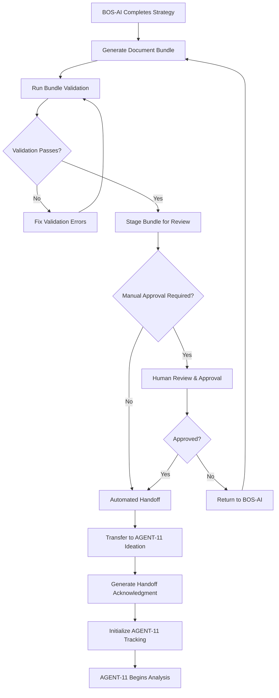
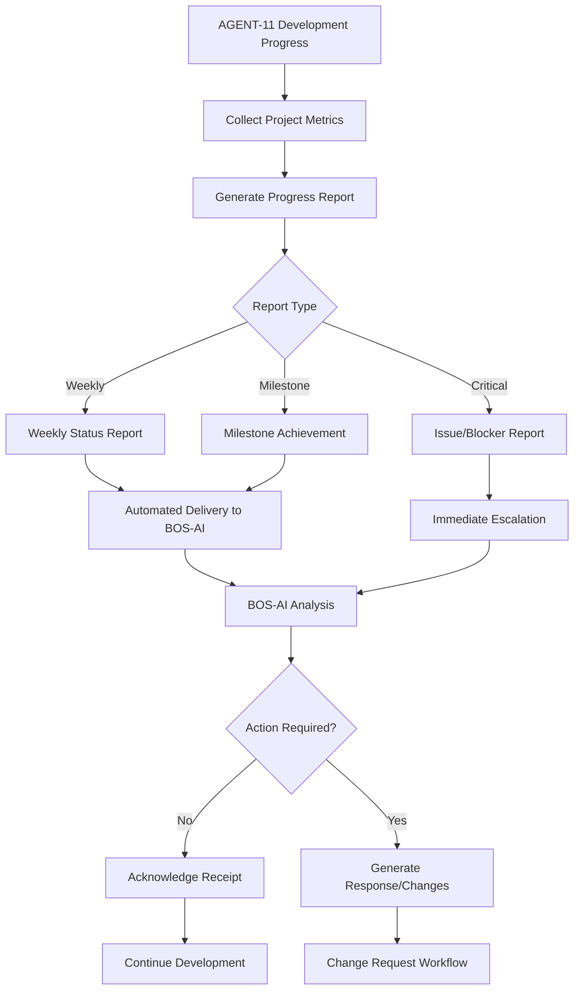
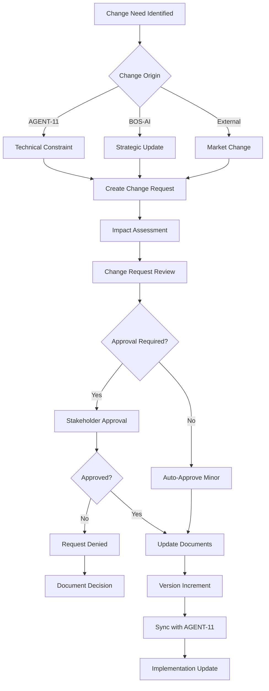

# BOS-AI ↔ AGENT-11 Integration Workflows

**Version**: 1.0.0  
**Last Updated**: 2025-01-29  
**Status**: Production Ready

## Overview

This document defines the complete set of workflows for BOS-AI and AGENT-11 integration. Each workflow includes step-by-step procedures, validation checkpoints, and escalation paths.

## Core Integration Workflows

### 1. PRD Handoff Workflow

The primary workflow for transferring product requirements from BOS-AI to AGENT-11.

#### Process Flow Diagram



#### Step-by-Step Process

##### Phase 1: Bundle Preparation (BOS-AI)

**Step 1.1: Strategy Completion**
- Market analysis finalized
- User research completed
- Competitive landscape analyzed
- Business requirements defined
- Success metrics established

**Validation Checkpoint**: Strategic analysis completeness check
- All required research artifacts present
- Business case clearly articulated
- Success criteria measurable and specific

**Step 1.2: Document Bundle Creation**
```bash
# BOS-AI generates bundle using templates
./bos-ai/tools/create-bundle.sh \
  --project "proj_001" \
  --version "1.0.0" \
  --output "./output/proj_001/bundle-v1.0.0"
```

**Documents Created:**
- `core-requirements/prd.md` - Product Requirements Document
- `core-requirements/context.md` - Business Context
- `core-requirements/client-blueprint.md` - Success Metrics
- `design-specifications/brand-guidelines.md` - Brand Standards
- `strategic-direction/vision.md` - Product Vision
- `strategic-direction/roadmap.md` - Development Roadmap
- `manifest.yaml` - Bundle Metadata

**Step 1.3: Self-Validation**
```bash
# BOS-AI runs validation before handoff
./integration-bridge/scripts/validation/validate-bundle.sh \
  "./output/proj_001/bundle-v1.0.0" \
  "./output/proj_001/validation-report.md"
```

**Success Criteria:**
- Schema validation: 100% pass
- Content completeness: >95% score
- Cross-references: All resolved
- Business logic: No critical issues

##### Phase 2: Validation Gateway

**Step 2.1: Automated Validation**
```bash
# Integration bridge validates bundle
./integration-bridge/bridge validate \
  "./bos-ai/output/proj_001/bundle-v1.0.0"
```

**Validation Checks:**
1. **Schema Compliance**: YAML frontmatter structure
2. **Required Sections**: All mandatory content present
3. **Content Quality**: Minimum word counts, formatting
4. **Cross-References**: Internal links and dependencies
5. **Metadata Integrity**: Version consistency, checksums
6. **Business Logic**: Requirements feasibility and completeness

**Step 2.2: Validation Report Generation**
```yaml
# Example validation report structure
validation_status: "passed"
timestamp: "2025-01-29T10:00:00Z"
bundle_version: "1.0.0"
project_id: "proj_001"

results:
  schema_validation:
    status: "passed"
    errors: 0
    warnings: 2
  content_completeness:
    status: "passed"
    score: 97
    missing_sections: []
  cross_references:
    status: "passed"
    broken_links: 0
    total_links: 15

recommendations:
  - "Consider expanding market analysis section"
  - "Add more specific user acceptance criteria"
```

**Step 2.3: Human Review Gate (Optional)**
```bash
# If manual approval required
./integration-bridge/tools/review/request-approval.sh \
  --bundle "./bos-ai/output/proj_001/bundle-v1.0.0" \
  --reviewer "product-owner@company.com"
```

**Review Checklist:**
- [ ] Business requirements align with strategic goals
- [ ] Technical requirements are feasible
- [ ] Success metrics are measurable
- [ ] Timeline estimates are realistic
- [ ] Resource requirements are available

##### Phase 3: Bundle Handoff

**Step 3.1: Automated Transfer**
```bash
# Integration bridge performs handoff
./integration-bridge/bridge handoff \
  "./bos-ai/output/proj_001/bundle-v1.0.0" \
  "./agent11-projects/new-project"
```

**Transfer Actions:**
1. Create AGENT-11 project structure
2. Copy bundle to ideation directory
3. Initialize git repository (if needed)
4. Create tracking files
5. Generate handoff acknowledgment

**Step 3.2: AGENT-11 Initialization**
```bash
# AGENT-11 project setup
cd ./agent11-projects/new-project
/coord dev-alignment
```

**Initialization Tasks:**
- Analyze ideation bundle
- Create technical implementation plan
- Initialize progress tracking
- Set up development environment
- Begin implementation

##### Phase 4: Handoff Confirmation

**Step 4.1: Acknowledgment Generation**
```markdown
# handoff-acknowledgment.md
**Handoff Date**: 2025-01-29T10:00:00Z
**Bundle Version**: 1.0.0
**Status**: ✅ Successfully received

## Bundle Contents Verified
- [x] Product Requirements Document
- [x] Business Context
- [x] Brand Guidelines
- [x] Vision Document
- [x] Roadmap
- [x] Client Blueprint

## Next Steps
1. Technical analysis and planning
2. Architecture design
3. Development implementation
4. Regular progress reporting
```

**Step 4.2: Status Update to BOS-AI**
```bash
# Notify BOS-AI of successful handoff
./integration-bridge/tools/notify/handoff-complete.sh \
  --project "proj_001" \
  --status "success" \
  --agent11-project "./agent11-projects/new-project"
```

#### Workflow Metrics

**Target Performance:**
- Total handoff time: <5 minutes
- Validation success rate: >95%
- Bundle completeness: >98%
- Manual intervention: <10% of handoffs

**Success Criteria:**
- AGENT-11 can begin development immediately
- No missing critical requirements
- Clear business context preserved
- Progress tracking initialized

---

### 2. Progress Reporting Workflow

Continuous workflow for AGENT-11 to report development progress back to BOS-AI.

#### Process Flow Diagram



#### Weekly Status Report Process

**Step 1: Automated Metrics Collection**
```bash
# AGENT-11 collects development metrics
./integration-bridge/scripts/reporting/collect-metrics.sh \
  "./agent11-projects/current-project"
```

**Metrics Collected:**
- Git commit activity
- Task completion percentage
- Test coverage and quality
- Performance benchmarks
- Issue/bug status
- Timeline adherence

**Step 2: Report Generation**
```bash
# Generate weekly report
./integration-bridge/scripts/reporting/generate-report.sh \
  "./agent11-projects/current-project" \
  "weekly" \
  "./status-reports/weekly/2025-01-29-status.md"
```

**Report Template:**
```markdown
---
report_type: "weekly_status"
report_date: "2025-01-29"
project_id: "proj_001"
reporting_period: "2025-01-22 to 2025-01-29"
overall_status: "on_track"
completion_percentage: 45
---

# Weekly Development Status Report

## Executive Summary
Development is progressing on schedule with core authentication 
system completed and user management features in progress.

## Completed This Week
- [x] User authentication system implementation
- [x] Database schema finalization  
- [x] API endpoint testing setup
- [x] Initial UI component library

## In Progress
- [ ] User profile management (60% complete)
- [ ] Payment integration setup (30% complete)
- [ ] Email notification system (20% complete)

## Planned for Next Week
- [ ] Complete user profile features
- [ ] Stripe payment integration
- [ ] Admin dashboard initial build

## Metrics
- **Tasks Completed**: 8/12 planned
- **Code Coverage**: 87%
- **Performance Tests**: All passing
- **Open Issues**: 3 (all low priority)

## Issues and Blockers
None requiring immediate attention.

## Change Requests
No scope changes requested this period.
```

**Step 3: Automated Delivery**
```bash
# Deliver report to BOS-AI status directory
./integration-bridge/scripts/reporting/deliver-report.sh \
  "./status-reports/weekly/2025-01-29-status.md" \
  "./bos-ai/incoming/proj_001/reports/"
```

#### Milestone Report Process

**Trigger Conditions:**
- Major feature completion
- Development phase completion
- Deployment milestones
- Critical decision points

**Enhanced Reporting:**
```markdown
# Milestone Report Template
## Milestone: Authentication System Complete

**Achievement Date**: 2025-01-29
**Original Target**: 2025-01-30
**Status**: ✅ Completed Early

### Deliverables Completed
- [x] User registration and login
- [x] Password reset functionality  
- [x] OAuth integration (Google, GitHub)
- [x] Session management
- [x] Security audit passed

### Quality Metrics
- **Test Coverage**: 95%
- **Security Scan**: No critical issues
- **Performance**: Sub-200ms response times
- **User Acceptance**: All criteria met

### Business Impact
- **User Onboarding**: Ready for launch
- **Security Compliance**: GDPR ready
- **Technical Debt**: Minimal

### Next Phase
Ready to begin user profile management phase.
Timeline remains on track for overall project completion.
```

#### Critical Issue Reporting

**Immediate Escalation Triggers:**
- Project timeline at risk (>2 week delay)
- Technical blockers requiring business decisions
- Scope changes needed for technical feasibility
- External dependency failures
- Security vulnerabilities discovered

**Critical Report Process:**
```bash
# Generate critical issue report
./integration-bridge/scripts/reporting/generate-critical-report.sh \
  --issue "external-api-deprecated" \
  --impact "high" \
  --project "./agent11-projects/current-project"
```

**Critical Report Template:**
```markdown
---
report_type: "critical_issue"
severity: "high"
project_id: "proj_001"
issue_id: "ISS-2025-001"
reported_date: "2025-01-29T14:30:00Z"
---

# Critical Issue Report

## Issue Summary
Third-party payment API announced deprecation with 30-day notice.
Current integration will stop working on 2025-02-28.

## Business Impact
- **Timeline**: Potential 1-2 week delay
- **Features Affected**: Payment processing, subscription management
- **User Impact**: Cannot process payments after deprecation

## Technical Analysis
- Current Stripe API v1 being deprecated
- Migration to v2 required
- Estimated effort: 5-8 days
- Testing requirements: Extended due to payment sensitivity

## Proposed Solutions
1. **Immediate Migration**: Start Stripe v2 integration now
2. **Alternative Provider**: Evaluate PayPal or Square alternatives
3. **Delayed Launch**: Push launch date to accommodate migration

## Business Input Required
- Priority of payment feature for launch
- Budget for extended development
- Risk tolerance for delayed launch

## Recommended Action
Immediate migration to Stripe v2 with extended testing.
Request 1-week timeline extension for thorough validation.
```

---

### 3. Change Request Workflow

Structured process for handling requirement changes and clarifications during development.

#### Process Flow Diagram



#### Change Request Types

**Type 1: Clarification Requests**
- AGENT-11 needs more detail on existing requirements
- No scope change, just clarification
- Typically resolved within 24 hours

**Type 2: Scope Additions**
- New features or requirements discovered during development
- Requires business approval and timeline impact assessment
- May affect budget and resources

**Type 3: Scope Modifications**
- Changes to existing requirements based on technical constraints
- Requires business decision on trade-offs
- Often involves alternative solution proposals

**Type 4: Strategic Pivots**
- Major direction changes based on market feedback
- Requires comprehensive re-planning
- May trigger new bundle creation

#### Change Request Process

**Step 1: Change Request Creation**
```bash
# AGENT-11 creates change request
./integration-bridge/scripts/workflows/create-change-request.sh \
  --type "scope_addition" \
  --priority "medium" \
  --project "./agent11-projects/current-project"
```

**Change Request Template:**
```markdown
---
change_type: "scope_addition"
priority: "medium"
requested_by: "development_team"
impact_assessment: "medium"
estimated_effort: "3_days"
timeline_impact: "1_week_delay"
---

# Change Request: Real-time Notifications

## Current State
Email notifications implemented for user actions.
No real-time notification system in current requirements.

## Requested Change
Add real-time push notifications for critical user events:
- Payment confirmations
- Security alerts
- System maintenance notices

## Business Justification
User feedback during development indicates strong preference for 
immediate notification of payment and security events.

## Impact Analysis
**Development Impact:**
- Additional 3 days development
- WebSocket implementation required
- Push notification service integration

**Timeline Impact:**
- 1 week delay to current milestone
- No impact to overall project timeline

**Technical Considerations:**
- Requires additional infrastructure (WebSocket server)
- Mobile app support needed for push notifications
- Browser permission handling required

## Proposed Implementation
1. WebSocket server setup for real-time communication
2. Browser push notification API integration
3. Fallback to email for unsupported browsers
4. User preference controls for notification types

## Alternative Solutions
1. **Polling-based**: Check for updates every 30 seconds
2. **Email-only**: Enhanced email notification system
3. **Deferred**: Implement in next version

## Business Approval Required
- [ ] Product Owner sign-off
- [ ] Budget approval for infrastructure costs
- [ ] Timeline extension acceptance
```

**Step 2: Impact Assessment**
```bash
# Automated impact analysis
./integration-bridge/scripts/workflows/assess-impact.sh \
  "./change-requests/CR-2025-001-realtime-notifications.md" \
  "./agent11-projects/current-project"
```

**Impact Assessment Report:**
```yaml
change_request_id: "CR-2025-001"
assessment_date: "2025-01-29"

impacts:
  timeline:
    current_milestone: "1 week delay"
    overall_project: "no impact"
    critical_path: false
  
  budget:
    development_cost: "+$1,500"
    infrastructure_cost: "+$50/month"
    total_impact: "5% increase"
  
  technical:
    complexity_increase: "medium"
    new_dependencies: ["websocket", "push-service"]
    risk_level: "low"
  
  business:
    user_value: "high"
    competitive_advantage: "medium"
    market_alignment: "strong"

recommendation: "approve"
justification: "High user value with manageable technical impact"
```

**Step 3: Approval Process**
```bash
# Route for approval based on impact level
./integration-bridge/scripts/workflows/route-approval.sh \
  --change-request "CR-2025-001" \
  --impact-level "medium" \
  --auto-approve-threshold "low"
```

**Approval Matrix:**
- **Low Impact**: Auto-approve (timeline <2 days, budget <$500)
- **Medium Impact**: Product Owner approval required
- **High Impact**: Full stakeholder approval (timeline >1 week, budget >$2000)
- **Critical Impact**: Emergency review process

**Step 4: Document Updates**
```bash
# Update affected documents
./integration-bridge/scripts/workflows/update-documents.sh \
  --change-request "CR-2025-001" \
  --approved-date "2025-01-29" \
  --bundle-path "./ideation/"
```

**Version Management:**
- Minor changes: Patch version increment (1.0.0 → 1.0.1)
- Feature additions: Minor version increment (1.0.0 → 1.1.0)
- Major changes: Major version increment (1.0.0 → 2.0.0)

---

### 4. Clarification Request Workflow

Streamlined process for AGENT-11 to request clarifications without formal change requests.

#### Quick Clarification Process

**Step 1: Identify Unclear Requirements**
```bash
# AGENT-11 identifies ambiguous requirements
./integration-bridge/scripts/workflows/request-clarification.sh \
  --section "User Authentication" \
  --question "OAuth provider preference?" \
  --urgency "medium"
```

**Clarification Template:**
```markdown
# Clarification Request: OAuth Provider Selection

**Section**: User Authentication (PRD section 3.2)
**Question**: Which OAuth providers should be supported?
**Context**: PRD mentions "social login" but doesn't specify providers

## Current Requirement
"Users can log in using social media accounts"

## Clarification Needed
1. Which specific OAuth providers? (Google, Facebook, GitHub, etc.)
2. How many providers should be supported initially?
3. Any regional preferences or compliance requirements?

## Implementation Impact
- Google OAuth: 1 day implementation
- Multiple providers: 2-3 days implementation  
- Each provider requires separate API keys and testing

## Proposed Assumption
Implement Google OAuth initially, add others based on user feedback.

**Urgency**: Medium (needed within 2 days for development continuity)
**Timeline Impact**: None if answered within 48 hours
```

**Step 2: Automated Routing**
```bash
# Route clarification to appropriate BOS-AI module
./integration-bridge/scripts/workflows/route-clarification.sh \
  --request "CLAR-2025-001" \
  --category "technical_specification" \
  --urgency "medium"
```

**Step 3: BOS-AI Response**
```markdown
# Clarification Response: OAuth Provider Selection

**Request ID**: CLAR-2025-001
**Response Date**: 2025-01-29
**Responded By**: BOS-AI Strategy Module

## Answer
Support Google and GitHub OAuth initially.

**Rationale**:
- Google: Broadest user base coverage
- GitHub: Developer-friendly for technical users
- Facebook: Avoided due to privacy concerns in target market

## Additional Context
- Implement generic OAuth framework for easy addition of providers
- Plan to add Microsoft and Apple OAuth in v2.0
- User research showed 85% coverage with Google + GitHub

## Updated Requirement
Replace PRD section 3.2 with:
"Users can log in using Google or GitHub accounts via OAuth 2.0"

**Implementation Priority**: Google first, GitHub second
**Timeline**: No change to current estimates
```

#### FAQ Integration

**Step 1: FAQ Generation**
```bash
# Generate FAQ from frequent clarifications
./integration-bridge/scripts/workflows/generate-faq.sh \
  --project "proj_001" \
  --period "last_30_days"
```

**Common Clarifications FAQ:**
```markdown
# Project FAQ: Common Clarifications

## Authentication & Security

**Q: What OAuth providers should be supported?**
A: Google and GitHub for initial release. Generic framework for future additions.

**Q: What password strength requirements?**  
A: Minimum 8 characters, mix of letters/numbers/symbols. No maximum length limit.

**Q: Session timeout requirements?**
A: 24 hours for regular users, 4 hours for admin accounts.

## User Interface

**Q: Mobile responsiveness requirements?**
A: Full responsive design required. Mobile-first approach preferred.

**Q: Browser support matrix?**
A: Chrome 90+, Firefox 88+, Safari 14+, Edge 90+. No IE support.

**Q: Dark mode support required?**
A: Not required for initial release, but architecture should support future addition.

## Business Logic

**Q: User data export requirements?**
A: Full data export in JSON format. GDPR compliance required.

**Q: Payment processing regional requirements?**
A: US and EU support required. Stripe handles compliance.
```

---

## Workflow Performance Metrics

### Key Performance Indicators

**Speed Metrics:**
- PRD Handoff: <5 minutes end-to-end
- Change Request Processing: <24 hours for medium impact
- Clarification Response: <2 hours for urgent requests
- Progress Report Generation: <30 seconds

**Quality Metrics:**
- Bundle Validation Success: >95%
- Change Request Approval Rate: 80-90%
- Clarification Resolution Rate: >98%
- Requirement Completeness: >95%

**Process Metrics:**
- Workflow Automation Rate: >90%
- Manual Intervention Required: <10%
- Error Recovery Success: >95%
- Documentation Sync Rate: 100%

### Success Criteria by Workflow

**PRD Handoff Workflow:**
- ✅ Zero data loss during transfer
- ✅ Complete business context preserved  
- ✅ AGENT-11 can begin immediately
- ✅ Validation catches 95% of issues

**Progress Reporting Workflow:**
- ✅ Regular, consistent updates to BOS-AI
- ✅ Business-friendly status communication
- ✅ Early warning for timeline risks
- ✅ Automated metric collection accuracy >95%

**Change Request Workflow:**
- ✅ Structured impact assessment
- ✅ Clear approval processes
- ✅ Version control maintained
- ✅ All stakeholders informed

**Clarification Request Workflow:**
- ✅ Rapid resolution of ambiguities
- ✅ Knowledge capture for future projects
- ✅ Minimal development interruption
- ✅ Complete requirement clarity

## Integration Points

### With Existing AGENT-11 System
- Uses existing mission system (`/coord` commands)
- Extends current progress tracking files
- Integrates with `.claude/agents/` structure
- Maintains compatibility with all existing workflows

### With BOS-AI System  
- Consumes standardized BOS-AI output formats
- Provides structured feedback through reports
- Handles version synchronization automatically
- Supports BOS-AI iteration and refinement cycles

These workflows establish a robust, automated communication protocol between BOS-AI strategic planning and AGENT-11 technical execution, ensuring high-quality software delivery with minimal manual coordination overhead.